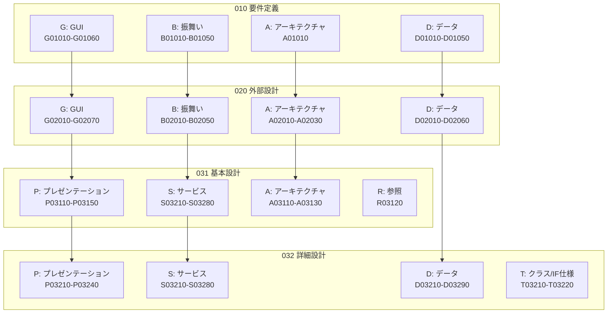
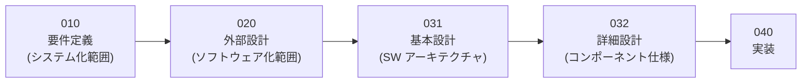
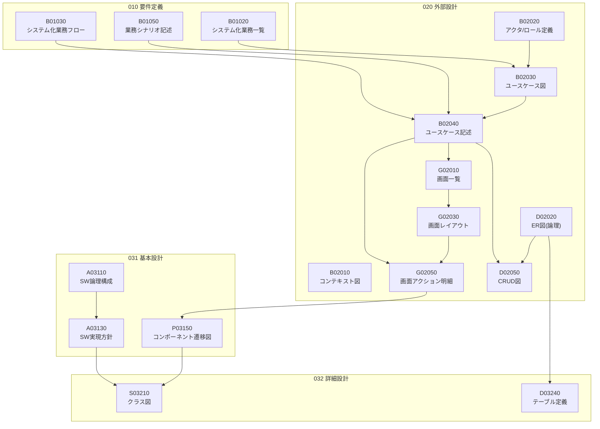

# WebPot SI Docs 概要

## 1. WebPot SI Docs とは

**WebPot SI Docs** (v1.3, 2015年) は、エクサ TI部が提供していた **Webアプリケーション開発の工程成果物テンプレート集** です。ウォーターフォール開発プロセス（要件定義→外部設計→内部設計→実装）に基づき、各工程で作成すべきドキュメントのテンプレートとサンプルを提供します。

### 前提条件

| 項目 | 値 |
|------|-----|
| 規模 | 300FP以上 |
| 金額 | 5,000万円以上 |
| 体制 | 10名以上 |
| 工数 | 50人月以上 |
| アーキテクチャ | UI-Service-DAO構造のJava Webアプリ |
| ツール | Excel / Astah* |

### サンプルアプリ

「**お弁当アプリケーション**」（弁当注文システム）を題材に、テンプレートの記載例が提供されています。

---

## 2. 全体構成

### フェーズとカテゴリのマトリクス

### フェーズの流れ

---

## 3. 工程成果物ID採番ルール

**形式**: `<分類><フェーズ番号><2桁通し番号>`

| 記号 | 分類名 | 対象フェーズ | 概要 |
|------|--------|------------|------|
| **G** | GUI | 010, 020 | 画面仕様（発注者向け） |
| **B** | 振舞い | 010, 020 | システム/ソフトウェアの振舞い（発注者向け） |
| **D** | データ | 010, 020, 032 | データモデル |
| **A** | アーキテクチャ | 010, 020, 031 | 非機能要件、システム構成 |
| **P** | プレゼンテーション | 031, 032 | 画面仕様詳細（開発者向け） |
| **S** | サービス | 032 | サービス/DAO仕様詳細（開発者向け） |
| **T** | テンプレート/クラス仕様 | 032 | クラス/IF仕様詳細 |
| **R** | 参照 | 全フェーズ | 用語集、ネーミングルール |
| **X** | 環境 | 031以降 | 環境構築（対象外） |

**例**: `B02030` = B(振舞い) + 020(外部設計) + 30(通し番号) = ユースケース図

---

## 4. 工程成果物一覧（全63件）

### 010 要件定義（12件）

| ID | 成果物名 | 必須 | 作成単位 |
|----|---------|------|---------|
| G01010 | レイアウト共通ルール | ○ | プロジェクト |
| G01020 | 共通CSSファイル | △ | プロジェクト |
| G01030 | 共通イメージファイル | △ | プロジェクト |
| G01040 | 共通JavaScriptファイル | △ | プロジェクト |
| G01050 | 共通画面モックアップ(HTML) | △ | プロジェクト |
| G01060 | 画面モックアップ用サンプル(HTML) | △ | 画面パターン |
| B01010 | システム振舞い共通ルール | ○ | プロジェクト |
| B01020 | システム化業務一覧 | ○ | プロジェクト |
| B01030 | システム化業務フロー | ○ | 業務シナリオ |
| B01040 | システム化業務説明 | △ | 業務ブロック |
| B01050 | システム化業務シナリオ記述 | △ | 業務シナリオ |
| A01010 | 非機能要件一覧 | △ | プロジェクト |

### 020 外部設計（19件）

| ID | 成果物名 | 必須 | 作成単位 |
|----|---------|------|---------|
| G02010 | 画面一覧 | ○ | プロジェクト |
| G02020 | 画面遷移 | ○ | プロジェクト |
| G02030 | 画面レイアウト | ○ | 画面 |
| G02040 | 画面入出力項目一覧 | ○ | 画面 |
| G02050 | 画面アクション明細 | ○ | 画面 |
| G02060 | 画面モックアップ(HTML) | ○ | 画面 |
| G02070 | メッセージ一覧 | ○ | プロジェクト |
| B02010 | システムコンテキストダイアグラム | ○ | プロジェクト |
| B02020 | アクタ定義／ロール定義 | ○ | プロジェクト |
| B02030 | ユースケース図 | ○ | プロジェクト |
| B02040 | ユースケース記述 | ○ | ユースケース |
| B02050 | ユースケースシナリオ記述 | △ | シナリオ |
| D02010 | データ辞書(論理モデル) | ○ | プロジェクト |
| D02020 | ER図(論理モデル) | ○ | プロジェクト |
| D02030 | エンティティ一覧(論理モデル) | ○ | プロジェクト |
| D02040 | エンティティ定義(論理モデル) | ○ | エンティティ |
| D02050 | CRUD図(論理モデル) | △ | プロジェクト |
| D02060 | ファイル一覧・定義 | ○ | プロジェクト |
| A02010 | システム構成／ノード配置 | ○ | プロジェクト |
| A02020 | ノード別構成 | ○ | ノード |
| A02030 | アーキテクチャ方針 | ○ | プロジェクト |

### 031 内部設計 基本設計（7件）

| ID | 成果物名 | 必須 | 作成単位 |
|----|---------|------|---------|
| P03110 | HTML(Velocityテンプレート) | ○ | 画面 |
| P03120 | CSSファイル | ○ | プロジェクト |
| P03130 | イメージファイル | ○ | プロジェクト |
| P03140 | JavaScriptファイル | △ | プロジェクト |
| P03150 | コンポーネント遷移図(画面・アクション) | ○ | プロジェクト |
| A03110 | ソフトウェア論理構成 | ○ | プロジェクト |
| A03120 | ソフトウェア物理構成 | ○ | プロジェクト |
| A03130 | ソフトウェア実現方針 | ○ | プロジェクト |
| R03120 | 実装成果物ネーミングルール | ○ | プロジェクト |

### 032 内部設計 詳細設計（19件）

| ID | 成果物名 | 必須 | 作成単位 |
|----|---------|------|---------|
| P03210 | JavaScript関数仕様詳細 | ○ | 画面 |
| P03220 | アクションクラス仕様詳細 | ○ | クラス |
| P03230 | チェッククラス仕様詳細 | ○ | クラス |
| P03240 | プロパティファイル仕様詳細 | ○ | ファイル |
| S03210 | クラス図(サービス・DAO) | ○ | プロジェクト |
| S03220 | サービスインターフェイス仕様詳細 | ○ | IF |
| S03230 | サービス実装クラス仕様詳細 | ○ | クラス |
| S03240 | DAOインターフェイス仕様詳細 | ○ | IF |
| S03250 | DAO実装クラス仕様詳細 | ○ | クラス |
| S03260 | DTOクラス仕様詳細 | ○ | クラス |
| S03270 | 共通インターフェイス仕様詳細 | ○ | IF |
| S03280 | 共通クラス仕様詳細 | ○ | クラス |
| D03210 | データベース定義 | △ | ノード |
| D03220 | 表領域一覧/定義 | ○ | 適宜 |
| D03230 | ユーザ・ロール一覧/定義 | ○ | 適宜 |
| D03240 | テーブル一覧/定義 | ○ | 適宜 |
| D03250 | ビュー一覧/定義 | ○ | 適宜 |
| D03260 | インデックス一覧/定義 | ○ | 適宜 |
| D03270 | 制約一覧/定義 | △ | 適宜 |
| T03210 | クラス仕様詳細 | ○ | クラス |
| T03220 | インターフェイス仕様詳細 | ○ | IF |

### 全フェーズ共通（3件）

| ID | 成果物名 | 必須 | 作成単位 |
|----|---------|------|---------|
| R00010 | 用語集 | ○ | プロジェクト |
| T00000 | テンプレート | - | - |
| T00001 | 更新履歴 | - | - |

---

## 5. 成果物テンプレートの構造

各Excelテンプレートには以下の共通ヘッダがあります：

| フィールド | 説明 |
|-----------|------|
| プロジェクト名 | プロジェクトの正式名称 |
| システム名 | 対象システムの名称 |
| バージョン | 文書バージョン |
| 工程成果物ID | ID採番ルールに従った識別子 |
| 作成者 | 初回作成者のフルネーム |
| 作成日付 | 初回作成日 |
| 更新者 | 最終更新者 |
| 更新日付 | 最終更新日 |
| 工程成果物名 | 成果物の正式名称 |

---

## 6. 成果物間のトレーサビリティ

