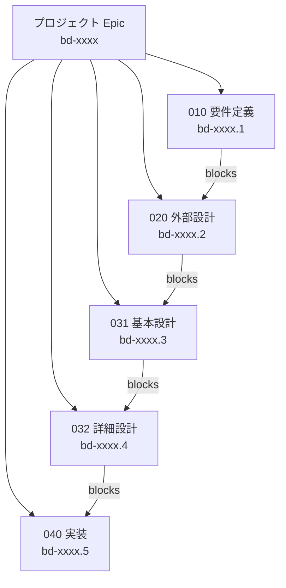
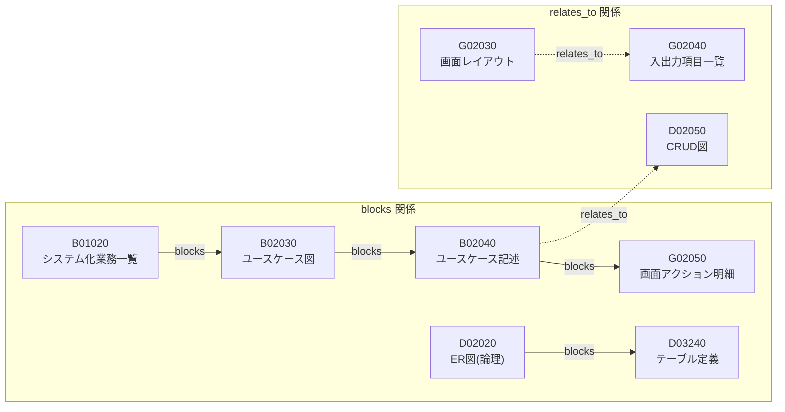
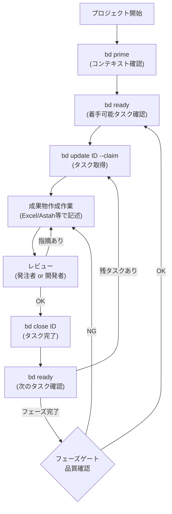
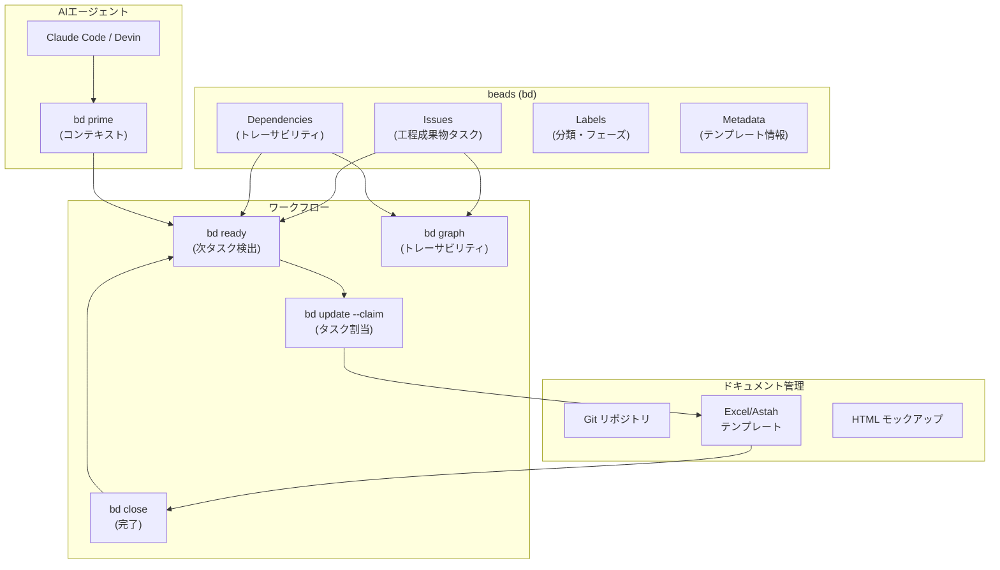

# beads (bd) によるワークフロー化 検討レポート

## 1. 結論

**beads (bd) を使って WebPot SI Docs のウォーターフォール開発ワークフローを構築することは可能です。** ただし、beadsはイシュートラッカーであり、ドキュメント管理システムではないため、「成果物の作成タスク管理」と「成果物間の依存関係追跡」にフォーカスしたワークフロー化が適切です。

### 適合度評価

| beads機能 | WebPot SI Docs要素 | 適合度 |
|-----------|-------------------|--------|
| Epic + 階層ID | フェーズ (010, 020, 031, 032) | **高** |
| Issue (タスク) | 個々の工程成果物 (B01010, G02010等) | **高** |
| 依存関係 (blocks) | 成果物間のトレーサビリティ | **高** |
| Labels | 成果物分類 (G, B, D, A, P, S) | **高** |
| Priority | 必須(○)/推奨(△) | **高** |
| Metadata (JSON) | テンプレートのヘッダ情報 | **高** |
| `bd ready` | 次に着手可能な成果物の自動検出 | **高** |
| Templates / Formulas | 標準ワークフローの再利用 | **中** |
| ドキュメント本体の管理 | Excel/Astahファイルの格納 | **対象外** |

---

## 2. マッピング設計

### 2.1 フェーズ → Epic



### 2.2 工程成果物 → Issue

各工程成果物を beads の Issue として登録します。

**Issue の構造例:**

```
Title:    "G02010 画面一覧"
Type:     task
Priority: 0 (必須=○ → P0, 推奨=△ → P2)
Labels:   ["GUI", "020-外部設計", "プロジェクト単位"]
Metadata: {
  "artifact_id": "G02010",
  "category": "G",
  "phase": "020",
  "unit": "プロジェクト",
  "mandatory": true,
  "author_role": "開発者",
  "reviewer_role": "発注者",
  "template_file": "G02010 画面一覧.xlsx"
}
```

### 2.3 成果物間依存関係 → Dependency



### 2.4 分類 → Labels

| Label | 対象 | 色 |
|-------|------|-----|
| `GUI` | G系成果物 | 青 |
| `振舞い` | B系成果物 | 緑 |
| `データ` | D系成果物 | 橙 |
| `アーキテクチャ` | A系成果物 | 紫 |
| `プレゼンテーション` | P系成果物 | 水色 |
| `サービス` | S系成果物 | 黄 |
| `必須` | ○の成果物 | 赤 |
| `推奨` | △の成果物 | 灰 |

---

## 3. 実装方法

### 3.1 初期セットアップスクリプト例

```bash
#!/bin/bash
# WebPot SI Docs ワークフロー構築スクリプト

# プロジェクト初期化
bd init

# ===== プロジェクト Epic =====
bd create "Webアプリ開発プロジェクト" -t epic -p 0 \
  --description="WebPot SI Docs準拠のウォーターフォール開発" --json

# ===== 010 要件定義 Epic =====
bd create "010 要件定義" -t epic -p 0 \
  --description="システム化範囲の決定" --json

# --- 要件定義: GUI系 ---
bd create "G01010 レイアウト共通ルール" -t task -p 0 \
  --description="画面レイアウトの見た目動作表現を均質化するためのルール定義" --json

bd create "B01010 システム振舞い共通ルール" -t task -p 0 \
  --description="システム化業務一覧等を記述するためのルール" --json

bd create "B01020 システム化業務一覧" -t task -p 0 \
  --description="システム化対象のすべての業務の一覧" --json

bd create "B01030 システム化業務フロー" -t task -p 0 \
  --description="業務シナリオ単位の業務フロー" --json

# ===== 020 外部設計 Epic =====
bd create "020 外部設計" -t epic -p 0 \
  --description="ソフトウェア化範囲の決定" --json

# --- 外部設計: GUI系 ---
bd create "G02010 画面一覧" -t task -p 0 \
  --description="システム化対象の全画面の一覧表" --json

bd create "G02020 画面遷移" -t task -p 0 \
  --description="画面間の全遷移を表現した図" --json

# ... (以下同様に全成果物を登録)

# ===== 依存関係の設定 =====
# bd dep add <child-id> <parent-id>
# 例: 外部設計は要件定義の完了をブロックされる
```

### 3.2 ワークフロー運用



### 3.3 Metadata 設計

各成果物 Issue の `metadata` フィールドに格納する JSON スキーマ：

```json
{
  "artifact_id": "G02010",
  "category": "G",
  "category_name": "GUI",
  "phase": "020",
  "phase_name": "外部設計",
  "unit": "プロジェクト",
  "mandatory": true,
  "author_role": "開発者",
  "reviewer_role": "発注者",
  "template_file": "G02010 画面一覧.xlsx",
  "version": "1.0",
  "review_status": "未レビュー",
  "review_date": null,
  "reviewer_name": null,
  "deliverable_path": "docs/020_外部設計/G02010_画面一覧.xlsx"
}
```

---

## 4. beads の強みが活きるポイント

### 4.1 `bd ready` による次タスク自動検出

ウォーターフォールでは前工程の完了が後工程の着手条件です。`bd ready` は依存関係（blocks）を自動チェックし、ブロッカーが解消されたタスクだけを表示するため、**「今何をすべきか」が自動的にわかります**。

```bash
$ bd ready --json
# → 依存先がすべてclosedのタスクだけが表示される
```

### 4.2 階層IDによるフェーズ管理

```
bd-a1b2        (プロジェクト Epic)
bd-a1b2.1      (010 要件定義 Epic)
bd-a1b2.1.1    (G01010 レイアウト共通ルール)
bd-a1b2.1.2    (B01010 システム振舞い共通ルール)
bd-a1b2.2      (020 外部設計 Epic)
bd-a1b2.2.1    (G02010 画面一覧)
...
```

### 4.3 CRUD図的なトレーサビリティ

依存関係グラフにより、成果物間のトレーサビリティを `bd graph` で可視化できます。

### 4.4 マルチエージェント並行作業

同一フェーズ内で独立した成果物は並行して作業可能です。beads の Hash-based IDs により、複数の担当者が衝突なく同時にタスクを処理できます。

---

## 5. 制約事項・注意点

### 5.1 beads が対応しないもの

| 要素 | 理由 | 代替案 |
|------|------|--------|
| Excel/Astahファイル本体の管理 | beadsはイシュートラッカー | Git + ファイルサーバで管理 |
| ドキュメントの内容チェック | 品質は人間がレビュー | メタデータでレビュー状態を追跡 |
| テンプレートの自動生成 | beadsはテンプレエンジンでない | スクリプト + メタデータ連携 |

### 5.2 ウォーターフォール特有の考慮

- **フェーズゲート**: フェーズ完了判定は `bd ready` だけでは不十分。Epicのクローズをフェーズゲート通過の条件とする
- **手戻り**: ウォーターフォールでの手戻りは `bd reopen` で対応可能
- **複数回レビュー**: コメント機能 (`bd comment`) でレビュー指摘を記録

---

## 6. 推奨アプローチ

### Step 1: パイロット導入

1. 小規模プロジェクト（1フェーズ分）で試行
2. 010 要件定義の12成果物をbeadsに登録
3. 依存関係を設定し、`bd ready` で運用を検証

### Step 2: 全フェーズ展開

1. セットアップスクリプト化（上記3.1参照）
2. 全63成果物 + 依存関係を登録
3. メタデータスキーマを標準化

### Step 3: AIエージェント連携

1. Claude Code等のAIエージェントが `bd prime` でコンテキスト取得
2. `bd ready` で次の作業を自動取得
3. AIが成果物のドラフトを作成、人間がレビュー

---

## 7. 全体アーキテクチャ


