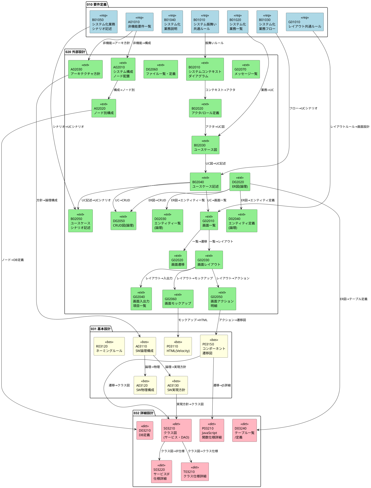
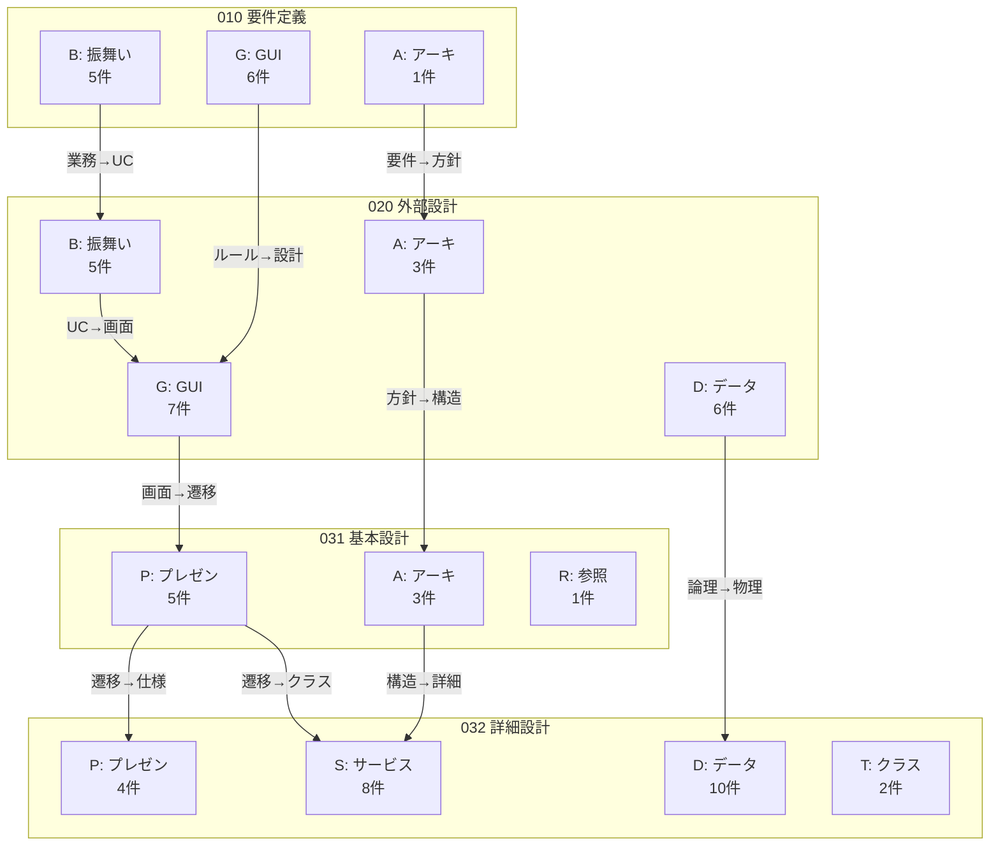
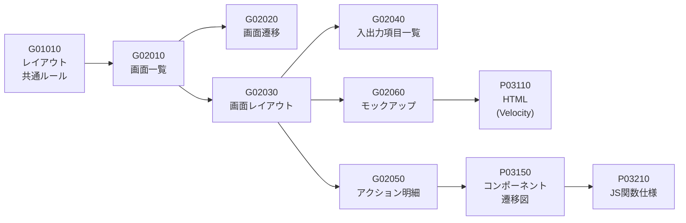
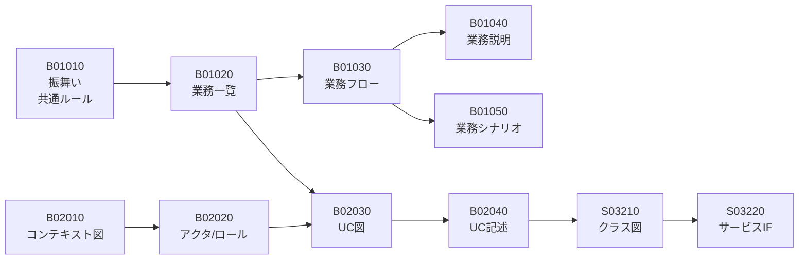
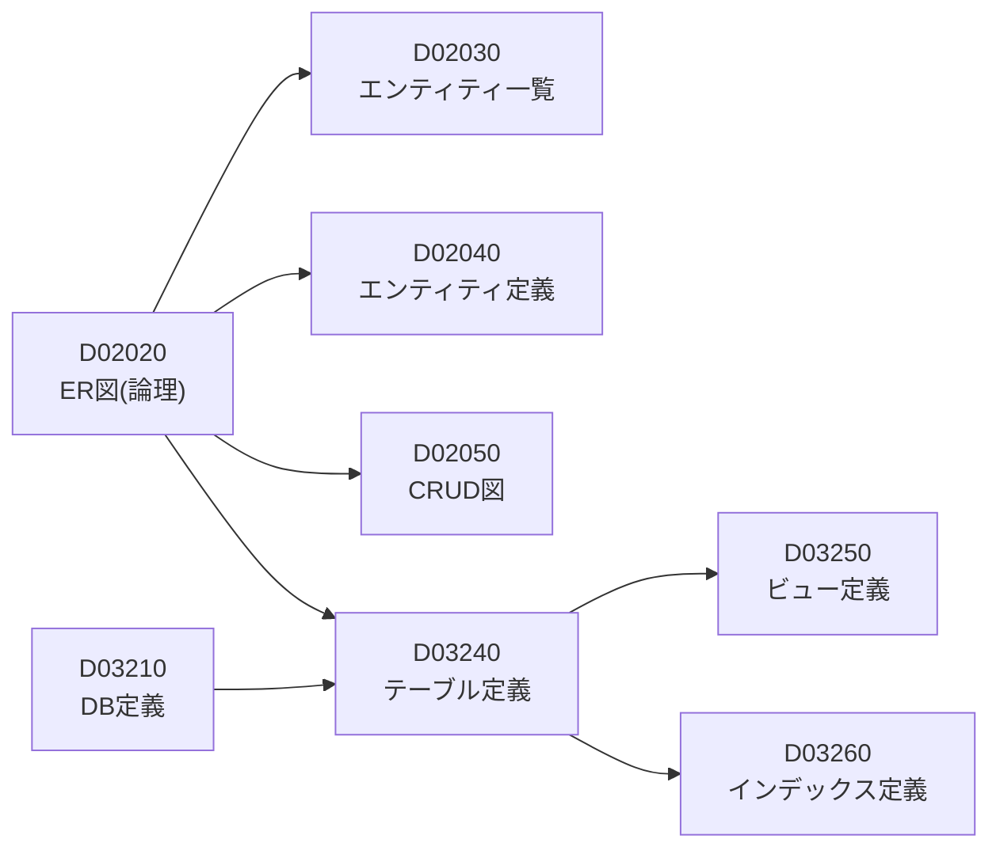

# 工程成果物 依存関係マップ

## 1. 全体依存関係図

---

## 2. フェーズ間の依存関係（簡略版）

---

## 3. カテゴリ別のライフサイクル

### GUI系 (G → P) のライフサイクル

### 振舞い系 (B → S) のライフサイクル

### データ系 (D) のライフサイクル

---

## 4. beads Issue 登録時の依存関係一覧

以下は `bd dep add <from> <to>` (fromがtoに依存 = toが完了しないとfromに着手できない) で設定すべき依存関係の一覧です。

### 010→020 フェーズ間依存

| from (後工程) | to (前工程) | 関係 |
|--------------|------------|------|
| B02010 コンテキスト図 | B01010 振舞い共通ルール | blocks |
| B02030 ユースケース図 | B01020 業務一覧 | blocks |
| B02040 ユースケース記述 | B01030 業務フロー | blocks |
| B02050 UCシナリオ記述 | B01050 業務シナリオ | blocks |
| G02010 画面一覧 | G01010 レイアウト共通ルール | blocks |
| A02010 システム構成 | A01010 非機能要件一覧 | blocks |
| A02030 アーキテクチャ方針 | A01010 非機能要件一覧 | blocks |

### 020 フェーズ内依存

| from | to | 関係 |
|------|-----|------|
| B02020 アクタ/ロール定義 | B02010 コンテキスト図 | blocks |
| B02030 ユースケース図 | B02020 アクタ/ロール定義 | blocks |
| B02040 ユースケース記述 | B02030 ユースケース図 | blocks |
| B02050 UCシナリオ記述 | B02040 ユースケース記述 | blocks |
| G02010 画面一覧 | B02040 ユースケース記述 | blocks |
| G02020 画面遷移 | G02010 画面一覧 | blocks |
| G02030 画面レイアウト | G02010 画面一覧 | blocks |
| G02040 入出力項目一覧 | G02030 画面レイアウト | blocks |
| G02050 アクション明細 | G02030 画面レイアウト | blocks |
| G02060 モックアップ | G02030 画面レイアウト | blocks |
| D02030 エンティティ一覧 | D02020 ER図(論理) | blocks |
| D02040 エンティティ定義 | D02020 ER図(論理) | blocks |
| D02050 CRUD図 | D02020 ER図(論理) | blocks |
| D02050 CRUD図 | B02040 ユースケース記述 | blocks |
| A02020 ノード別構成 | A02010 システム構成 | blocks |

### 020→031 フェーズ間依存

| from | to | 関係 |
|------|-----|------|
| P03110 HTML | G02060 モックアップ | blocks |
| P03150 遷移図 | G02050 アクション明細 | blocks |
| A03110 SW論理構成 | A02030 アーキテクチャ方針 | blocks |

### 031 フェーズ内依存

| from | to | 関係 |
|------|-----|------|
| A03120 SW物理構成 | A03110 SW論理構成 | blocks |
| A03130 SW実現方針 | A03110 SW論理構成 | blocks |

### 031→032 フェーズ間依存

| from | to | 関係 |
|------|-----|------|
| P03210 JS関数仕様 | P03150 遷移図 | blocks |
| S03210 クラス図 | A03130 SW実現方針 | blocks |
| S03210 クラス図 | P03150 遷移図 | blocks |
| D03240 テーブル定義 | D02020 ER図(論理) | blocks |
| D03210 DB定義 | A02020 ノード別構成 | blocks |

### 032 フェーズ内依存

| from | to | 関係 |
|------|-----|------|
| S03220 サービスIF仕様 | S03210 クラス図 | blocks |
| T03210 クラス仕様 | S03210 クラス図 | blocks |
| D03250 ビュー定義 | D03240 テーブル定義 | blocks |
| D03260 インデックス定義 | D03240 テーブル定義 | blocks |
