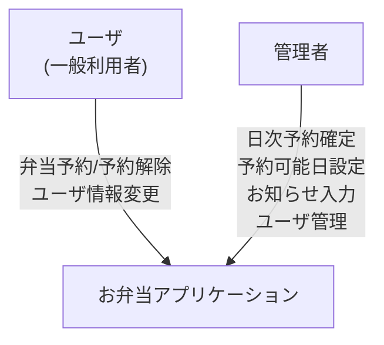
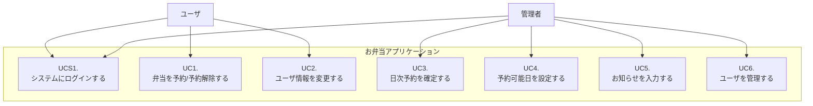
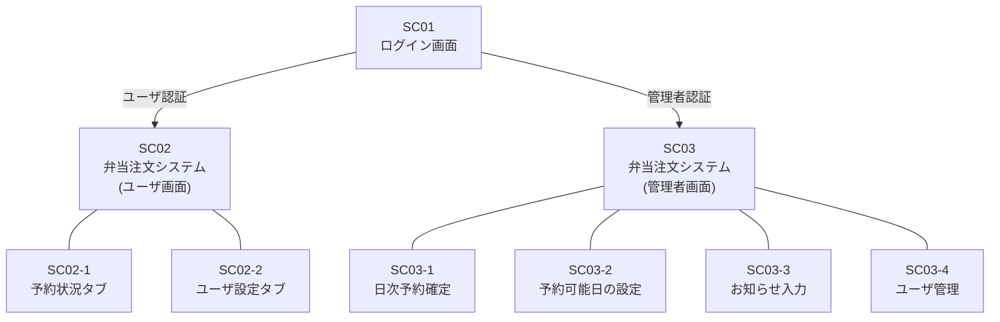
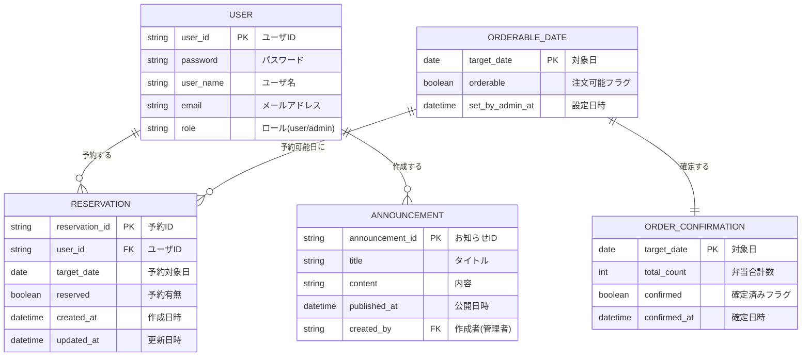
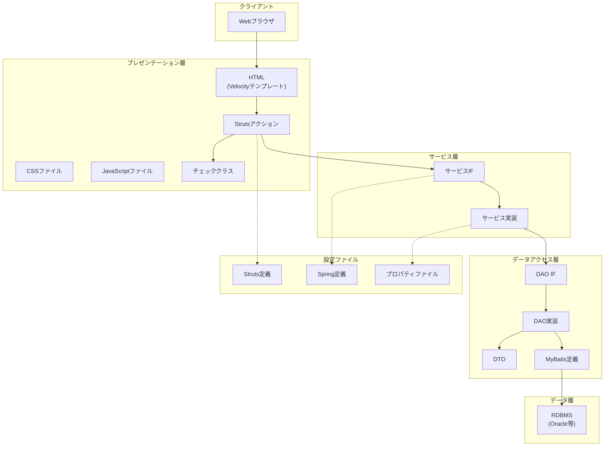

# お弁当アプリケーション サンプル分析

WebPot SI Docs には「**お弁当アプリケーション構築プロジェクト**」のサンプルが含まれています。

---

## 1. システム概要

お弁当の注文管理Webアプリケーション。ユーザが弁当を予約し、管理者が予約を確定・管理するシステム。

### アクタ



---

## 2. ユースケース



### ユースケース記述例: UC1. 弁当を予約・予約解除する

| 項目 | 内容 |
|------|------|
| 概要 | ユーザが弁当の予約内容を変更する |
| アクタ | ユーザ |
| 事前条件 | アクタはユーザとしてシステムにログインしていること |

**基本系列**:
1. アクタは、予約変更したい対象日を選択し、現在の予約内容を変更する
   1. 予約状況タブをクリックし予約状況を表示
   2. 前月/次月ボタンで月を切り替え
   3. 日付をクリックし、予約マーク表示(予約あり)/非表示(予約なし)で予約状況を変更
2. システムは、変更された予約内容を記録し、表示内容を更新
3. 変更したい日の分だけ繰り返す

---

## 3. 画面構成



---

## 4. ER図（論理モデル）

以下はサンプルのテーブル定義から推定した論理モデルです。



---

## 5. ソフトウェアアーキテクチャ



---

## 6. beads でのモデル化

上記のお弁当アプリを beads で管理する場合のイシュー構造例：

```
bd-xxxx          お弁当アプリケーション構築プロジェクト [epic]
├── bd-xxxx.1    010 要件定義 [epic]
│   ├── .1.1     G01010 レイアウト共通ルール [task] ○
│   ├── .1.2     B01010 システム振舞い共通ルール [task] ○
│   ├── .1.3     B01020 システム化業務一覧 [task] ○
│   ├── .1.4     B01030 システム化業務フロー [task] ○
│   └── ...
├── bd-xxxx.2    020 外部設計 [epic]
│   ├── .2.1     G02010 画面一覧 [task] ○
│   ├── .2.2     G02020 画面遷移 [task] ○
│   ├── .2.3     G02030 画面レイアウト: SC01 ログイン画面 [task] ○
│   ├── .2.4     G02030 画面レイアウト: SC02 ユーザ画面 [task] ○
│   ├── .2.5     G02030 画面レイアウト: SC03 管理者画面 [task] ○
│   ├── .2.6     B02030 ユースケース図 [task] ○
│   ├── .2.7     B02040 UC1. 弁当を予約/予約解除する [task] ○
│   ├── .2.8     B02040 UCS1. システムにログインする [task] ○
│   ├── .2.9     D02020 ER図(論理モデル) [task] ○
│   └── ...
├── bd-xxxx.3    031 基本設計 [epic]
│   ├── .3.1     A03110 ソフトウェア論理構成 [task] ○
│   ├── .3.2     A03120 ソフトウェア物理構成 [task] ○
│   ├── .3.3     A03130 ソフトウェア実現方針 [task] ○
│   └── ...
└── bd-xxxx.4    032 詳細設計 [epic]
    ├── .4.1     D03240 テーブル定義 [task] ○
    ├── .4.2     S03210 クラス図(サービス・DAO) [task] ○
    └── ...
```
