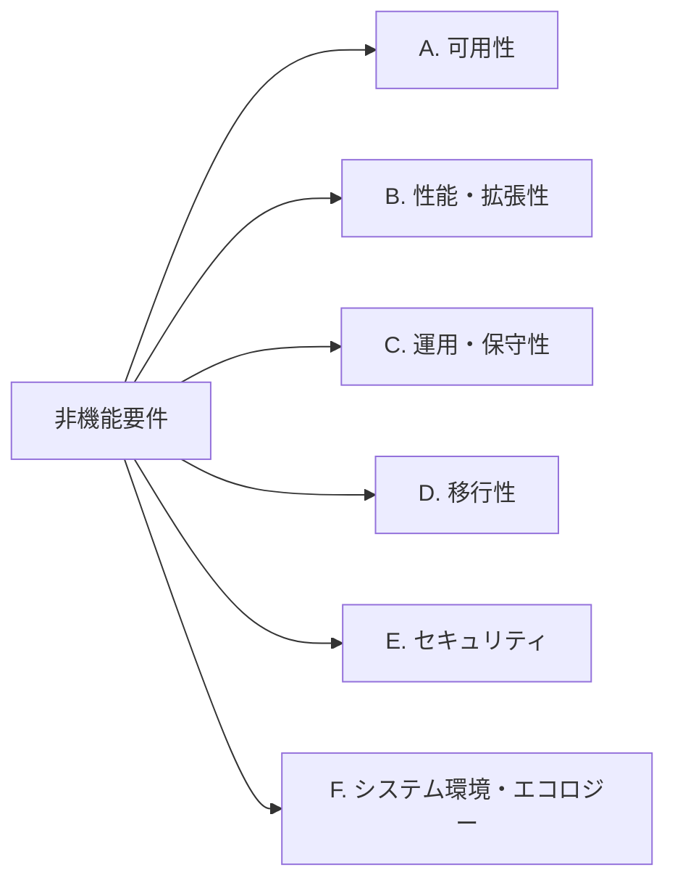

# A01010 非機能要件一覧

## 1. 本書の位置付け

本書は「書籍管理Webアプリ」（以下、本システム）に対する**非機能要件**を一覧化したものである。
機能要件は [B01020 システム化業務一覧](./B01020_システム化業務一覧.md) を参照のこと。
振舞いに関する共通ルールは [B01010 システム振舞い共通ルール](./B01010_システム振舞い共通ルール.md) に従う。

本書の要件は、後続の以下成果物で具体化される。

- A03110 ソフトウェア論理構成
- A03130 ソフトウェア実現方針

---

## 2. 前提

| 項目         | 内容                                                       |
| ------------ | ---------------------------------------------------------- |
| 利用者数     | 1名（個人利用、同時アクセスは1セッションのみ）             |
| 利用環境     | 個人Windows PC上のローカル起動Webアプリ                    |
| 実行環境     | Node.js 24 LTS                                             |
| 通信         | localhost のみ（外部ネットワーク公開なし）                 |
| データ件数   | 想定 数百〜数千件規模（個人蔵書として現実的な上限）        |

---

## 3. 非機能要件分類

[IPA 非機能要求グレード](https://www.ipa.go.jp/) の大分類を踏まえ、本システムの規模に合わせて6分類で整理する。

---

## 4. 非機能要件一覧

| 要件ID  | 分類             | 要件名                       | 内容                                                                                       | 目標値・判定基準                                  |
| ------- | ---------------- | ---------------------------- | ------------------------------------------------------------------------------------------ | ------------------------------------------------- |
| NFR-A01 | A. 可用性        | 稼働時間                     | ユーザがローカル起動した間のみ稼働すればよく、24時間運用は求めない。                       | ユーザ起動中に正常応答すること                    |
| NFR-A02 | A. 可用性        | 障害復旧                     | プロセス異常終了時はユーザによる再起動で復旧できる。                                       | 再起動操作で前回データを失わずに復旧             |
| NFR-A03 | A. 可用性        | データ永続性                 | アプリ終了・PC 再起動後もデータが失われない。                                              | ローカルストレージ／ファイルに永続化              |
| NFR-B01 | B. 性能・拡張性  | 画面応答時間                 | 1ユーザ・1セッション前提で、主要操作の応答が体感的に遅延しない。                          | 通常操作の応答 1秒以内（ローカル環境）            |
| NFR-B02 | B. 性能・拡張性  | 一覧表示性能                 | 書籍が想定上限件数まで増えても一覧表示が劣化しない。                                      | 1,000件登録時にも 1ページ表示 1秒以内             |
| NFR-B03 | B. 性能・拡張性  | スケーラビリティ             | 個人利用に特化し、マルチユーザ・水平スケールは対象外。                                    | 同時セッション 1                                  |
| NFR-C01 | C. 運用・保守性  | インストール                 | Node.js 24 LTS がインストールされた PC で、コマンド一発で起動できる。                     | `npm install` ＋ 起動コマンドで動作               |
| NFR-C02 | C. 運用・保守性  | ログ                         | サーバ側で操作ログ／エラーログをローカルファイルに出力する。                              | INFO / WARN / ERROR の3レベル、UTF-8、ローテーション任意 |
| NFR-C03 | C. 運用・保守性  | バックアップ                 | ユーザがデータファイル単位でコピー／復元できる構成とする。                                | データはファイル単位で取り出し可能                |
| NFR-C04 | C. 運用・保守性  | バージョン表示               | フッタにアプリのバージョン番号を表示する（[G01010] 3.3）。                                | `vX.Y.Z` 形式で表示                               |
| NFR-D01 | D. 移行性        | データ移行                   | 既存システムからの移行は対象外（新規システム）。                                          | 移行手順は不要                                    |
| NFR-D02 | D. 移行性        | エクスポート/インポート      | 将来の PC 乗り換え用にエクスポート機能の余地を残すが、初版では必須としない。              | 初版スコープ外（任意拡張）                        |
| NFR-E01 | E. セキュリティ  | 認証・認可                   | ログイン機能は持たない。単一ユーザ前提のため認可制御も行わない（[B01010] 5.1）。          | 認証なしを正式仕様とする                          |
| NFR-E02 | E. セキュリティ  | 通信                         | localhost のみで待ち受け、外部ネットワークへのバインドを行わない。                        | 既定で `127.0.0.1` のみで待ち受け                 |
| NFR-E03 | E. セキュリティ  | 入力検証                     | 画面側・サーバ側の二重バリデーションを行う（[B01010] 5.2）。SQL/コマンドインジェクションを防ぐ。 | 二重検証の実装                                    |
| NFR-E04 | E. セキュリティ  | CSRF/XSS 対策                | 認証はないが、外部ページからの誘導や入力経由のスクリプト実行を防止する。                  | 出力時エスケープ・CSRF トークンは設計工程で判断   |
| NFR-E05 | E. セキュリティ  | データ外部送信               | データは外部に送信しない（[B01010] 5.9）。                                                | 外部 API 呼び出しを行わない                       |
| NFR-E06 | E. セキュリティ  | エラー情報の隠蔽             | スタックトレース等の技術的詳細をユーザに見せない（[B01010] 5.7）。                        | 共通エラーページで日本語メッセージのみ表示        |
| NFR-F01 | F. システム環境  | 対応 OS                      | Windows 10/11 上で動作すること（個人利用想定）。                                          | Windows 10/11 で起動・操作可能                    |
| NFR-F02 | F. システム環境  | 対応ブラウザ                 | モダンブラウザ最新版（Chrome / Edge / Firefox）。                                         | 上記ブラウザの最新版で動作                        |
| NFR-F03 | F. システム環境  | ランタイム                   | Node.js 24 LTS で動作すること。                                                            | `node -v` が 24.x.x                               |
| NFR-F04 | F. システム環境  | 文字コード                   | データ・ログ・ソースは UTF-8（BOM なし）（[B01010] 5.9）。                                | UTF-8 で統一                                      |
| NFR-F05 | F. システム環境  | UI 言語                      | UI 表示は日本語のみ。多言語化は対象外（[B01010] 5.6）。                                   | 日本語固定                                        |
| NFR-F06 | F. システム環境  | アクセシビリティ             | キーボードのみで全操作可能、フォーカス可視（[B01010] 5.8 / [G01010] 10）。                | WCAG 2.1 レベル A 相当                            |

---

## 5. 適用範囲外の事項

本システムの性質上、以下は非機能要件として扱わない。

- マルチユーザ／同時アクセス制御
- 高可用構成（冗長化、フェイルオーバー）
- 外部ネットワーク経由のリモートアクセス
- 法令対応・監査ログ・個人情報保護法対応（個人蔵書のため）
- モバイル端末最適化・印刷スタイル

---

## 6. 要件ID 命名規則

- 形式：`NFR-{分類記号}{連番2桁}`
- 分類記号：A=可用性 / B=性能 / C=運用 / D=移行 / E=セキュリティ / F=システム環境
- 例：`NFR-E03`（セキュリティ分類の3番目）

---

## 7. 後続成果物との対応

| 要件ID 群     | 主な引継ぎ先                            |
| ------------- | --------------------------------------- |
| NFR-A* / B*   | A03110 ソフトウェア論理構成             |
| NFR-C* / F*   | A03130 ソフトウェア実現方針             |
| NFR-E*        | A03130 ソフトウェア実現方針（セキュリティ方針節） |

---

## 8. B01010 共通ルールに対する例外

なし。

## 9. 改訂履歴

| 版   | 日付       | 改訂者   | 内容       |
| ---- | ---------- | -------- | ---------- |
| 1.0  | 2026-05-19 | Devin AI | 初版作成   |
