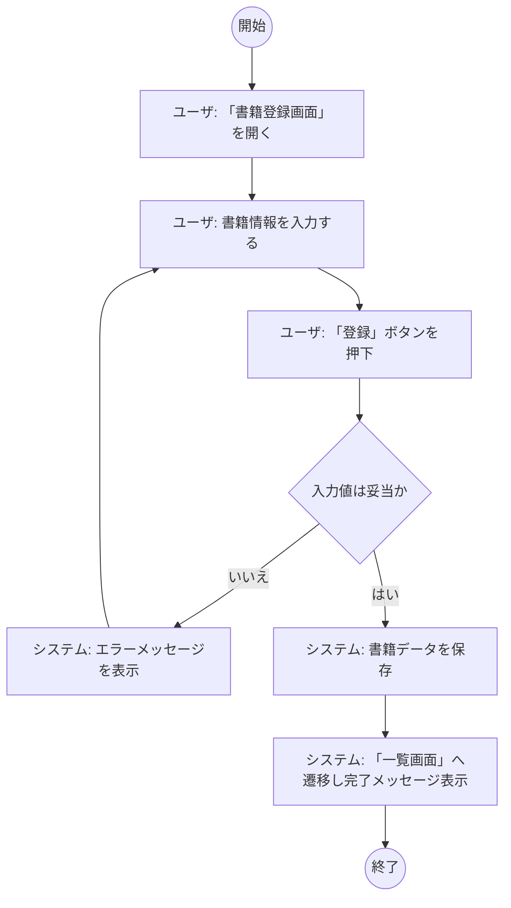
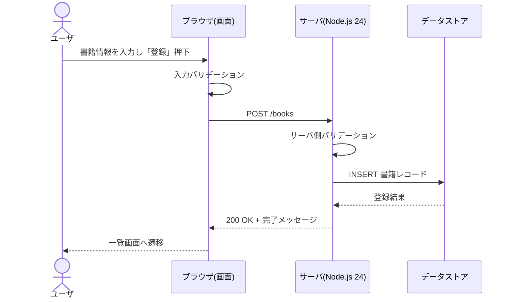
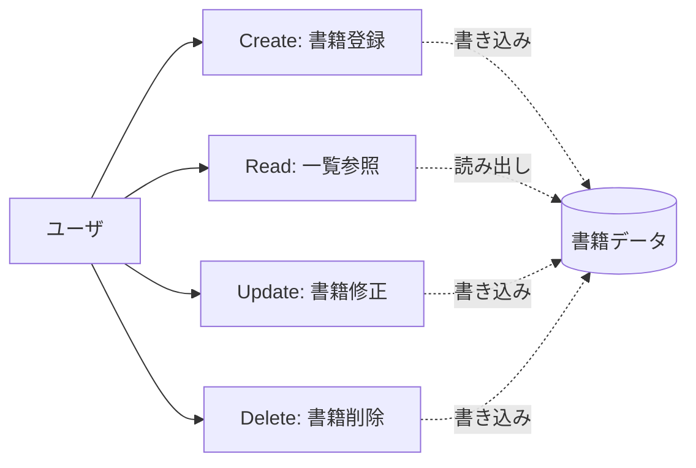
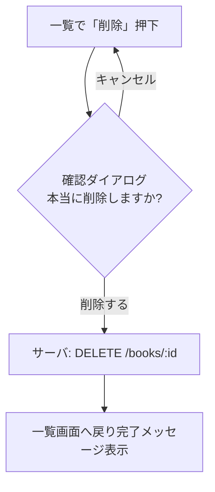

# B01010 システム振舞い共通ルール

## 1. 本書の位置付け

本書は「書籍管理Webアプリ」（以下、本システム）の要件定義工程における**全成果物に共通して適用される記述ルールおよび振舞いルール**を定義する。
本書で定めたルールは、業務一覧（B01020）・業務フロー・システムコンテキストダイアグラム（B02010）・以降の外部設計／基本設計／詳細設計の各成果物にも継承される。

| 項目         | 内容                                                                 |
| ------------ | -------------------------------------------------------------------- |
| システム名   | 書籍管理Webアプリ                                                    |
| 利用形態     | 個人Windows PC上で利用するWebアプリ（ローカル起動）                  |
| 利用者数     | 1名（個人利用）                                                      |
| 認証         | なし（ログイン機能を持たない）                                       |
| 実行環境     | Node.js 24 LTS                                                       |
| 主ユースケース | 書籍登録(1件)、一覧参照(10件/ページ)、修正(1件)、削除(1件)         |
| UI言語       | 日本語                                                               |

---

## 2. 業務一覧の記述ルール

業務一覧（B01020 等）は、本システムが扱う業務単位を一覧化したものである。
以下の項目順・粒度で記述する。

### 2.1 必須項目

| 列名         | 説明                                                       | 例                       |
| ------------ | ---------------------------------------------------------- | ------------------------ |
| 業務ID       | `Bnnnnn` 形式の一意なID。要件定義書の章番号と整合させる。  | `B11010`                 |
| 業務名       | 業務を端的に表す日本語名称。動詞＋目的語を基本とする。     | 書籍を登録する           |
| 業務概要     | 一文（80字以内）で業務の目的・入力・出力を示す。           | 1冊の書籍情報を登録する  |
| アクター     | 業務を実行する人または外部システム。本システムでは「ユーザ」のみ。 | ユーザ           |
| トリガ       | 業務開始の契機（画面操作・時間・外部イベント）。           | 「登録」ボタン押下       |
| 関連ユースケース | ユースケースIDを記載する。                             | UC-01                    |

### 2.2 記述粒度ルール

- 1業務 = 1ユースケース = 1ユーザゴール を原則とする。
- CRUD のうち画面遷移や入力フォームが独立するものは、それぞれ別業務として記述する（登録・修正・削除・参照は別業務）。
- 「ログインする」「ログアウトする」など本システムに存在しない業務は記載しない。

---

## 3. 業務フローの記述ルール

業務フローは Mermaid 記法の `flowchart` または `sequenceDiagram` を用いて、Markdown 内に直接埋め込む。
PNG 等の画像ファイルは原則使用しない（差分管理性を優先する）。

### 3.1 表記の基本

- 主役は「ユーザ」と「本システム」の2レーンとする。外部システムは存在しない。
- 開始ノードは `((開始))`、終了ノードは `((終了))` で表す。
- 判断分岐は菱形 `{条件}` で表し、分岐ラベルは `はい` / `いいえ` を用いる（`Yes/No` は使用しない）。
- 画面名は `「画面名」` のように鉤括弧で囲む。

### 3.2 標準テンプレート（書籍登録の例）

### 3.3 シーケンス図の標準テンプレート

画面とサーバの責務分担を示す場合は `sequenceDiagram` を用いる。

---

## 4. 用語定義

本システム内で使用する主要用語の意味を以下に統一する。
本書で定義した用語以外の業界一般用語は、初出時に文脈で補足する。

| 用語 | 定義 | 補足 |
| ---- | ---- | ---- |
| **書籍** | 本システムが管理する単位データ。タイトル、著者、出版社、ISBN、出版日、登録日時、更新日時 等の属性を持つ。 | 物理本／電子本は区別しない。 |
| **ユーザ** | 本システムを利用する個人。本システムのアクターは1名のみで、ロール区別は持たない。 | ログイン機能を持たないため、ユーザの識別・認証は行わない。 |
| **一覧** | 登録済みの書籍を表形式で表示する画面または応答データ。1ページ最大10件を表示し、ページネーションで前後ページに遷移する。 | 既定の並び順は「登録日時の降順」とする。 |
| **CRUD** | データ操作の4分類（Create=登録／Read=参照／Update=修正／Delete=削除）。本システムは書籍に対する CRUD をすべて提供する。 | 1リクエストで操作する件数は、登録・修正・削除は各 **1件**、参照（一覧）は **最大10件/ページ** とする。 |

### 4.1 CRUD と業務の対応

---

## 5. 共通振舞いルール

すべての画面・機能で守るべき横断的な振舞いを以下に定める。
個別ユースケースで本ルールを上書きする場合は、当該設計書に明示すること。

### 5.1 認証・認可

- **ログイン機能は提供しない。** 認証画面・サインアップ・パスワードリセット等の機能も存在しない。
- 利用者は単一であることを前提とする。ロール・権限制御は行わない。
- セッション・Cookie によるユーザ識別は行わない（CSRF 対策は別途技術設計で扱う）。

### 5.2 入力バリデーション

- バリデーションは **画面側（即時フィードバック）** と **サーバ側（最終チェック）** の二重で行う。
- バリデーション失敗時は、対象入力欄の直下に赤字でエラーメッセージを表示し、フォーカスを最初のエラー欄へ移す。
- 必須項目は項目名の末尾に `*` を付け、ラベルに `aria-required="true"` を付与する。
- 文字数上限を超える入力は、画面側で入力自体を制限する（コピー&ペースト含む）。
- 日付は `YYYY-MM-DD` 形式に統一し、ブラウザの `<input type="date">` を用いる。

### 5.3 削除確認

- 削除操作は **必ず確認ダイアログを介する**（誤操作防止のため）。
- ダイアログの既定フォーカスは **「キャンセル」** とする。
- 削除実行後は元に戻せない（論理削除は行わない）。完了後は一覧画面へ戻り、完了メッセージを表示する。

### 5.4 一覧表示・ページネーション

- 1ページあたりの表示件数は **10件固定**。
- ページャは「先頭 / 前へ / ページ番号 / 次へ / 末尾」を表示する。
- 0件時は表ではなく「登録された書籍はありません」というメッセージとし、登録画面への導線リンクを表示する。
- 既定ソートは「登録日時の降順」。各列ヘッダクリックで昇順／降順をトグルできる。

### 5.5 メッセージ表示

- 成功メッセージは画面上部に**緑系の通知バー**で 3 秒間表示し、自動で閉じる。
- エラーメッセージは**赤系の通知バー**で表示し、ユーザが閉じるまで残す。
- メッセージ文言は **すべて日本語** で記述し、句点（。）で終える。

### 5.6 UI/言語ルール

- UI 表示言語は **日本語のみ**。多言語化は対象外。
- フォントはブラウザ既定の sans-serif 系を採用し、日本語可読性を優先する。
- 日時表記は `YYYY-MM-DD HH:mm`（24時間制、ローカルタイムゾーン）に統一する。
- 数値（件数等）は3桁区切りカンマを付ける（例：1,234件）。
- ボタンラベルは動詞で統一（例：「登録」「修正」「削除」「戻る」）。

### 5.7 エラーハンドリング

- 想定内エラー（バリデーション、対象不在 等）：個別画面で日本語メッセージを表示。
- 想定外エラー（サーバ例外 等）：共通エラーページで「処理中にエラーが発生しました。時間をおいて再度お試しください。」を表示する。
- いかなる場合もスタックトレース等の技術的詳細をユーザに見せない。

### 5.8 アクセシビリティ・操作性

- すべての操作はキーボードのみで完了できること（Tab で順送り、Enter で実行、Esc でダイアログ閉じ）。
- ボタン・リンクには `aria-label` または可視テキストを付与する。
- 画面遷移時はページタイトル（`<title>`）を遷移先の画面名に更新する。

### 5.9 データ保存

- データは個人 PC 上のローカル領域に保存する（外部送信を行わない）。
- 文字エンコーディングは UTF-8 とする。
- 数値ID（書籍ID）はサーバ採番・自動採番で、ユーザは入力しない／変更できない。

---

## 6. ルール適用範囲と例外

- 本書のルールは要件定義以降のすべての成果物に適用する。
- 例外を設ける場合、該当成果物に「**B01010 共通ルールに対する例外**」節を設け、理由を明記する。
- 本書の改訂時は、改訂履歴に変更内容と影響範囲（依存ドキュメント）を記載する。

## 7. 改訂履歴

| 版   | 日付       | 改訂者   | 内容       |
| ---- | ---------- | -------- | ---------- |
| 1.0  | 2026-05-19 | Devin AI | 初版作成   |
