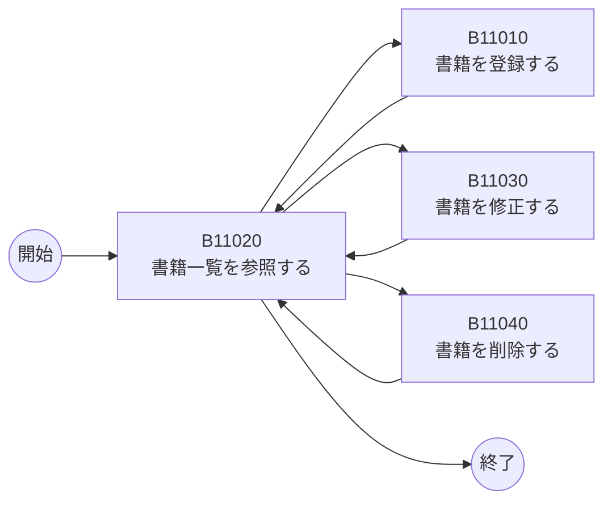

# B01020 システム化業務一覧

## 1. 本書の位置付け

本書は「書籍管理Webアプリ」（以下、本システム）が提供する業務を一覧化したものである。
記述ルール・粒度・項目順は [B01010 システム振舞い共通ルール](./B01010_システム振舞い共通ルール.md) の「2. 業務一覧の記述ルール」に準拠する。

本書で定義する業務は、後続の以下成果物の基礎入力となる。

- B01030 システム化業務フロー（本書の各業務の手順を Mermaid で図示）
- B02030 ユースケース図（本書の関連ユースケース ID と1対1で対応）
- B02040 ユースケース記述

---

## 2. 前提

| 項目         | 内容                                                       |
| ------------ | ---------------------------------------------------------- |
| アクター     | ユーザ（1名のみ、認証なし）                                |
| 対象データ   | 書籍（タイトル/著者/ISBN/出版社/購入日/価格/メモ）         |
| 操作単位     | 登録・修正・削除は1件単位、一覧参照は10件/ページ           |
| 実行環境     | 個人Windows PC上のWebアプリ（Node.js 24 LTS）              |

業務の境界は「1業務 = 1ユーザゴール = 1ユースケース」とし、書籍に対する CRUD を独立業務として分解する。

---

## 3. 業務一覧

| 業務ID  | 業務名             | 業務概要                                                                       | アクター | トリガ                       | 関連ユースケース |
| ------- | ------------------ | ------------------------------------------------------------------------------ | -------- | ---------------------------- | ---------------- |
| B11010  | 書籍を登録する     | 1冊の書籍情報（タイトル・著者必須、その他任意）を入力し、書籍データを新規登録する。 | ユーザ   | 「書籍登録」画面で「登録」押下 | UC-01            |
| B11020  | 書籍一覧を参照する | 登録済み書籍を10件/ページで一覧表示し、ページャで前後ページに遷移する。        | ユーザ   | 「一覧」画面の表示またはページ移動 | UC-02            |
| B11030  | 書籍を修正する     | 1冊の書籍情報を編集画面で更新する。タイトル・著者は必須。                       | ユーザ   | 一覧で対象行の「修正」押下   | UC-03            |
| B11040  | 書籍を削除する     | 確認ダイアログを介して1冊の書籍データを物理削除する。                          | ユーザ   | 一覧で対象行の「削除」押下   | UC-04            |

### 3.1 補足

- **登録・修正・削除は各 1件単位**、一覧参照は1ページ最大10件（[B01010] 5.4 に準拠）。
- 本システムは認証を持たないため、「ログインする」「ログアウトする」業務は存在しない（[B01010] 5.1）。
- 物理削除のみで論理削除は行わない（[B01010] 5.3）。

---

## 4. 業務間の関係

各業務の遷移関係を以下に示す。一覧参照を基点として、登録・修正・削除へ分岐する。

各業務は完了後に一覧画面へ戻る（[B01010] 5.3 / 5.4 に準拠）。

---

## 5. ユースケース ID との対応

| 業務ID  | 業務名             | ユースケースID | CRUD区分 |
| ------- | ------------------ | -------------- | -------- |
| B11010  | 書籍を登録する     | UC-01          | Create   |
| B11020  | 書籍一覧を参照する | UC-02          | Read     |
| B11030  | 書籍を修正する     | UC-03          | Update   |
| B11040  | 書籍を削除する     | UC-04          | Delete   |

---

## 6. B01010 共通ルールに対する例外

なし。

## 7. 改訂履歴

| 版   | 日付       | 改訂者   | 内容       |
| ---- | ---------- | -------- | ---------- |
| 1.0  | 2026-05-19 | Devin AI | 初版作成   |
