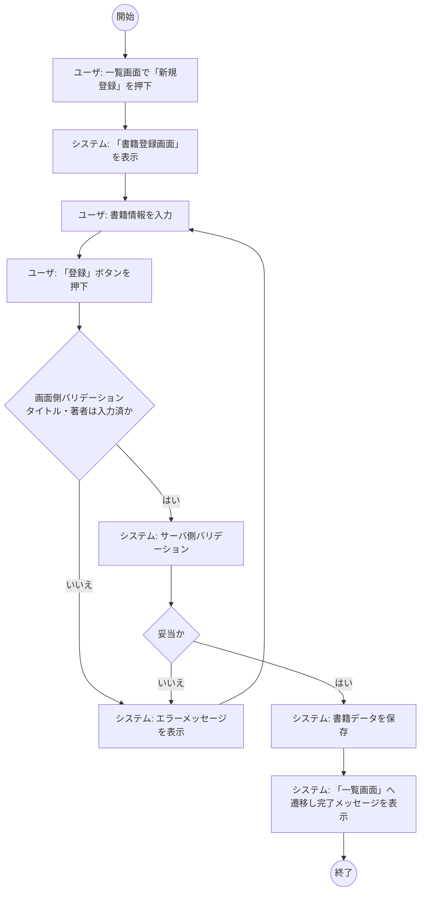
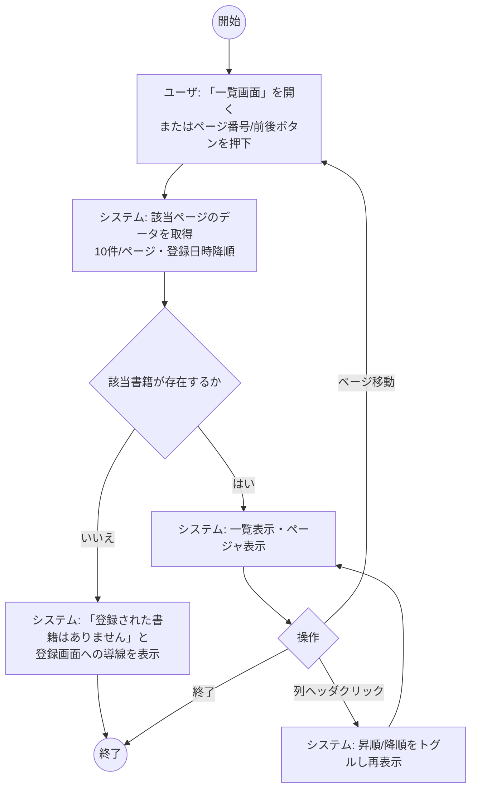
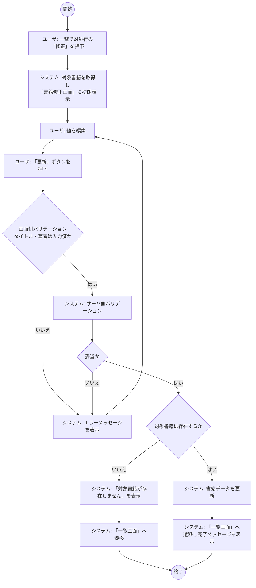
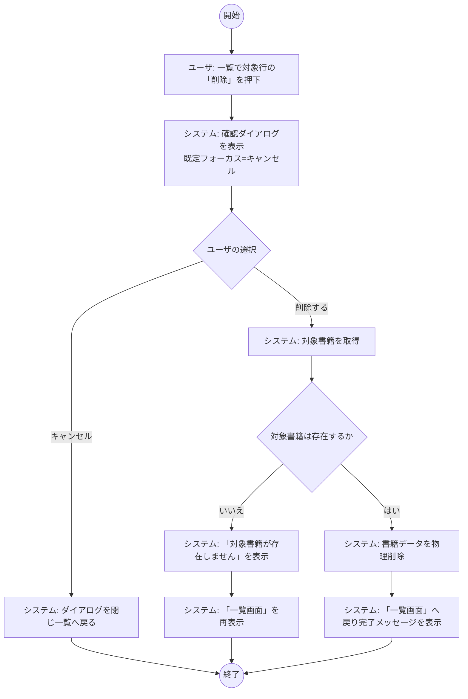
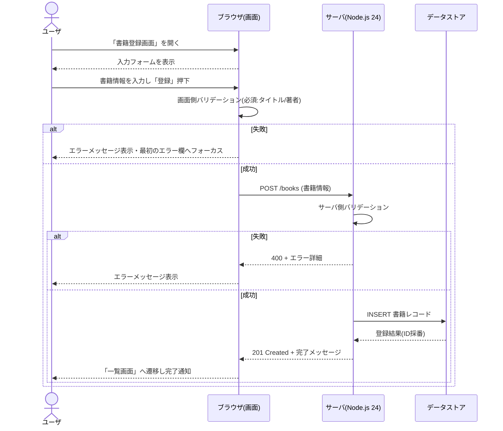

# B01030 システム化業務フロー

## 1. 本書の位置付け

本書は [B01020 システム化業務一覧](./B01020_システム化業務一覧.md) に列挙した4業務（B11010〜B11040）について、ユーザと本システム（書籍管理Webアプリ）の振舞いを業務フローとして示すものである。

記法・凡例・共通振舞いは [B01010 システム振舞い共通ルール](./B01010_システム振舞い共通ルール.md) の「3. 業務フローの記述ルール」と「5. 共通振舞いルール」に準拠する。

---

## 2. 凡例

- レーンは「ユーザ」「本システム」の2レーン構成（外部システムなし）。
- 開始 `((開始))` / 終了 `((終了))` / 判断 `{条件}`（分岐ラベルは「はい/いいえ」）。
- 画面名は `「画面名」` のように鉤括弧で囲む。
- 入力バリデーションは画面側・サーバ側の二重で行う（[B01010] 5.2）。

---

## 3. B11010 書籍を登録する

タイトル・著者を必須とし、ISBN・出版社・購入日・価格・メモは任意で入力する。

---

## 4. B11020 書籍一覧を参照する

既定ソートは登録日時の降順、1ページ10件固定。0件時は登録画面への導線を表示する（[B01010] 5.4）。

---

## 5. B11030 書籍を修正する

修正対象は1件、必須項目はタイトル・著者。

---

## 6. B11040 書籍を削除する

確認ダイアログ必須、既定フォーカスは「キャンセル」、物理削除のみ（[B01010] 5.3）。

---

## 7. 代表シーケンス（書籍登録）

画面とサーバの責務分担を補足する。記法は [B01010] 3.3 に準拠。

---

## 8. B01010 共通ルールに対する例外

なし。

## 9. 改訂履歴

| 版   | 日付       | 改訂者   | 内容       |
| ---- | ---------- | -------- | ---------- |
| 1.0  | 2026-05-19 | Devin AI | 初版作成   |
