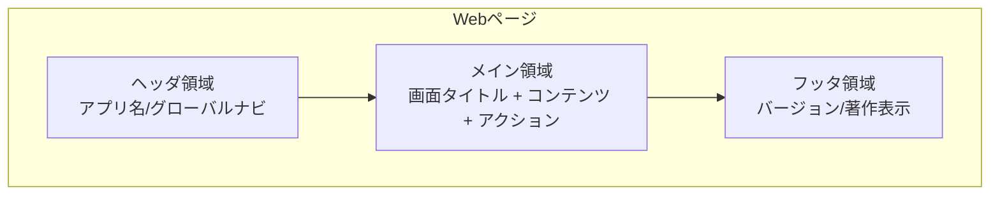
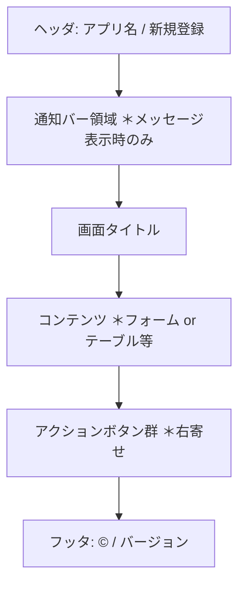

# G01010 レイアウト共通ルール

## 1. 本書の位置付け

本書は「書籍管理Webアプリ」（以下、本システム）の全画面に共通して適用する**画面レイアウト・UI構成・スタイルのルール**を定義する。

本書で定めたルールは、後続の以下成果物に継承される。

- G02010 画面一覧 / G02020 画面遷移 / G02030 画面レイアウト
- G02070 メッセージ一覧

振舞いに関する共通ルール（バリデーション、削除確認、ページネーション等）は [B01010 システム振舞い共通ルール](./B01010_システム振舞い共通ルール.md) に従い、本書はあくまでレイアウト面のルールを扱う。

---

## 2. 前提

| 項目             | 内容                                                          |
| ---------------- | ------------------------------------------------------------- |
| 利用環境         | 個人Windows PC上のWebブラウザ（モダンブラウザ最新版を想定）   |
| UI言語           | 日本語のみ                                                    |
| 想定解像度       | 1280×720 以上（PC利用前提、モバイル最適化は対象外）           |
| 想定操作         | マウス＋キーボード（キーボードのみでも全操作可能）            |
| アクセシビリティ | WCAG 2.1 レベル A 相当を目安とする                            |

---

## 3. 画面構成

すべての画面は以下の3領域構成を採用する。

### 3.1 ヘッダ領域

- 左寄せでアプリ名「書籍管理」を表示し、クリックで「一覧画面」へ遷移する。
- 右寄せでグローバルナビとして「新規登録」リンクを配置する。
- ヘッダ高さは 56px 固定、背景は濃色（白文字）。
- メッセージ表示領域（通知バー）はヘッダ直下に固定配置する（[B01010] 5.5）。

### 3.2 メイン領域

- 画面タイトル（`<h1>`）→ 説明文（任意）→ コンテンツ → アクションボタン群 の順に縦並びで配置する。
- 横幅は最大 960px・中央寄せ。左右の余白は 16px 以上を確保する。
- セクション間の縦マージンは 24px を基本とする。

### 3.3 フッタ領域

- フッタ高さは 40px 固定、背景は淡色。
- 中央寄せで「© 書籍管理 v{バージョン}」を表示する。

---

## 4. グリッド・余白・タイポグラフィ

### 4.1 余白とサイズ

| トークン   | 値       | 用途                                  |
| ---------- | -------- | ------------------------------------- |
| spacing-xs | 4px      | 隣接要素間の最小余白                  |
| spacing-s  | 8px      | アイコンとラベルの間など              |
| spacing-m  | 16px     | フォームフィールド間、ボタン間        |
| spacing-l  | 24px     | セクション間                          |
| spacing-xl | 32px     | 画面タイトルとコンテンツ間            |

### 4.2 文字サイズ・ウェイト

| 用途         | サイズ | ウェイト | 備考                       |
| ------------ | ------ | -------- | -------------------------- |
| 画面タイトル | 24px   | 700      | `<h1>` 相当                |
| セクション見出し | 18px | 700      | `<h2>` 相当                |
| 本文         | 14px   | 400      | 既定                       |
| 補足・注釈   | 12px   | 400      | 灰色文字                   |
| ボタンラベル | 14px   | 600      | 動詞で統一（[B01010] 5.6） |

### 4.3 行高・フォント

- 行高は本文 1.6、見出し 1.3 を基本とする。
- フォントはブラウザ既定の sans-serif（OS の日本語フォント）に従う（[B01010] 5.6）。

---

## 5. カラーパレット

| トークン       | 用途                       | 例                       |
| -------------- | -------------------------- | ------------------------ |
| color-primary  | ヘッダ背景・主要ボタン     | 濃色（白文字とのコントラスト比 4.5 以上） |
| color-accent   | フォーカスリング・リンク   | 視認性の高い青系         |
| color-success  | 成功通知バー               | 緑系（[B01010] 5.5）     |
| color-error    | エラー通知バー・必須エラー | 赤系（[B01010] 5.5）     |
| color-warning  | 警告通知バー               | 橙系                     |
| color-bg       | ページ背景                 | 白〜淡灰                 |
| color-text     | 本文文字色                 | 濃灰（黒に近い）         |
| color-muted    | 補足文字色・境界線         | 中間灰                   |

文字色と背景色のコントラスト比は **4.5:1 以上** を確保する（WCAG AA 相当）。

---

## 6. フォーム要素

### 6.1 フォームレイアウト

- ラベルは入力欄の **上**に配置する（縦並び）。
- 必須項目はラベル末尾に赤色の `*` を付け、`aria-required="true"` を付与する（[B01010] 5.2）。
- 入力欄の幅は内容に応じて 240px / 480px / 100% の3段階で使い分ける。
- 入力欄下に補足説明（プレースホルダではなく説明テキスト）を 12px で表示できる。

### 6.2 エラー表示

- バリデーション失敗時は対象欄の**直下**に赤字（color-error）でエラーメッセージを表示する。
- 入力欄の枠線を赤色に変更し、`aria-invalid="true"` を付与する。
- 最初のエラー欄へフォーカスを移す（[B01010] 5.2）。

### 6.3 ボタン

| 種別       | 用途                           | スタイル                       |
| ---------- | ------------------------------ | ------------------------------ |
| プライマリ | 「登録」「更新」「削除する」等の主アクション | color-primary 塗りつぶし       |
| セカンダリ | 「キャンセル」「戻る」等       | 白背景＋枠線                   |
| 危険       | 削除確定ボタン                 | color-error 塗りつぶし         |
| リンク風   | 補助的なテキストリンク         | 下線＋color-accent             |

- ボタンの最小高さは 36px、左右パディング 16px。
- アクション群は右寄せで配置し、主アクションを右端、副アクションを左に置く。
- 押下中はローディング状態（スピナー＋disabled）を表示する。

---

## 7. テーブル（一覧）

- 表ヘッダはスティッキー（縦スクロール時に固定）とする。
- 偶数行に淡灰色のゼブラストライプを付ける。
- 行の右端に「修正」「削除」のアクションボタンを配置する。
- 列ヘッダクリックでソート（昇順/降順/解除のトグル）（[B01010] 5.4）。
- 0件時は表ではなく案内メッセージ＋登録画面リンクを表示する（[B01010] 5.4）。

---

## 8. ダイアログ（モーダル）

- 削除確認等のモーダルは画面中央に表示し、背景を半透明オーバーレイで覆う。
- 既定フォーカスは安全側のボタン（例：削除確認ダイアログは「キャンセル」）（[B01010] 5.3）。
- `Esc` キーでキャンセル相当の動作を行う。
- 開いている間、背景はスクロール禁止とする。

---

## 9. メッセージ表示

[B01010] 5.5 に準拠する。レイアウト上のルールは以下のとおり。

| 種別     | 配置             | 表示時間 | 背景色        |
| -------- | ---------------- | -------- | ------------- |
| 成功     | ヘッダ直下に通知バー | 3秒で自動クローズ | color-success |
| エラー   | ヘッダ直下に通知バー | ユーザが閉じるまで残す | color-error   |
| 警告     | ヘッダ直下に通知バー | ユーザが閉じるまで残す | color-warning |

文言ルール（日本語・句点で終える等）は [B01010] 5.5 を参照。

---

## 10. アクセシビリティ・キーボード操作

- Tab 順序は左上→右下に向かう論理順とする（[B01010] 5.8）。
- フォーカスリングは必ず可視（color-accent の 2px アウトライン）。CSS で `outline: none` を単独で指定しない。
- ボタン・リンク・フォーム要素は `aria-label` または可視テキストでラベル付けする（[B01010] 5.8）。
- 画面遷移時に `<title>` を遷移先画面名へ更新する（[B01010] 5.8）。
- 色のみで意味を伝えない（必須は `*`、エラーはアイコン＋テキスト等を併用）。

---

## 11. レスポンシブ方針

- 想定主解像度は 1280×720 以上の PC ブラウザ。
- 1024px 未満のビューポートではレイアウト崩れを防ぐ最小限の対応のみ行い、モバイル最適化は対象外とする。
- 印刷スタイルは対象外。

---

## 12. 標準画面骨格

各画面は以下の骨格をベースに、メイン領域の中身のみを差し替える。

---

## 13. B01010 共通ルールに対する例外

なし。

## 14. 改訂履歴

| 版   | 日付       | 改訂者   | 内容       |
| ---- | ---------- | -------- | ---------- |
| 1.0  | 2026-05-19 | Devin AI | 初版作成   |
