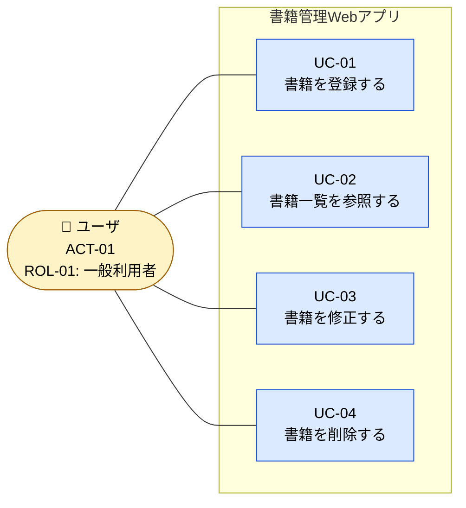

# B02020 アクタ定義 / ロール定義

## 1. 本書の位置付け

本書は「書籍管理Webアプリ」（以下、本システム）における**アクタ（Actor）**および**ロール（Role）**を定義する。

ユースケース図（B02030）・ユースケース記述（B02040）・画面遷移（G02020）等の後続成果物で参照する**唯一のアクタ集合**を確定することが目的である。

前提とする上位ドキュメント:

- [B01010 システム振舞い共通ルール](../010_要件定義/B01010_システム振舞い共通ルール.md)
- [B02010 システムコンテキストダイアグラム](./B02010_システムコンテキストダイアグラム.md)

---

## 2. アクタ定義の方針

| 観点               | 方針                                                                                              |
| ------------------ | ------------------------------------------------------------------------------------------------- |
| 認証               | 本システムはログイン機能を持たない（[B01010] 5.1）。アクタの**識別・認証は行わない**。            |
| 利用者数           | 1名（個人利用）。同時利用は想定しない。                                                           |
| ロール（権限区分） | **単一ロールのみ**。CRUD すべてを実行可能。ロールによる権限制御は行わない。                       |
| 外部システム       | 連携先となる外部システムは存在しない（[B02010] 3章）。よって**システムアクタは定義しない**。      |
| タイマ・ジョブ     | 定期実行・バッチ・スケジューラは存在しない。タイマアクタは定義しない。                            |

> **結論**: 本システムのアクタは**「ユーザ」1種類のみ**である。

---

## 3. アクタ一覧

| アクタID | アクタ名 | 区分         | 人数 | 主要関心事                                       | 関連ユースケース        |
| -------- | -------- | ------------ | ---- | ------------------------------------------------ | ----------------------- |
| ACT-01   | ユーザ   | プライマリ（人間） | 1名  | 自分の蔵書情報を登録・参照・修正・削除すること | UC-01 / UC-02 / UC-03 / UC-04 |

### 3.1 アクタ詳細: ACT-01 ユーザ

| 項目                | 内容                                                                                  |
| ------------------- | ------------------------------------------------------------------------------------- |
| 名称                | ユーザ                                                                                |
| 区分                | プライマリアクタ（人間・本システムの直接利用者）                                      |
| 識別方法            | 識別しない（認証なし、1名前提）                                                       |
| 利用デバイス        | 個人Windows PC、Webブラウザ                                                           |
| 想定スキル          | 一般的なPC/ブラウザ操作が可能。技術知識は不要。                                       |
| 利用頻度            | 日常的（書籍購入・整理のタイミングで使用）                                            |
| 主要ゴール          | 蔵書を1冊単位で登録・参照・修正・削除し、自分の書籍コレクションを管理する             |
| 入力                | 書籍情報（タイトル・著者・ISBN・出版社・購入日・価格・メモ）、画面操作                |
| 出力                | 一覧画面・登録/編集フォーム・通知メッセージ・確認ダイアログ                           |
| 制約                | 同時利用なし、外部送信なし、データはローカル保管                                      |

---

## 4. ロール定義

本システムは**単一ロール**のみを持つ。これはアクタ「ユーザ」に**1対1で対応**する。

| ロールID | ロール名     | 対応アクタ | 権限                                                                 |
| -------- | ------------ | ---------- | -------------------------------------------------------------------- |
| ROL-01   | 一般利用者   | ACT-01     | 書籍データに対する Create / Read / Update / Delete のすべてを実行可能 |

### 4.1 権限マトリクス（ロール × 操作）

| 操作                   | ROL-01 一般利用者 |
| ---------------------- | :---------------: |
| 書籍を登録する（C）    | ●                 |
| 書籍一覧を参照する（R）| ●                 |
| 書籍を修正する（U）    | ●                 |
| 書籍を削除する（D）    | ●                 |

> **凡例**: ● = 実行可能。本システムは権限制御を行わないため、すべての操作が許可される。

---

## 5. アクタ関連図

アクタとシステムの関係を、システムコンテキスト（B02010）の表現と整合する形で示す。

---

## 6. 不在のアクタ（明示的に定義しないもの）

将来要件の混入を防ぐため、本システムが**意図的に持たない**アクタを以下に明示する。

| 不在アクタ       | 不在の理由                                                                 |
| ---------------- | -------------------------------------------------------------------------- |
| 管理者           | ロール権限制御を行わないため不要（[B01010] 5.1）。                         |
| ゲスト／未認証   | 認証機能がなく、全利用者が「ユーザ」と等価。                               |
| 外部システム     | 連携先が存在しない（[B02010] 3章）。                                       |
| スケジューラ     | 定期実行・バッチが存在しない。                                             |
| 外部API/Webhook  | 外部通信を行わない。                                                       |

---

## 7. アクタの呼称ルール

後続成果物では以下の呼称に統一する。

- アクタ正式名: **ユーザ**
- 文書内表記: 「ユーザ」（鉤括弧不要）。一覧表のセル等で文脈上必要な場合のみ「ユーザ」と表記する。
- 英語表記: 必要な場合 `User`（PascalCase / 単数形）。
- システム側の呼称: 「本システム」または「システム」とし、「アプリ」「サーバ」等の表記揺れは行わない（[B01010] 4章）。

---

## 8. B01010 共通ルールに対する例外

なし。

## 9. 改訂履歴

| 版   | 日付       | 改訂者   | 内容       |
| ---- | ---------- | -------- | ---------- |
| 1.0  | 2026-05-19 | Devin AI | 初版作成   |
