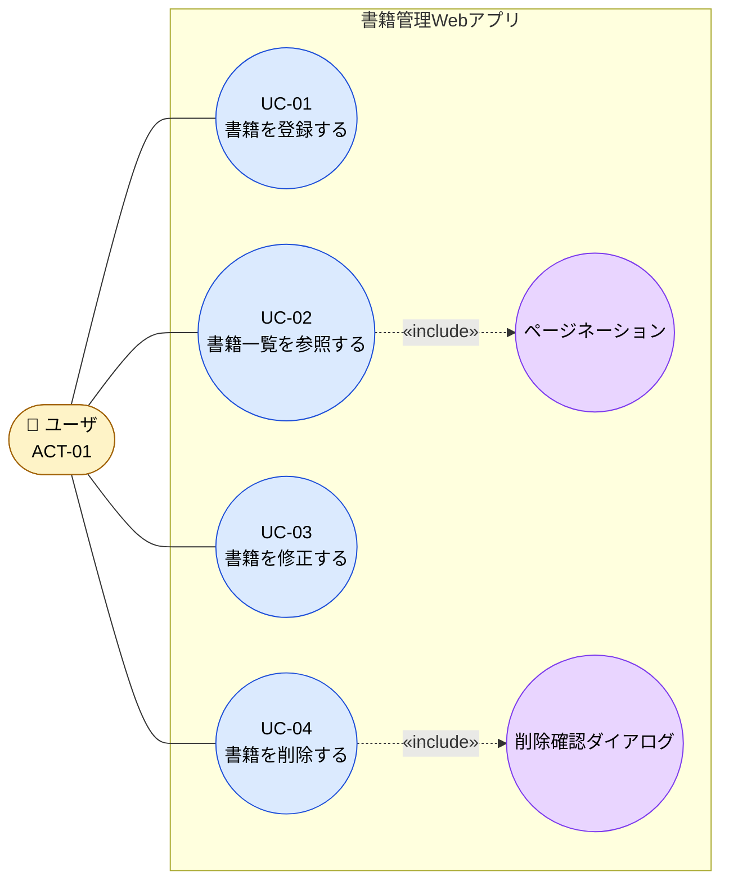
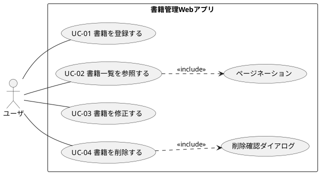
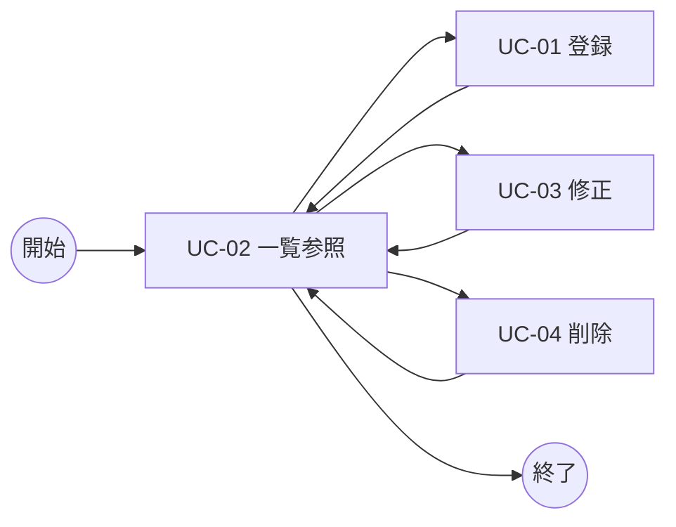

# B02030 ユースケース図

## 1. 本書の位置付け

本書は「書籍管理Webアプリ」（以下、本システム）の**ユースケース図**を定義する。

[B01020 システム化業務一覧](../010_要件定義/B01020_システム化業務一覧.md) で定義された業務、および [B02020 アクタ定義/ロール定義](./B02020_アクタ定義_ロール定義.md) で定義されたアクタを入力とし、ユーザとシステムの関わりを図示する。

本書のユースケースは、[B02040 ユースケース記述](./B02040_ユースケース記述.md) で詳細化される。

---

## 2. 前提

| 項目          | 内容                                                              |
| ------------- | ----------------------------------------------------------------- |
| アクタ        | ユーザ（ACT-01 / ROL-01 一般利用者）の1種類のみ                   |
| 対象データ    | 書籍（タイトル/著者/ISBN/出版社/購入日/価格/メモ）                |
| 業務範囲      | 書籍に対する CRUD（登録・参照・修正・削除）                       |
| 業務単位      | 登録/修正/削除は1件単位、参照（一覧）は10件/ページ                |
| 外部システム  | なし（[B02010] 参照）                                             |

---

## 3. ユースケース一覧

[B01020] 5章の業務 ID 対応表に準拠する。

| ユースケースID | ユースケース名     | 対応業務ID | CRUD区分 | アクタ |
| -------------- | ------------------ | ---------- | -------- | ------ |
| UC-01          | 書籍を登録する     | B11010     | Create   | ユーザ |
| UC-02          | 書籍一覧を参照する | B11020     | Read     | ユーザ |
| UC-03          | 書籍を修正する     | B11030     | Update   | ユーザ |
| UC-04          | 書籍を削除する     | B11040     | Delete   | ユーザ |

---

## 4. ユースケース図（全体）

PlantUML / Mermaid のいずれでも表現可能であるが、本書は **Mermaid** を用いる（[B01010] 3章のルールに準拠）。

### 4.1 図の凡例

| 記号                | 意味                                                                                          |
| ------------------- | --------------------------------------------------------------------------------------------- |
| 楕円 (UC)           | ユースケース                                                                                  |
| 人物アイコン        | アクタ（人間）                                                                                |
| 実線 (―)            | ユースケースとアクタの関連                                                                    |
| 点線 «include»      | ユースケースの中で必ず呼び出される共通振る舞い（包含）                                        |
| 角丸サブグラフ枠    | システム境界。枠内が本システムの責務範囲                                                      |

### 4.2 «include» 関係の説明

- **UC-02 ← ページネーション**: 一覧参照では、表示件数（10件/ページ）を超える場合に必ずページャを介して表示する。[B01010] 5.4 のルールが包含される。
- **UC-04 ← 削除確認ダイアログ**: 削除操作は確認ダイアログを必ず経由する。[B01010] 5.3 のルールが包含される。

> **注**: 包含する「ページネーション」「削除確認ダイアログ」は独立した業務ではなく、共通振舞いルールの再利用である。よってユースケース ID は付与しない。

---

## 5. PlantUML 表記（参考）

Mermaid を主表記とするが、PlantUML での同等表現を参考として併記する（将来 PlantUML ベースのドキュメント生成に切替えた場合の互換情報）。

---

## 6. ユースケース間の遷移関係

ユースケース図そのものではないが、画面遷移（G02020）の前提となる「ユースケース間の代表的な呼び出しシーケンス」を補足する。

- すべての業務は一覧画面（UC-02）を起点とし、完了後は一覧画面へ戻る（[B01010] 5.3 / 5.4）。

---

## 7. スコープ外ユースケース

以下は本システムが**意図的に持たない**ユースケースである。要件追加時の混入防止のため明示する。

| 不在ユースケース    | 不在の理由                                                          |
| ------------------- | ------------------------------------------------------------------- |
| ログイン／ログアウト | 認証機能を持たない（[B01010] 5.1）                                  |
| 一括登録 / 一括削除 | 操作単位は1件のみ（[B01010] 5.4 / [B01020] 3章）                    |
| 検索（タイトル等）  | 本リリースのスコープ外。一覧＋ページネーションのみ                  |
| 外部API連携         | 連携先が存在しない（[B02010] 3章）                                  |
| CSV/JSONエクスポート | ローカル DB ファイルのコピーで代替する（運用は利用者の自己責任）   |

---

## 8. B01010 共通ルールに対する例外

なし。

## 9. 改訂履歴

| 版   | 日付       | 改訂者   | 内容       |
| ---- | ---------- | -------- | ---------- |
| 1.0  | 2026-05-19 | Devin AI | 初版作成   |
