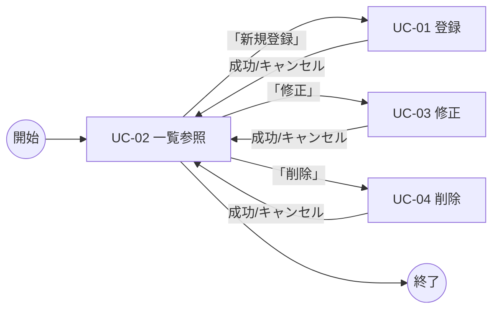

# B02040 ユースケース記述

## 1. 本書の位置付け

本書は [B02030 ユースケース図](./B02030_ユースケース図.md) で定義した各ユースケースを、**目的・事前条件・主成功シナリオ・代替シナリオ・例外シナリオ・事後条件**の観点で詳細化する。

本書は以下の後続成果物の基礎入力となる。

- G02010 画面一覧 / G02020 画面遷移 / G02030 画面レイアウト
- G02070 メッセージ一覧
- D02020 ER図（論理モデル）
- P03210 APIルーティング仕様（基本設計）

前提とする上位ドキュメント:
- [B01010 システム振舞い共通ルール](../010_要件定義/B01010_システム振舞い共通ルール.md)
- [B01020 システム化業務一覧](../010_要件定義/B01020_システム化業務一覧.md)
- [B02020 アクタ定義/ロール定義](./B02020_アクタ定義_ロール定義.md)

---

## 2. ユースケース記述の標準項目

| 項目             | 内容                                                                 |
| ---------------- | -------------------------------------------------------------------- |
| ユースケースID   | `UC-NN` 形式                                                         |
| ユースケース名   | 業務名と一致                                                         |
| 概要             | 1〜2文で目的を要約                                                   |
| プライマリアクタ | ユーザ                                                               |
| ステークホルダ   | システム本体（バリデーション・永続化を担う）                         |
| 事前条件         | このユースケース開始前に成立しているべき状態                         |
| トリガ           | ユースケース開始の契機                                               |
| 主成功シナリオ   | ハッピーパスの手順（番号付き）                                       |
| 代替シナリオ     | 主成功シナリオの途中で分岐する正常系                                 |
| 例外シナリオ     | エラー時に進む系（バリデーション失敗、対象不在等）                   |
| 事後条件         | 終了時に成立する状態                                                 |
| 関連画面         | 操作対象となる画面（G02010 でID化予定）                              |
| メッセージ       | 表示する成功・エラー・確認メッセージ（G02070 で詳細化）              |
| 備考             | 例外・補足                                                           |

---

## 3. UC-01 書籍を登録する

| 項目             | 内容                                                                                       |
| ---------------- | ------------------------------------------------------------------------------------------ |
| ユースケースID   | UC-01                                                                                      |
| ユースケース名   | 書籍を登録する                                                                             |
| 概要             | 1冊の書籍情報を入力し、書籍データを新規登録する。                                          |
| プライマリアクタ | ユーザ                                                                                     |
| 事前条件         | 本システムが起動している。ブラウザで本システムにアクセス可能である。                       |
| トリガ           | 一覧画面（SC01）のヘッダ「新規登録」リンク、または「書籍登録画面」（SC02）への直接遷移。   |
| 関連画面         | SC02 書籍登録フォーム                                                                      |

### 3.1 主成功シナリオ

1. ユーザは「書籍登録画面（SC02）」を開く。
2. 本システムは空のフォームを表示する。
3. ユーザはタイトル（必須）・著者（必須）・ISBN・出版社・購入日・価格・メモを入力する。
4. ユーザは「登録」ボタンを押下する。
5. 本システムはクライアント側バリデーションを実行する（必須・型・桁数）。
6. 本システムはサーバ側バリデーションを実行する（[B01010] 5.2）。
7. 本システムは書籍データを SQLite に INSERT する（`created_at` / `updated_at` を現在時刻で採番、`id` を自動採番）。
8. 本システムは一覧画面（SC01）へ遷移し、成功メッセージ「書籍を登録しました。」を緑系通知バーで 3 秒間表示する（[B01010] 5.5）。

### 3.2 代替シナリオ

| ID    | 分岐点 | 内容                                                                                       |
| ----- | ------ | ------------------------------------------------------------------------------------------ |
| 3a    | 手順4  | ユーザが「キャンセル」ボタン（または「戻る」リンク）を押下した場合、入力を破棄して一覧画面へ戻る。 |

### 3.3 例外シナリオ

| ID    | 発生点 | 内容                                                                                       |
| ----- | ------ | ------------------------------------------------------------------------------------------ |
| 5e    | 手順5  | クライアントバリデーション失敗。エラー欄を赤枠表示し、直下に赤字メッセージを表示。最初のエラー欄にフォーカスする（[B01010] 5.2）。手順3 へ戻る。 |
| 6e    | 手順6  | サーババリデーション失敗。フォーム再表示し、入力値を保持したままエラーメッセージを表示する。手順3 へ戻る。 |
| 7e    | 手順7  | DB I/O エラー（書込み不能等）。共通エラーページを表示し「処理中にエラーが発生しました。時間をおいて再度お試しください。」を表示する（[B01010] 5.7）。 |

### 3.4 事後条件

- 成功時: `books` テーブルに新規レコードが1件追加される。`created_at` / `updated_at` は同一時刻。
- 失敗時: `books` テーブルに変更はない。

### 3.5 メッセージ（参考）

- 成功: `書籍を登録しました。`
- 必須エラー: `{項目名}は必須です。`
- 桁数超過: `{項目名}は{n}文字以内で入力してください。`
- システムエラー: `処理中にエラーが発生しました。時間をおいて再度お試しください。`

---

## 4. UC-02 書籍一覧を参照する

| 項目             | 内容                                                                                       |
| ---------------- | ------------------------------------------------------------------------------------------ |
| ユースケースID   | UC-02                                                                                      |
| ユースケース名   | 書籍一覧を参照する                                                                         |
| 概要             | 登録済み書籍を10件/ページで一覧表示し、ページャで前後ページに遷移する。                    |
| プライマリアクタ | ユーザ                                                                                     |
| 事前条件         | 本システムが起動している。                                                                 |
| トリガ           | ヘッダ「書籍管理」リンク押下、または `/` へのアクセス、各業務完了後の自動遷移。            |
| 関連画面         | SC01 書籍一覧画面                                                                          |

### 4.1 主成功シナリオ

1. ユーザは一覧画面（SC01）を開く。
2. 本システムは現在のページ番号（既定: 1）に対応する 10 件を「登録日時の降順」で取得する（[B01010] 5.4）。
3. 本システムは件数・総ページ数・現在ページを計算し、ページャを描画する（先頭/前へ/番号/次へ/末尾）。
4. 本システムは一覧テーブルを表示し、行末に「修正」「削除」ボタンを配置する。
5. ユーザはページ移動・列ソート・修正・削除のいずれかの操作を行う。

### 4.2 代替シナリオ

| ID    | 分岐点 | 内容                                                                                       |
| ----- | ------ | ------------------------------------------------------------------------------------------ |
| 2a    | 手順2  | 登録件数が 0 件の場合、表ではなく「登録された書籍はありません。」メッセージと登録画面リンクを表示する（[B01010] 5.4）。 |
| 5a    | 手順5  | 列ヘッダクリックでソート順をトグル（昇順→降順→解除）。                                     |
| 5b    | 手順5  | 「修正」押下で UC-03 を開始。                                                              |
| 5c    | 手順5  | 「削除」押下で UC-04 を開始。                                                              |
| 5d    | 手順5  | 「新規登録」リンクで UC-01 を開始。                                                        |

### 4.3 例外シナリオ

| ID    | 発生点 | 内容                                                                                       |
| ----- | ------ | ------------------------------------------------------------------------------------------ |
| 2e    | 手順2  | ページ番号が範囲外（負数・総ページ超過）の場合、1ページ目を表示する。                       |
| 2f    | 手順2  | DB I/O エラー。共通エラーページを表示（[B01010] 5.7）。                                    |

### 4.4 事後条件

- ユーザは現在のページに含まれる書籍データを参照可能な状態となる。
- DB の状態は変化しない（読み取りのみ）。

---

## 5. UC-03 書籍を修正する

| 項目             | 内容                                                                                       |
| ---------------- | ------------------------------------------------------------------------------------------ |
| ユースケースID   | UC-03                                                                                      |
| ユースケース名   | 書籍を修正する                                                                             |
| 概要             | 1冊の書籍情報を編集画面で更新する。タイトル・著者は必須。                                  |
| プライマリアクタ | ユーザ                                                                                     |
| 事前条件         | 修正対象の書籍データが少なくとも1件存在する。                                              |
| トリガ           | 一覧画面（SC01）で対象行の「修正」ボタンを押下する。                                       |
| 関連画面         | SC03 書籍編集フォーム（SC02 と同レイアウト）                                               |

### 5.1 主成功シナリオ

1. ユーザは一覧画面（SC01）で対象行の「修正」ボタンを押下する。
2. 本システムは対象書籍を `id` で取得し、書籍編集画面（SC03）に値をプリセットして表示する。
3. ユーザは項目を編集する（タイトル・著者は必須）。
4. ユーザは「更新」ボタンを押下する。
5. 本システムはクライアント／サーバ両側でバリデーションを実行する（[B01010] 5.2）。
6. 本システムは対象レコードを UPDATE する（`updated_at` を現在時刻に更新、`created_at` は不変）。
7. 本システムは一覧画面（SC01）へ遷移し「書籍情報を更新しました。」を表示する。

### 5.2 代替シナリオ

| ID    | 分岐点 | 内容                                                                                       |
| ----- | ------ | ------------------------------------------------------------------------------------------ |
| 4a    | 手順4  | ユーザが「キャンセル」ボタンを押下した場合、変更を破棄し一覧画面へ戻る。                   |

### 5.3 例外シナリオ

| ID    | 発生点 | 内容                                                                                       |
| ----- | ------ | ------------------------------------------------------------------------------------------ |
| 2e    | 手順2  | 対象 `id` の書籍が存在しない（既に削除済等）。共通エラーページに「対象の書籍が見つかりません。」を表示。 |
| 5e/6e | 手順5/6 | バリデーション失敗時は値を保持してフォーム再表示し、エラーメッセージを表示。手順3 へ戻る。 |
| 6f    | 手順6  | DB I/O エラー。共通エラーページを表示。                                                    |

### 5.4 事後条件

- 成功時: 対象レコードの内容が更新され、`updated_at` が手順6の実行時刻となる。
- 失敗時: 対象レコードは更新前のままである。

---

## 6. UC-04 書籍を削除する

| 項目             | 内容                                                                                       |
| ---------------- | ------------------------------------------------------------------------------------------ |
| ユースケースID   | UC-04                                                                                      |
| ユースケース名   | 書籍を削除する                                                                             |
| 概要             | 確認ダイアログを介して1冊の書籍データを物理削除する。                                      |
| プライマリアクタ | ユーザ                                                                                     |
| 事前条件         | 削除対象の書籍データが少なくとも1件存在する。                                              |
| トリガ           | 一覧画面（SC01）で対象行の「削除」ボタンを押下する。                                       |
| 関連画面         | SC01 + 削除確認ダイアログ                                                                  |

### 6.1 主成功シナリオ

1. ユーザは一覧画面（SC01）で対象行の「削除」ボタンを押下する。
2. 本システムは削除確認ダイアログを表示する。既定フォーカスは「キャンセル」（[B01010] 5.3）。
3. ユーザは「削除する」ボタンを押下する。
4. 本システムは対象レコードを DELETE する。
5. 本システムは一覧画面（SC01）へ遷移し、「書籍を削除しました。」を表示する。

### 6.2 代替シナリオ

| ID    | 分岐点 | 内容                                                                                       |
| ----- | ------ | ------------------------------------------------------------------------------------------ |
| 3a    | 手順3  | 「キャンセル」または `Esc` キーでダイアログを閉じる。一覧画面に留まり、削除を行わない。     |

### 6.3 例外シナリオ

| ID    | 発生点 | 内容                                                                                       |
| ----- | ------ | ------------------------------------------------------------------------------------------ |
| 4e    | 手順4  | 対象 `id` が既に存在しない場合、一覧画面に戻り「対象の書籍は既に削除されています。」を警告系で表示。 |
| 4f    | 手順4  | DB I/O エラー。共通エラーページを表示（[B01010] 5.7）。                                    |

### 6.4 事後条件

- 成功時: 対象レコードが `books` テーブルから物理削除される（論理削除はしない）。
- 失敗時: `books` テーブルに変更はない。

---

## 7. ユースケース間の関係

---

## 8. 共通制約のサマリ

| 観点               | 制約                                                                       | 参照                  |
| ------------------ | -------------------------------------------------------------------------- | --------------------- |
| 操作単位           | 登録・修正・削除は各1件、一覧は10件/ページ                                 | [B01010] 5.4          |
| バリデーション     | 画面側＋サーバ側の二重チェック                                             | [B01010] 5.2          |
| 削除確認           | 必ず確認ダイアログ。既定フォーカスは「キャンセル」                         | [B01010] 5.3          |
| メッセージ         | 成功は緑系（3秒）、エラーは赤系（ユーザクローズ）                          | [B01010] 5.5          |
| エラー応答         | 想定内エラーは個別表示、想定外エラーは共通エラーページへ                   | [B01010] 5.7          |
| 認証               | なし。すべての操作を単一ロールで実行                                       | [B02020] 4章          |

---

## 9. B01010 共通ルールに対する例外

なし。

## 10. 改訂履歴

| 版   | 日付       | 改訂者   | 内容       |
| ---- | ---------- | -------- | ---------- |
| 1.0  | 2026-05-19 | Devin AI | 初版作成   |
