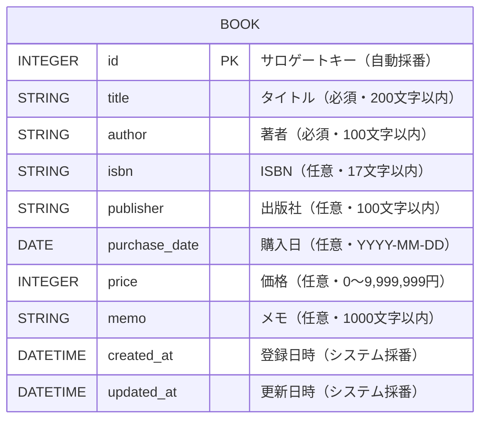
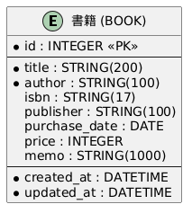
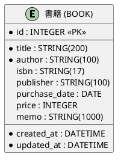
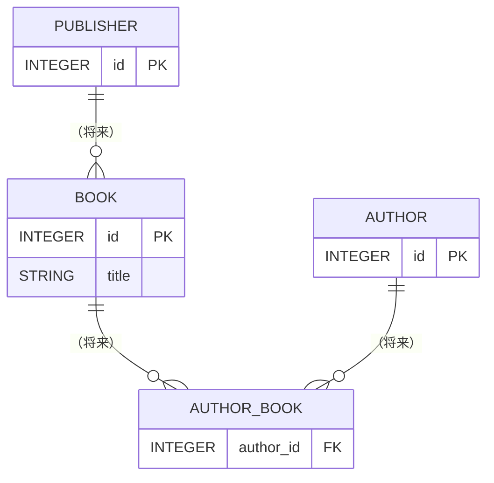

# D02020 ER図（論理モデル）

## 1. 本書の位置付け

本書は「書籍管理Webアプリ」（以下、本システム）の**データ論理モデル**を ER 図形式で定義する。

物理モデル（カラム型・インデックス・制約等の SQLite 固有の表現）は基本設計 [D03240 テーブル定義] で詳細化する。本書は**論理レベル**（属性の意味・必須/任意・関係・正規化）を確定することが目的である。

前提とする上位ドキュメント:
- [B01010 システム振舞い共通ルール](../010_要件定義/B01010_システム振舞い共通ルール.md)
- [B02040 ユースケース記述](./B02040_ユースケース記述.md)
- [G02030 画面レイアウト](./G02030_画面レイアウト.md)

---

## 2. データモデルの方針

| 観点               | 方針                                                                                          |
| ------------------ | --------------------------------------------------------------------------------------------- |
| アクタ             | 1名のみ（[B02020]）。ユーザはエンティティとしてモデル化しない。                              |
| 対象データ         | 書籍（Book）のみ。                                                                            |
| 認証               | なし。ユーザ・ロール・権限テーブルは存在しない。                                              |
| 監査               | 各レコードに登録日時（`created_at`）・更新日時（`updated_at`）を持つ。物理削除のみで履歴は持たない。 |
| 正規化             | 第3正規形（3NF）を目標。出版社・著者は属性として `books` に保持（マスタ分離は対象外）。      |
| 主キー             | サロゲートキー（`id` 自動採番）を採用。                                                       |
| 関係               | エンティティは1個のみのため、エンティティ間のリレーションは存在しない。                       |

---

## 3. エンティティ一覧

| エンティティID | エンティティ名（論理） | 物理テーブル名（暫定） | 説明                                                          |
| -------------- | ---------------------- | ---------------------- | ------------------------------------------------------------- |
| E-01           | 書籍                   | `books`                | 本システムが管理する単位データ。1冊 = 1レコード。              |

---

## 4. ER図

### 4.1 Mermaid 記法

### 4.2 PlantUML 表記（参考）

### 4.3 凡例

| 表記              | 意味                                                          |
| ----------------- | ------------------------------------------------------------- |
| PK                | 主キー（Primary Key）                                         |
| `*`               | NOT NULL（必須）                                              |
| `STRING(n)`       | 最大長 n 文字の可変長文字列                                   |
| `INTEGER`         | 整数（負数を含まない）                                        |
| `DATE`            | 日付（`YYYY-MM-DD`）                                          |
| `DATETIME`        | 日時（`YYYY-MM-DD HH:mm:ss`、ローカルタイムゾーン）           |

---

## 5. 属性定義（論理）

### 5.1 BOOK（書籍）

| #  | 属性ID    | 論理名     | データ型      | 必須 | 一意 | 既定値 | 説明                                                            | 由来                  |
| -- | --------- | ---------- | ------------- | ---- | ---- | ------ | --------------------------------------------------------------- | --------------------- |
| 1  | id        | 書籍ID     | INTEGER       | ●    | ●    | 自動採番 | サロゲートキー。ユーザは入力・変更しない（[B01010] 5.9）       | 設計上のサロゲート    |
| 2  | title     | タイトル   | STRING(200)   | ●    | -    | -      | 書籍のタイトル。1〜200文字。                                    | [G02030] 4.3          |
| 3  | author    | 著者       | STRING(100)   | ●    | -    | -      | 著者名。複数著者は自由記述（カンマ区切り等）。1〜100文字。       | [G02030] 4.3          |
| 4  | isbn      | ISBN       | STRING(17)    | -    | -    | NULL   | ISBN-10 / ISBN-13。数字とハイフンのみ。0〜17文字。              | [G02030] 4.3          |
| 5  | publisher | 出版社     | STRING(100)   | -    | -    | NULL   | 出版社名。0〜100文字。                                          | [G02030] 4.3          |
| 6  | purchase_date | 購入日 | DATE          | -    | -    | NULL   | `YYYY-MM-DD`。ブラウザ既定の日付入力。                          | [G02030] 4.3          |
| 7  | price     | 価格       | INTEGER       | -    | -    | NULL   | 円単位の整数。0〜9,999,999。                                     | [G02030] 4.3          |
| 8  | memo      | メモ       | STRING(1000)  | -    | -    | NULL   | 自由記述。0〜1000文字。                                         | [G02030] 4.3          |
| 9  | created_at | 登録日時 | DATETIME      | ●    | -    | 現在時刻 | INSERT 時にシステムが採番。以降不変。                          | [B02040] 3.4          |
| 10 | updated_at | 更新日時 | DATETIME      | ●    | -    | 現在時刻 | INSERT/UPDATE 時にシステムが採番。                              | [B02040] 5.4          |

### 5.2 ドメイン制約のサマリ

| 項目             | 制約                                                                  |
| ---------------- | --------------------------------------------------------------------- |
| 必須項目         | `id`, `title`, `author`, `created_at`, `updated_at`                   |
| 一意制約         | `id`（主キー）                                                        |
| ISBN形式         | 数字とハイフンのみ、最大17文字（チェックディジット検証は対象外）      |
| 価格範囲         | 0 ≤ price ≤ 9,999,999                                                 |
| 日付形式         | `YYYY-MM-DD`（[B01010] 5.2）                                          |
| 文字エンコーディング | UTF-8（[B01010] 5.9）                                              |

---

## 6. 主キー・候補キー

| キー種別     | 構成属性 | 説明                                                       |
| ------------ | -------- | ---------------------------------------------------------- |
| 主キー       | `id`     | サロゲートキー。INSERT 時に DB 側で自動採番。              |
| 候補キー     | -        | 自然キー候補は存在しない（同名・同著者の重複登録を許容する） |

> **ISBN は候補キーとしない**。
> 理由: ISBN は任意項目であり、空欄や ISBN を持たない自費出版書籍も登録対象とするため。

---

## 7. リレーション

本システムのエンティティは BOOK 1個のみであり、**エンティティ間のリレーションは存在しない**。

将来「著者マスタ」「出版社マスタ」を導入する場合は以下のような拡張余地があるが、本リリースのスコープ外とする。

---

## 8. 正規化検証

| 正規形 | 満たすか | 根拠                                                                                       |
| ------ | -------- | ------------------------------------------------------------------------------------------ |
| 1NF    | ●        | 各属性は単一値（複数著者は自由記述で1セルに格納するが、現リリースでは集合属性と見なさない） |
| 2NF    | ●        | 主キーが単一属性（`id`）のため、部分関数従属は発生しない                                    |
| 3NF    | ●        | 主キー以外の属性間に推移的従属はない（`publisher` から他属性は決まらない）                 |

> **注**: `author` / `publisher` を別エンティティに分離すれば BCNF まで到達できるが、利用者1名・スケール小のため本リリースでは採用しない。

---

## 9. データ容量試算

| 想定値                     | 内容                                              |
| -------------------------- | ------------------------------------------------- |
| 1レコードの平均サイズ      | 約 1.5 KB（テキスト主体・UTF-8）                  |
| 想定登録件数               | 数百〜数千件（個人蔵書）                          |
| ピーク時データサイズ       | 5,000件 × 1.5KB ≒ 約 7.5 MB                       |
| SQLite ファイルサイズ目安  | 10 MB 未満（インデックス含む）                    |

ローカルファイル DB として十分小規模であり、特別なチューニングは不要。

---

## 10. 監査・履歴の取り扱い

- 削除は**物理削除**のみ（論理削除なし、[B01010] 5.3）。
- 更新履歴テーブルは持たない（個人利用・1ユーザ前提）。
- `created_at` / `updated_at` は監査用途であり、利用者は変更できない。

---

## 11. B01010 共通ルールに対する例外

なし。

## 12. 改訂履歴

| 版   | 日付       | 改訂者   | 内容       |
| ---- | ---------- | -------- | ---------- |
| 1.0  | 2026-05-19 | Devin AI | 初版作成   |
