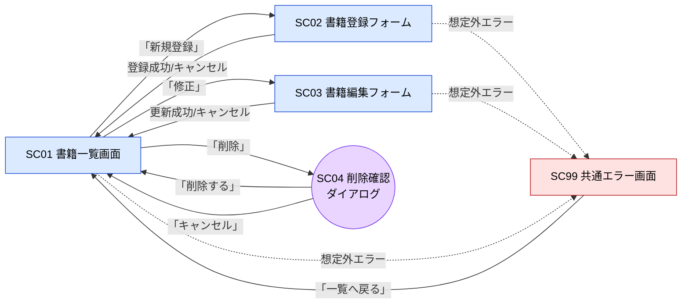

# G02010 画面一覧

## 1. 本書の位置付け

本書は「書籍管理Webアプリ」（以下、本システム）が提供する**画面の一覧**を定義する。

[B02040 ユースケース記述](./B02040_ユースケース記述.md) で参照される画面 ID と、各画面の役割・URL・関連ユースケースを確定する。

以下の後続成果物の入力となる。

- G02020 画面遷移
- G02030 画面レイアウト
- G02070 メッセージ一覧
- P03210 APIルーティング仕様（基本設計）

前提とする上位ドキュメント:
- [B01010 システム振舞い共通ルール](../010_要件定義/B01010_システム振舞い共通ルール.md)
- [G01010 レイアウト共通ルール](../010_要件定義/G01010_レイアウト共通ルール.md)
- [B02040 ユースケース記述](./B02040_ユースケース記述.md)

---

## 2. 命名・採番ルール

| 項目         | ルール                                                                       |
| ------------ | ---------------------------------------------------------------------------- |
| 画面ID       | `SC` + 2桁連番（`SC01`, `SC02`, …）。SC = Screen の略。                       |
| 画面名       | 日本語、機能を表す端的な名称。「画面」または「フォーム」を末尾に付ける。     |
| URL          | RESTful 風に統一。GET = 画面表示、POST = フォーム送信。                       |
| HTTPメソッド | 画面に対応する主たるメソッドのみ記載。詳細は P03210 で定義。                  |
| EJSテンプレート | `views/{snake_case名}.ejs` を基本とする（命名規約は R03120 で確定）。       |

---

## 3. 画面一覧

| 画面ID | 画面名             | 種別       | URL                  | HTTPメソッド | テンプレート（暫定）       | 関連UC | 主な操作                                    |
| ------ | ------------------ | ---------- | -------------------- | ------------ | -------------------------- | ------ | ------------------------------------------- |
| SC01   | 書籍一覧画面       | 一覧       | `/` または `/books`  | GET          | `views/books_list.ejs`     | UC-02  | ページ移動／ソート／修正／削除／新規登録    |
| SC02   | 書籍登録フォーム   | 入力フォーム | `/books/new`         | GET / POST   | `views/book_form.ejs`      | UC-01  | 入力／登録／キャンセル                      |
| SC03   | 書籍編集フォーム   | 入力フォーム | `/books/:id/edit`    | GET / POST   | `views/book_form.ejs`      | UC-03  | 編集／更新／キャンセル                      |
| SC04   | 削除確認ダイアログ | モーダル   | （SC01 内に表示）    | -            | `views/_delete_modal.ejs` (部分テンプレート) | UC-04  | 削除する／キャンセル                        |
| SC99   | 共通エラー画面     | エラー     | `/error`             | GET          | `views/error.ejs`          | -      | 一覧画面へ戻る                              |

### 3.1 補足

- **SC02 と SC03 は同レイアウト**。同一 EJS テンプレート（`views/book_form.ejs`）を共有し、登録/編集の区別はサーバ側で渡すコンテキスト（モード変数・対象データの有無）で行う。
- **SC04 はモーダル（部分テンプレート）**。独立 URL を持たず、SC01 上で JavaScript により表示する。
- **SC99 は共通エラー画面**。想定外エラー時のフォールバック先で、[B01010] 5.7 に準拠する。
- 一覧の既定 URL は `/` だが、`/books` にもエイリアスを設けて意味を明確化する。

---

## 4. 画面 ↔ ユースケース対応表

| 画面ID | UC-01 | UC-02 | UC-03 | UC-04 |
| ------ | :---: | :---: | :---: | :---: |
| SC01   |       |   ●   |       |       |
| SC02   |   ●   |       |       |       |
| SC03   |       |       |   ●   |       |
| SC04   |       |       |       |   ●   |
| SC99   |   ○   |   ○   |   ○   |   ○   |

> 凡例: ● = 主画面、○ = 例外シナリオ時のフォールバック

---

## 5. 画面間の関係（俯瞰）

詳細な画面遷移と表示メッセージは [G02020 画面遷移](./G02020_画面遷移.md) を参照。

---

## 6. 画面共通要素（再掲）

[G01010] 3章 / 12章 の標準骨格に従い、すべての画面は以下を持つ。

| 要素           | 内容                                                              |
| -------------- | ----------------------------------------------------------------- |
| ヘッダ         | アプリ名「書籍管理」、グローバルナビ「新規登録」リンク            |
| 通知バー領域   | 成功・エラー・警告メッセージ表示（[B01010] 5.5）                  |
| 画面タイトル   | `<h1>` で画面名を表示。`<title>` も同期して更新。                 |
| メインコンテンツ | フォーム or テーブル                                            |
| アクション群   | 右寄せのボタン群（主アクションを右端）                            |
| フッタ         | バージョン表示（`© 書籍管理 v{バージョン}`）                      |

SC04（モーダル）と SC99（共通エラー）はヘッダ/フッタの取り扱いに例外がある。詳細は G02030 で記述する。

---

## 7. スコープ外の画面（参考）

将来要件混入を防ぐため、本リリースで作らない画面を明示する。

| 画面候補         | 不在の理由                                              |
| ---------------- | ------------------------------------------------------- |
| ログイン画面     | 認証機能なし（[B01010] 5.1）                            |
| 検索結果画面     | 検索機能スコープ外（[B02030] 7章）                       |
| インポート画面   | 一括操作スコープ外                                      |
| 設定画面         | 設定項目なし（環境変数で必要分のみ管理）                |
| ヘルプ・利用規約 | 個人利用のためスコープ外                                |

---

## 8. B01010 / G01010 共通ルールに対する例外

なし。

## 9. 改訂履歴

| 版   | 日付       | 改訂者   | 内容       |
| ---- | ---------- | -------- | ---------- |
| 1.0  | 2026-05-19 | Devin AI | 初版作成   |
