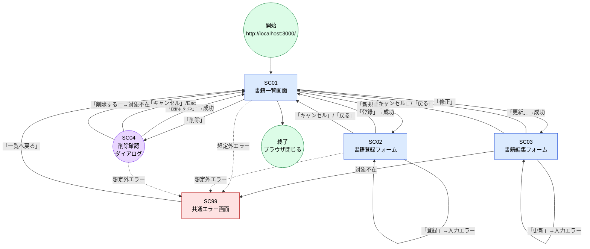
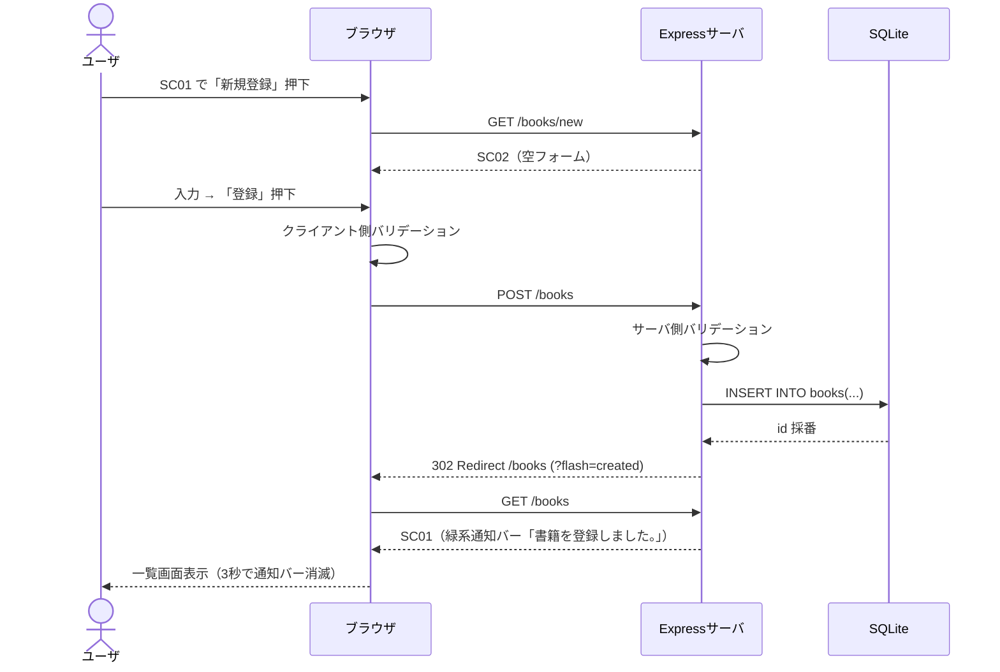
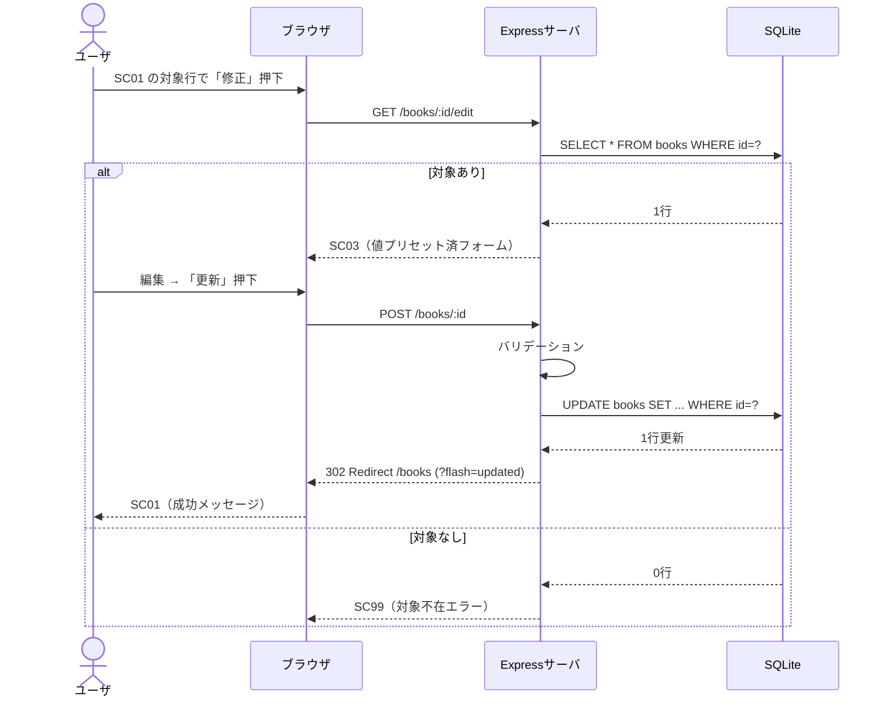
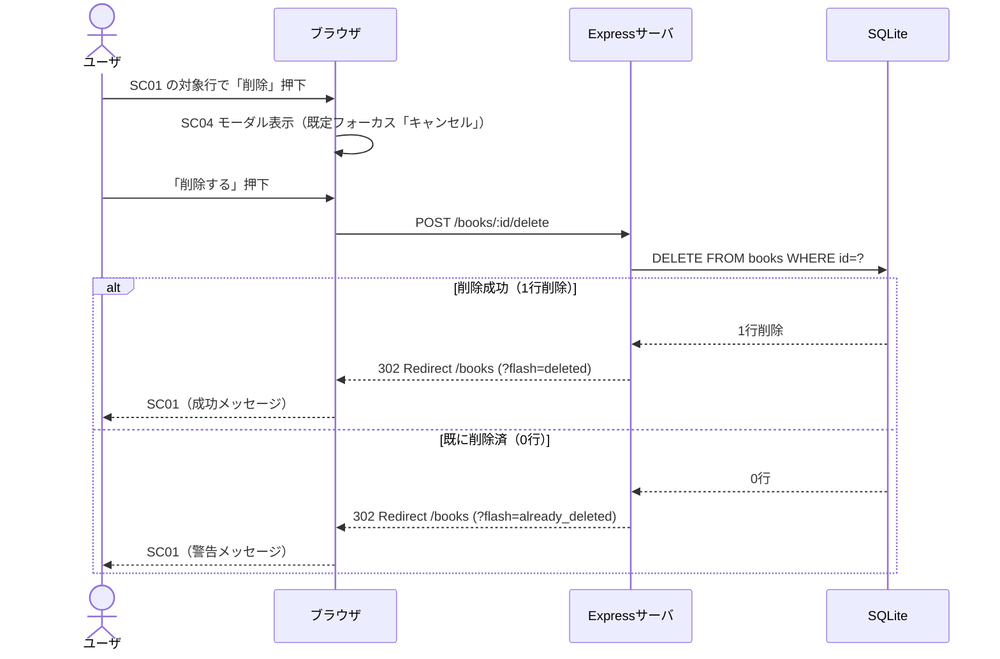
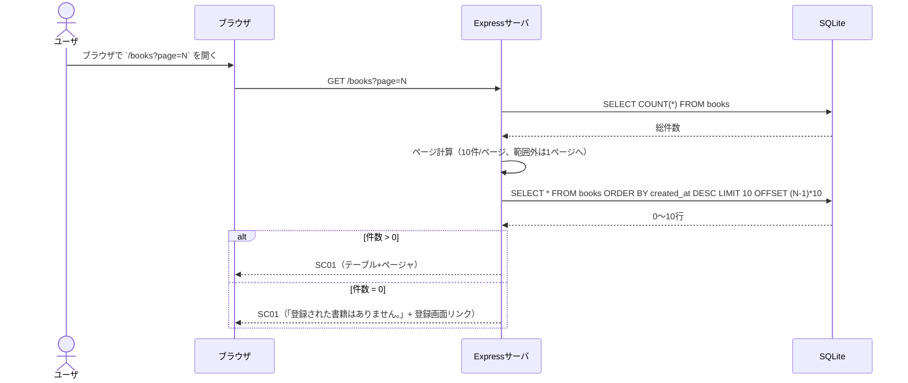

# G02020 画面遷移

## 1. 本書の位置付け

本書は [G02010 画面一覧](./G02010_画面一覧.md) で定義した画面間の**遷移条件・トリガ・遷移後の状態**を定義する。

[B02040 ユースケース記述](./B02040_ユースケース記述.md) の主成功シナリオ／代替シナリオ／例外シナリオを画面遷移の観点で再構成する。

前提とする上位ドキュメント:
- [B01010 システム振舞い共通ルール](../010_要件定義/B01010_システム振舞い共通ルール.md)
- [G01010 レイアウト共通ルール](../010_要件定義/G01010_レイアウト共通ルール.md)
- [G02010 画面一覧](./G02010_画面一覧.md)
- [B02040 ユースケース記述](./B02040_ユースケース記述.md)

---

## 2. 凡例

| 表記                | 意味                                                                       |
| ------------------- | -------------------------------------------------------------------------- |
| `[画面ID 画面名]`   | 画面ノード                                                                 |
| `「ラベル」`        | ボタン・リンクのラベル                                                     |
| `成功`              | サーバ側処理（バリデーション・DB操作）がすべて成立した状態                 |
| `失敗`              | サーバ側処理が失敗した状態（バリデーション NG／対象不在／DB エラー）       |
| `モーダル開閉`      | 同一画面上でモーダルダイアログの表示・非表示が切り替わる                   |

---

## 3. 全体画面遷移図

---

## 4. 遷移仕様表

各遷移を ID で一意化する。`TR-NN` は Transition の略。

| 遷移ID | 遷移元    | トリガ                       | 遷移先 | 条件                              | 遷移後の表示メッセージ                          | 関連UC |
| ------ | --------- | ---------------------------- | ------ | --------------------------------- | ----------------------------------------------- | ------ |
| TR-01  | (Start)   | `/` または `/books` を開く   | SC01   | -                                 | （初回はメッセージなし）                        | UC-02  |
| TR-02  | SC01      | 「新規登録」リンク押下       | SC02   | -                                 | （メッセージなし）                              | UC-01  |
| TR-03  | SC02      | 「登録」ボタン押下           | SC01   | サーバ側バリデーション成功 + DB INSERT 成功 | 成功: `書籍を登録しました。`                | UC-01  |
| TR-04  | SC02      | 「登録」ボタン押下           | SC02   | バリデーション失敗                | エラー: 各欄直下に赤字エラー（[B01010] 5.2）    | UC-01  |
| TR-05  | SC02      | 「キャンセル」/「戻る」      | SC01   | 入力破棄                          | （メッセージなし）                              | UC-01  |
| TR-06  | SC01      | 行の「修正」ボタン押下       | SC03   | 対象 `id` の書籍が存在            | （メッセージなし、フォームに値プリセット）      | UC-03  |
| TR-07  | SC03      | 「更新」ボタン押下           | SC01   | バリデーション成功 + DB UPDATE 成功 | 成功: `書籍情報を更新しました。`              | UC-03  |
| TR-08  | SC03      | 「更新」ボタン押下           | SC03   | バリデーション失敗                | エラー: 各欄直下に赤字エラー                    | UC-03  |
| TR-09  | SC03      | 「キャンセル」/「戻る」      | SC01   | 変更破棄                          | （メッセージなし）                              | UC-03  |
| TR-10  | SC03      | 編集画面ロード時             | SC99   | 対象 `id` の書籍が存在しない      | エラー: `対象の書籍が見つかりません。`           | UC-03  |
| TR-11  | SC01      | 行の「削除」ボタン押下       | SC04   | -                                 | -（モーダル表示、既定フォーカスは「キャンセル」）| UC-04  |
| TR-12  | SC04      | 「削除する」ボタン押下       | SC01   | DELETE 成功                       | 成功: `書籍を削除しました。`                    | UC-04  |
| TR-13  | SC04      | 「キャンセル」または `Esc`   | SC01   | DB 操作なし                       | （メッセージなし、モーダル閉）                  | UC-04  |
| TR-14  | SC04      | 「削除する」ボタン押下       | SC01   | 対象 `id` が既に存在しない        | 警告: `対象の書籍は既に削除されています。`      | UC-04  |
| TR-15  | SC01-03   | 想定外サーバエラー（5xx）    | SC99   | サーバ例外                        | エラー: `処理中にエラーが発生しました。時間をおいて再度お試しください。` | -      |
| TR-16  | SC99      | 「一覧へ戻る」リンク         | SC01   | -                                 | （メッセージなし）                              | -      |

> 成功・警告・エラーの文言は [G02070 メッセージ一覧](./G02070_メッセージ一覧.md) で一元管理する。

---

## 5. 主要シナリオの遷移シーケンス

### 5.1 書籍登録（UC-01 主成功シナリオ）

### 5.2 書籍修正（UC-03 主成功シナリオ）

### 5.3 書籍削除（UC-04 主成功シナリオ）

### 5.4 一覧表示・ページネーション（UC-02）

---

## 6. URL パラメータ・フラッシュメッセージ

メッセージ表示は以下の仕組みで一覧画面（SC01）に橋渡しする。詳細な実装方式は基本設計 P03210 / S03210 で定める。

| パラメータ                  | 種別     | 説明                                                               | 表示メッセージ                                  |
| --------------------------- | -------- | ------------------------------------------------------------------ | ----------------------------------------------- |
| `?flash=created`            | クエリ   | 登録成功直後のリダイレクト                                         | `書籍を登録しました。`                          |
| `?flash=updated`            | クエリ   | 修正成功直後のリダイレクト                                         | `書籍情報を更新しました。`                      |
| `?flash=deleted`            | クエリ   | 削除成功直後のリダイレクト                                         | `書籍を削除しました。`                          |
| `?flash=already_deleted`    | クエリ   | 削除時に対象がすでに存在しなかった場合                             | `対象の書籍は既に削除されています。`            |
| `?page=N`                   | クエリ   | 一覧画面のページ番号（既定: 1、範囲外は 1）                       | -                                               |
| `?sort=col&dir=asc|desc`    | クエリ   | 一覧画面のソート列・方向                                           | -                                               |

> `flash` キーの厳密な実装（クエリ/セッション/Cookie等）は基本設計で確定。本書は遷移条件のレベルで定義する。

---

## 7. キーボード操作仕様

[B01010] 5.8 / [G01010] 10章 に準拠する画面遷移上のキーバインド。

| キー       | 動作                                                              | 適用画面 |
| ---------- | ----------------------------------------------------------------- | -------- |
| `Tab`      | フォーカス順送り                                                  | 全画面   |
| `Shift+Tab`| フォーカス逆送り                                                  | 全画面   |
| `Enter`    | フォーカス中のボタン押下／フォーム送信                            | 全画面   |
| `Esc`      | モーダル（SC04）のキャンセル（背景にイベント伝播しない）          | SC04     |

---

## 8. ブラウザ「戻る」ボタンの扱い

- 個人利用前提のため、ブラウザの「戻る」を妨げない。ただし以下の振る舞いを期待する。
  - SC02/SC03 のフォーム入力中に「戻る」した場合、入力値は復元しない（POST 後の Redirect-Get パターンを採用するため）。
  - SC01 から「戻る」した場合、ブラウザ履歴の前ページ（通常は本システム外）に戻る。
- POST 送信後はサーバが必ず 302 Redirect で GET 表示に切り替える（Post-Redirect-Get）。これによりリロード時の二重送信を防止する。

---

## 9. B01010 / G01010 共通ルールに対する例外

なし。

## 10. 改訂履歴

| 版   | 日付       | 改訂者   | 内容       |
| ---- | ---------- | -------- | ---------- |
| 1.0  | 2026-05-19 | Devin AI | 初版作成   |
