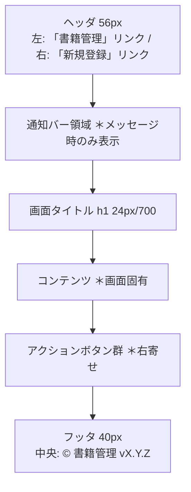

# G02030 画面レイアウト

## 1. 本書の位置付け

本書は [G02010 画面一覧](./G02010_画面一覧.md) で定義した各画面の**レイアウト（領域構成・配置・項目）**を、テキスト＋ASCIIワイヤフレーム＋Mermaid で定義する。

前提とする上位ドキュメント:
- [B01010 システム振舞い共通ルール](../010_要件定義/B01010_システム振舞い共通ルール.md)
- [G01010 レイアウト共通ルール](../010_要件定義/G01010_レイアウト共通ルール.md)
- [G02010 画面一覧](./G02010_画面一覧.md)
- [B02040 ユースケース記述](./B02040_ユースケース記述.md)

各画面の項目仕様（入力種別・桁数・必須）は本書を起点に、後続の D02020（ER）・D03240（テーブル定義）と整合させる。

---

## 2. 共通レイアウト（再掲）

[G01010] 3章・12章の標準骨格に従い、すべての画面は以下の領域構成を持つ。



- メイン領域の最大幅は **960px・中央寄せ**、左右余白 16px 以上。
- セクション間の縦マージンは **24px**。
- カラー・フォント・ボタンスタイルは [G01010] 4〜6章 に従う。

---

## 3. SC01 書籍一覧画面

### 3.1 役割

- 登録済み書籍を10件/ページで表形式表示する。
- 各行に「修正」「削除」アクションを持つ。
- ヘッダから「新規登録」へ遷移する。
- 削除確認モーダル（SC04）の親画面。

### 3.2 ワイヤフレーム（概念図）

```
┌──────────────────────────────────────────────────────────────────────┐
│  [書籍管理]                                              [新規登録]  │ ← ヘッダ
├──────────────────────────────────────────────────────────────────────┤
│  [通知バー: 「書籍を登録しました。」 ×]                              │ ← 通知（任意）
├──────────────────────────────────────────────────────────────────────┤
│  書籍一覧                                                            │ ← h1
│                                                                      │
│  ┌─────┬───────────┬──────────┬───────────┬──────────┬──────┬─────┐  │
│  │ ID  │ タイトル  │ 著者     │ 出版社    │ 購入日   │ 価格 │ 操作│  │
│  ├─────┼───────────┼──────────┼───────────┼──────────┼──────┼─────┤  │
│  │ 1   │ ...       │ ...      │ ...       │ ...      │  ... │ [修正] [削除] │
│  │ 2   │ ...       │ ...      │ ...       │ ...      │  ... │ [修正] [削除] │
│  │ ... │           │          │           │          │      │           │
│  └─────┴───────────┴──────────┴───────────┴──────────┴──────┴─────┘  │
│                                                                      │
│  [先頭] [前へ] 1 2 [3] 4 5 [次へ] [末尾]      総件数: 1,234件  3/124 │ ← ページャ
│                                                                      │
├──────────────────────────────────────────────────────────────────────┤
│                       © 書籍管理 v1.0.0                              │ ← フッタ
└──────────────────────────────────────────────────────────────────────┘
```

### 3.3 表示項目

| 列順 | 列名     | DB列            | 表示形式                          | 幅目安 | ソート |
| ---- | -------- | --------------- | --------------------------------- | ------ | ------ |
| 1    | ID       | `id`            | 整数（右寄せ）                    | 6em    | 可     |
| 2    | タイトル | `title`         | 文字列、長文は省略表示（…）       | 22em   | 可     |
| 3    | 著者     | `author`        | 文字列                            | 12em   | 可     |
| 4    | 出版社   | `publisher`     | 文字列、空欄は `-`                | 10em   | 可     |
| 5    | 購入日   | `purchase_date` | `YYYY-MM-DD`、空欄は `-`          | 8em    | 可     |
| 6    | 価格     | `price`         | 3桁区切り＋「円」、空欄は `-`     | 8em    | 可     |
| 7    | 操作     | -               | 「修正」「削除」ボタン            | auto   | 不可   |

> 並び順（既定）は `created_at` の降順。「ID」「タイトル」「著者」「出版社」「購入日」「価格」のヘッダクリックで昇順/降順をトグル。`memo` は一覧に表示しない（編集画面で確認）。

### 3.4 振舞い

- ページャは「先頭 / 前へ / ページ番号 / 次へ / 末尾」を表示（[B01010] 5.4）。
- 0件時は表ではなく「登録された書籍はありません。」メッセージと「新規登録画面へ」リンクを表示。
- 表ヘッダはスクロール時にスティッキー（[G01010] 7章）。
- 偶数行はゼブラストライプ。

### 3.5 URL/パラメータ

`GET /books?page=N&sort=col&dir=asc|desc`

詳細は G02020 / 基本設計 P03210 に従う。

---

## 4. SC02 書籍登録フォーム / SC03 書籍編集フォーム

### 4.1 役割

- 1冊の書籍情報を新規登録または更新する。
- **同一レイアウト**（テンプレート `views/book_form.ejs` を共有）。
- 画面タイトル・送信先 URL・送信ボタンラベルのみが登録／編集で異なる。

| 観点               | SC02 登録                       | SC03 編集                              |
| ------------------ | ------------------------------- | -------------------------------------- |
| 画面タイトル(h1)   | `書籍登録`                      | `書籍編集`                             |
| 送信先 URL         | `POST /books`                   | `POST /books/:id`                      |
| 主アクションラベル | 「登録」                        | 「更新」                               |
| 初期値             | すべて空                        | 対象書籍の現在値をプリセット           |
| キャンセル先       | `/books`（一覧）                | `/books`（一覧）                       |

### 4.2 ワイヤフレーム

```
┌──────────────────────────────────────────────────────────────────────┐
│  [書籍管理]                                              [新規登録]  │
├──────────────────────────────────────────────────────────────────────┤
│  [通知バー: エラー時のみ]                                            │
├──────────────────────────────────────────────────────────────────────┤
│  書籍登録 （または「書籍編集」）                                     │
│                                                                      │
│  タイトル *                                                          │
│  [____________________________________________________]              │
│  （200文字以内）                                                     │
│                                                                      │
│  著者 *                                                              │
│  [____________________________________________________]              │
│  （100文字以内）                                                     │
│                                                                      │
│  ISBN                                                                │
│  [_______________________]                                           │
│  （13文字、ハイフン任意）                                            │
│                                                                      │
│  出版社                                                              │
│  [_______________________________________]                           │
│  （100文字以内）                                                     │
│                                                                      │
│  購入日                                                              │
│  [📅 YYYY-MM-DD]                                                     │
│                                                                      │
│  価格                                                                │
│  [_________] 円  （0〜9,999,999 の整数）                              │
│                                                                      │
│  メモ                                                                │
│  ┌────────────────────────────────────────────────────┐              │
│  │                                                    │              │
│  │                                                    │              │
│  └────────────────────────────────────────────────────┘              │
│  （1000文字以内）                                                    │
│                                                                      │
│                              [キャンセル]  [登録 / 更新]             │ ← 右寄せ
├──────────────────────────────────────────────────────────────────────┤
│                       © 書籍管理 v1.0.0                              │
└──────────────────────────────────────────────────────────────────────┘
```

### 4.3 入力項目仕様

| #  | 項目     | フォームID     | 入力種別             | 必須 | 桁・範囲                  | プレースホルダ / 補足                  | 対応DB列         |
| -- | -------- | -------------- | -------------------- | ---- | ------------------------- | -------------------------------------- | ---------------- |
| 1  | タイトル | `title`        | `<input type="text">`| ●    | 1〜200 文字               | 「例: 達人プログラマー」               | `title`          |
| 2  | 著者     | `author`       | `<input type="text">`| ●    | 1〜100 文字               | 「例: Andrew Hunt」                    | `author`         |
| 3  | ISBN     | `isbn`         | `<input type="text">`| -    | 0〜17 文字（数字とハイフン）| 「例: 978-4-274-21933-2」             | `isbn`           |
| 4  | 出版社   | `publisher`    | `<input type="text">`| -    | 0〜100 文字               | -                                      | `publisher`      |
| 5  | 購入日   | `purchase_date`| `<input type="date">`| -    | `YYYY-MM-DD`              | ブラウザ既定の日付ピッカー             | `purchase_date`  |
| 6  | 価格     | `price`        | `<input type="number">`| -  | 0〜9,999,999 の整数（円） | 単位ラベル「円」を右側に併記          | `price`          |
| 7  | メモ     | `memo`         | `<textarea rows="6">`| -    | 0〜1000 文字              | -                                      | `memo`           |

#### 補足ルール

- 必須欄のラベル末尾に赤色 `*` を付与し `aria-required="true"`（[B01010] 5.2 / [G01010] 6.1）。
- 桁数超過は画面側で入力自体を制限（[B01010] 5.2）。
- ISBN は厳密チェック（チェックディジット計算）は本リリースのスコープ外。形式（数字+ハイフンのみ）のみ確認する。

### 4.4 アクションボタン

| ボタン         | 種別       | 配置             | 動作                                                       |
| -------------- | ---------- | ---------------- | ---------------------------------------------------------- |
| キャンセル     | セカンダリ | 右寄せ群の左側   | 入力を破棄して一覧画面（SC01）へ戻る                       |
| 登録 / 更新    | プライマリ | 右寄せ群の右端   | フォーム送信 → サーバ処理 → 一覧画面（SC01）へ Redirect    |

押下中はローディング状態（スピナー＋disabled）（[G01010] 6.3）。

### 4.5 エラー表示

- 各欄の直下に赤字でエラーメッセージを表示し、入力欄の枠線を赤色に、`aria-invalid="true"` を付与（[G01010] 6.2）。
- 1つ以上のエラーがある場合、最初のエラー欄にフォーカスを移す（[B01010] 5.2）。
- 通知バー領域にも汎用メッセージ「入力内容を確認してください。」をエラー色で表示する。

---

## 5. SC04 削除確認ダイアログ（モーダル）

### 5.1 役割

- SC01 上で「削除」ボタンが押された対象書籍について、削除実行の最終確認を行う。

### 5.2 ワイヤフレーム

```
SC01 全体は半透明オーバーレイで覆われる。中央にダイアログ。

         ┌────────────────────────────────────────┐
         │ 書籍を削除しますか？                  │ ← h2
         ├────────────────────────────────────────┤
         │ 「{タイトル}」を削除します。           │
         │ この操作は取り消せません。             │
         │                                        │
         │              [キャンセル]  [削除する]  │
         └────────────────────────────────────────┘
```

### 5.3 振舞い

| 項目                   | 内容                                                                       |
| ---------------------- | -------------------------------------------------------------------------- |
| 既定フォーカス         | **「キャンセル」ボタン**（[B01010] 5.3）                                   |
| `Enter` キー           | 既定フォーカス（キャンセル）を実行 → モーダル閉                            |
| `Esc` キー             | キャンセルと同等動作                                                       |
| 背景クリック           | キャンセルと同等動作                                                       |
| 「削除する」ボタン     | 危険スタイル（color-error 塗りつぶし）。押下で `POST /books/:id/delete` 送信 |
| 多重押下               | 押下後は disabled に切替え、二重送信を防止                                 |
| 表示中の背景スクロール | 禁止                                                                       |

### 5.4 表示文言

- 見出し: `書籍を削除しますか？`
- 本文: `「{タイトル}」を削除します。\nこの操作は取り消せません。`
- ボタン: 「キャンセル」「削除する」

> `{タイトル}` は対象書籍の `title` を埋め込む。HTML エスケープ必須。

---

## 6. SC99 共通エラー画面

### 6.1 役割

- 想定外エラー発生時、または対象不在時のフォールバック画面。

### 6.2 ワイヤフレーム

```
┌──────────────────────────────────────────────────────────────────────┐
│  [書籍管理]                                              [新規登録]  │
├──────────────────────────────────────────────────────────────────────┤
│  エラーが発生しました                                                │ ← h1
│                                                                      │
│  ⚠ 処理中にエラーが発生しました。                                    │
│     時間をおいて再度お試しください。                                 │
│                                                                      │
│                                  [一覧へ戻る]                        │
├──────────────────────────────────────────────────────────────────────┤
│                       © 書籍管理 v1.0.0                              │
└──────────────────────────────────────────────────────────────────────┘
```

### 6.3 振舞い

- メッセージ文言は [B01010] 5.7 に準拠（ユーザにスタックトレース等の技術詳細は見せない）。
- 「一覧へ戻る」ボタンで `/books`（SC01）に遷移する。
- 対象不在時（例: 編集画面で `id` が存在しない）は、メッセージを「対象の書籍が見つかりません。」に差し替える。

---

## 7. アクセシビリティ・キーボードフォーカス順

各画面の Tab フォーカス順を以下に統一する（[B01010] 5.8）。

### SC01

```
ヘッダ「書籍管理」→ ヘッダ「新規登録」 → 列ヘッダ（ID〜価格） → 1行目「修正」 → 1行目「削除」 → 2行目… → ページャ
```

### SC02 / SC03

```
ヘッダ「書籍管理」→ ヘッダ「新規登録」→ タイトル → 著者 → ISBN → 出版社 → 購入日 → 価格 → メモ → 「キャンセル」 → 「登録/更新」
```

### SC04

```
ダイアログ表示時、ダイアログ内に Tab トラップ:
「キャンセル」（既定フォーカス） ⇆ 「削除する」
```

---

## 8. レスポンシブ・最小サイズ

- 想定主解像度は 1280×720 以上（[G01010] 2章 / 11章）。
- 1024px 未満ではテーブルを横スクロール可とし、フォームは1カラムに維持する。

---

## 9. B01010 / G01010 共通ルールに対する例外

なし。

## 10. 改訂履歴

| 版   | 日付       | 改訂者   | 内容       |
| ---- | ---------- | -------- | ---------- |
| 1.0  | 2026-05-19 | Devin AI | 初版作成   |
