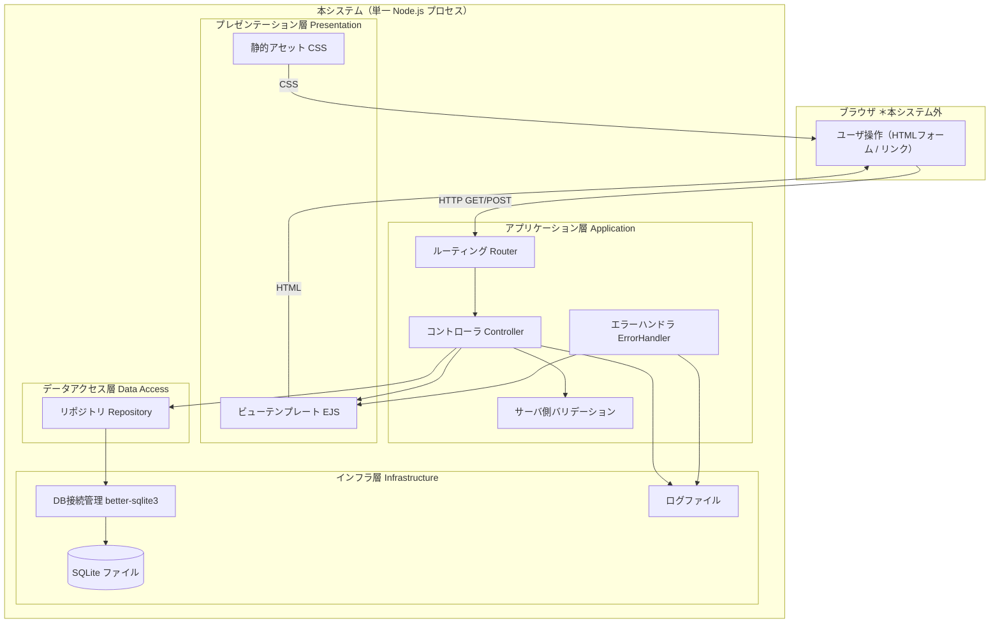
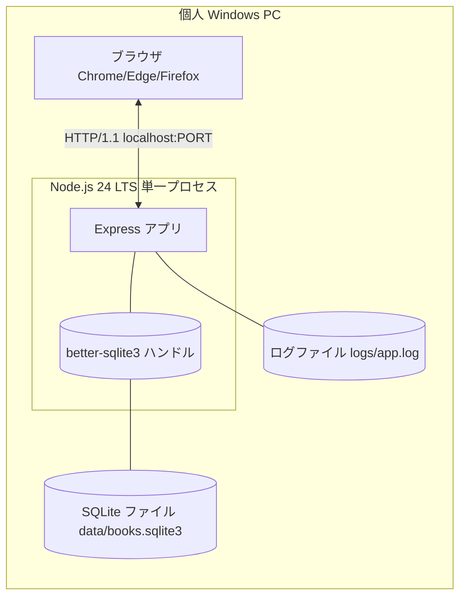
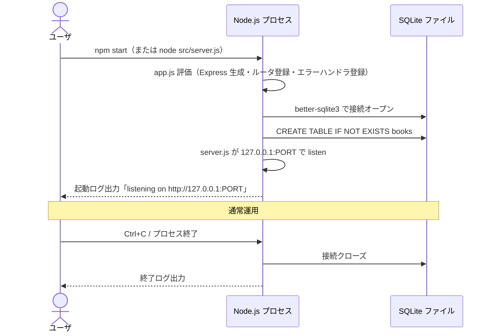

# A03110 ソフトウェア論理構成

## 1. 本書の位置付け

本書は「書籍管理Webアプリ」（以下、本システム）の**ソフトウェア論理構成**を定義する。

ソフトウェア全体を**論理的な層（レイヤ）に分割し**、各層の責務・依存関係・通信プロトコルを明確化することで、後続の詳細設計（D03240 / S03210 / P03210）および実装（040 実装）での設計判断のよりどころとする。

前提とする上位ドキュメント:
- [A01010 非機能要件一覧](../010_要件定義/A01010_非機能要件一覧.md)
- [B01010 システム振舞い共通ルール](../010_要件定義/B01010_システム振舞い共通ルール.md)
- [B02010 システムコンテキストダイアグラム](../020_外部設計/B02010_システムコンテキストダイアグラム.md)
- [G02020 画面遷移](../020_外部設計/G02020_画面遷移.md)

本書で確定した論理構成は、後続の以下成果物で具体化される。

- A03130 ソフトウェア実現方針（採用ライブラリ・通信様式・エラー処理方針）
- R03120 ネーミングルール（層ごとの命名規約）
- S03210 クラス図（クラス・モジュールの構造）
- P03210 APIルーティング仕様（プレゼンテーション層の入口）
- D03240 テーブル定義（インフラ層のスキーマ）

---

## 2. 設計方針

### 2.1 設計の基本コンセプト

[A01010] の非機能要件、特に以下を満たすことを目的とする。

| 要件ID    | 関連内容                                          | 論理構成への反映                                                |
| --------- | ------------------------------------------------- | --------------------------------------------------------------- |
| NFR-A03   | データ永続性                                      | データアクセス層を独立させ、永続化責務を1箇所に集約             |
| NFR-B01/02 | 画面応答 1秒以内、1,000件で一覧 1秒以内          | 単一プロセス・同期 I/O・インメモリ近傍の SQLite を採用しやすい層構成 |
| NFR-C01   | `npm install` ＋起動コマンドで動作                | 単一 Node.js プロセス、外部ミドルウェア不要                     |
| NFR-E02   | localhost のみで待ち受け                          | サーバ起動層を独立させ、bind アドレスを 1箇所で制御             |
| NFR-E03   | 入力検証の二重化（画面・サーバ）                  | プレゼンテーション層／アプリケーション層で二重に検証            |
| NFR-E06   | エラー情報の隠蔽                                  | 共通エラーハンドラを1箇所に集約                                 |

### 2.2 アーキテクチャスタイル

- **MPA（Multi-Page Application）**: 画面遷移はサーバサイドレンダリング（SSR）で行う。SPA / クライアントルーティングは採用しない。
- **レイヤードアーキテクチャ（4層）**: プレゼンテーション → アプリケーション → データアクセス → インフラの一方向依存とする。
- **同期実装**: SQLite を `better-sqlite3` で同期 I/O 利用する。コールバック・Promise によるレイヤ間制御は持ち込まない（1ユーザ・ローカル前提）。
- **単一プロセス**: ワーカー分離・クラスタ化は行わない（NFR-B03）。

---

## 3. 論理構成（4層モデル）

### 3.1 全体図



### 3.2 層と責務

| 層名               | 略号 | 主な責務                                                                                                                                    | 主成果物（実装単位）                                                                          |
| ------------------ | ---- | ------------------------------------------------------------------------------------------------------------------------------------------- | --------------------------------------------------------------------------------------------- |
| プレゼンテーション層 | P    | HTML を生成する。CSS・静的アセットを返す。出力時に HTML エスケープを行う（NFR-E04）。                                                       | `views/*.ejs`、`public/css/style.css`                                                          |
| アプリケーション層 | A    | HTTP リクエストを受け、ルーティング・サーバ側バリデーション（NFR-E03）・業務処理の流れ制御・例外処理（NFR-E06）を行う。                     | `src/app.js`、`src/server.js`、`src/routes/books.js`、`src/controllers/bookController.js`     |
| データアクセス層   | DA   | 書籍データの CRUD を SQL レベルで実行する。アプリケーション層に対し**SQL を隠蔽**し、ドメイン形式（プレーンオブジェクト）で受け渡しする。 | `src/repositories/bookRepository.js`                                                          |
| インフラ層         | IN   | SQLite ファイルへの物理接続、コネクション管理、起動／終了時のリソース制御、ログ出力先（NFR-C02）を担う。                                  | `src/db/database.js`、SQLite ファイル本体（`data/books.sqlite3`）、ログファイル                |

> 「ドメイン層」は本システムでは独立させない。エンティティが書籍 1個のみ（[D02020] 7章）であり、振舞いを持つ業務オブジェクトが存在しないため、データアクセス層が返すプレーンオブジェクトをそのまま使う。

### 3.3 依存方向ルール

- 依存は **上位層 → 下位層の一方向のみ** とする。下位層が上位層を import／require してはならない。
- 同一層内の依存は許容する（コントローラから別コントローラの呼び出しは禁止だが、ルータからコントローラは可）。
- インフラ層は他層から見て**最下層**であり、`require('better-sqlite3')` などの外部 I/O ライブラリ依存はインフラ層に閉じ込める。


> プレゼンテーション層は EJS テンプレートであり、アプリケーション層から render される受け身の存在である（コードレベルの直接依存はアプリケーション層 → プレゼンテーション層の一方向）。

---

## 4. 各層の詳細

### 4.1 プレゼンテーション層

| 項目               | 内容                                                                                                              |
| ------------------ | ----------------------------------------------------------------------------------------------------------------- |
| 形式               | EJS テンプレート（SSR）。クライアントサイド JS によるルーティングは行わない。                                     |
| 構成要素           | 画面ごとの `views/*.ejs`、共通レイアウト用パーシャル、`public/css/style.css`、必要最小限の `public/js/*.js`        |
| 受け取る入力       | コントローラから渡されるビューモデル（プレーンオブジェクト）、フラッシュメッセージ ID、入力エラーマップ            |
| 返す出力           | HTML レスポンス（UTF-8）                                                                                          |
| 守るべき横断ルール | 出力時 HTML エスケープ（NFR-E04）、日本語固定（NFR-F05）、3桁区切り表示（[B01010] 5.6）                           |

ビューテンプレートは [G02010] / [G02030] / [G02070] の画面定義と一対一で対応させる（マッピングは S03210 で具体化）。

### 4.2 アプリケーション層

アプリケーション層は責務ごとに以下の役割（コンポーネント）に分割する。

| 役割名         | 責務                                                                                                                                                                                | 配置                                                                |
| -------------- | ----------------------------------------------------------------------------------------------------------------------------------------------------------------------------------- | ------------------------------------------------------------------- |
| アプリ初期化   | Express アプリのインスタンス生成、ミドルウェア（静的配信・ボディパーサ・ビューエンジン）登録、ルータ登録、共通エラーハンドラ登録。                                                  | `src/app.js`                                                        |
| サーバ起動     | HTTP リスナの bind と起動ログ出力。`127.0.0.1` 固定（NFR-E02）。                                                                                                                    | `src/server.js`                                                     |
| ルーティング   | URL パス × HTTP メソッド を該当コントローラ関数に振り分ける。RESTful 風 URL を維持しつつ HTML フォームのため GET/POST のみ使用（詳細は P03210）。                                | `src/routes/books.js`                                               |
| コントローラ   | ユースケース1件（UC-01〜UC-04）に対応する一連の処理を実行：入力取得 → バリデーション呼出 → リポジトリ呼出 → ビュー描画 or リダイレクト。                                          | `src/controllers/bookController.js`                                 |
| バリデーション | コントローラから呼ばれ、項目ごとのドメイン制約（必須・桁・形式・範囲）を検証する。エラー時はエラーマップを返す（[G02070] MSG-V-001〜006 / MSG-E-003）。                            | コントローラ内 もしくは 同層下のユーティリティ                       |
| エラーハンドラ | 想定外例外を捕捉し、共通エラー画面（SC99）の表示と MSG-E-001 / MSG-E-004 のフラッシュ表示を行う（NFR-E06）。                                                                       | `src/app.js` に組み込む Express エラーミドルウェア                  |

#### アプリケーション層の依存ルール

- コントローラは **リポジトリのインタフェース** のみに依存する（SQL を直接書かない）。
- バリデーションロジックは外部ライブラリではなく自作で十分（個人利用・1エンティティ）。
- ルータ・コントローラはレスポンスのフォーマット（HTML / リダイレクト）にのみ責任を持つ。

### 4.3 データアクセス層

| 項目         | 内容                                                                                                                                                                                |
| ------------ | ----------------------------------------------------------------------------------------------------------------------------------------------------------------------------------- |
| 形式         | リポジトリパターン。書籍エンティティに対する CRUD を関数群として提供する。                                                                                                          |
| インタフェース | `findAll(opts)`, `findById(id)`, `count()`, `create(book)`, `update(id, book)`, `remove(id)` 等の関数集合（シグネチャ詳細は S03210 で確定）                                          |
| データ形式   | リポジトリは**プレーンオブジェクト**を返す（DB のカラム名と一致するキーを持つ JS オブジェクト）。SQLite の Statement オブジェクトを上位層に露出しない。                                |
| SQL 管理     | SQL は本層に閉じる。上位層には文字列としても渡さない（バインドパラメータでパラメタライズし、SQLインジェクション対策＝NFR-E03 を実装）。                                              |
| 配置         | `src/repositories/bookRepository.js`                                                                                                                                                |

### 4.4 インフラ層

| 項目         | 内容                                                                                                                                                                                |
| ------------ | ----------------------------------------------------------------------------------------------------------------------------------------------------------------------------------- |
| DB           | SQLite（`better-sqlite3` v11）。ローカルファイル `data/books.sqlite3` に永続化（NFR-A03）。                                                                                          |
| 接続管理     | プロセス起動時に DB ハンドルを1個生成し、データアクセス層に共有する。プロセス終了時に解放する。                                                                                     |
| スキーマ管理 | 起動時に `CREATE TABLE IF NOT EXISTS` を実行し、初回起動でも DB ファイルが作成される。詳細スキーマは D03240 で定義。                                                               |
| ログ         | プロセス標準出力およびローカルファイル（INFO/WARN/ERROR の3レベル、UTF-8）にログを出力する（NFR-C02）。                                                                            |
| 配置         | `src/db/database.js`、`data/books.sqlite3`（実行時生成）、`logs/*.log`（任意）                                                                                                       |

---

## 5. ファイル構成（論理）

実装着手前の論理的なディレクトリ構成を以下に定める。物理的なファイル名・命名規約は [R03120 ネーミングルール] で最終確定する。

```
book-manager-app/
├─ src/
│  ├─ app.js                          ← Express アプリ生成・ミドルウェア・ルータ登録
│  ├─ server.js                       ← HTTP リスナ起動（127.0.0.1 固定）
│  ├─ routes/
│  │  └─ books.js                     ← /books 配下のルート定義
│  ├─ controllers/
│  │  └─ bookController.js            ← UC-01〜UC-04 のフロー制御
│  ├─ repositories/
│  │  └─ bookRepository.js            ← books テーブルの CRUD
│  └─ db/
│     └─ database.js                  ← SQLite 接続・スキーマ初期化
├─ views/                              ← EJS テンプレート
│  ├─ book_list.ejs                   ← SC01
│  ├─ book_form.ejs                   ← SC02 / SC03 共有
│  ├─ error.ejs                       ← SC99
│  └─ partials/
│     ├─ header.ejs
│     ├─ footer.ejs
│     └─ notification.ejs
├─ public/
│  └─ css/style.css                   ← 共通CSS
├─ data/
│  └─ books.sqlite3                   ← 実行時生成（.gitignore 対象）
├─ logs/
│  └─ app.log                         ← 実行時生成（.gitignore 対象）
└─ package.json
```

> 実装時に追加が必要な共通ユーティリティ（例: フォーマッタ、バリデータ）は `src/lib/` 配下に置く想定だが、初版では発生したら追加する方針（YAGNI）。

---

## 6. 通信プロトコル・データ受け渡し

### 6.1 ブラウザ ↔ サーバ間

| 観点         | 方針                                                                                              |
| ------------ | ------------------------------------------------------------------------------------------------- |
| プロトコル   | HTTP/1.1（平文・localhost のみ、NFR-E02）                                                          |
| メソッド     | GET / POST のみ（HTML フォーム制約のため）。PUT/DELETE/PATCH は使用しない。                       |
| ボディ形式   | `application/x-www-form-urlencoded`（フォーム POST）                                              |
| レスポンス形式 | `text/html; charset=UTF-8`（通常）、`text/css; charset=UTF-8`（CSS）                            |
| リダイレクト | 更新系（POST）成功後は 303 See Other で `/books` に遷移する（PRG パターン、二重送信防止）         |
| 静的アセット | `GET /static/css/style.css` 等で配信。`public/` 配下を Express の静的ミドルウェアで公開する。     |

### 6.2 層間の受け渡しデータ形式

| 受け渡し                       | 形式                                                                                  |
| ------------------------------ | ------------------------------------------------------------------------------------- |
| ブラウザ → ルータ              | `req.params` / `req.query` / `req.body`（Express 標準）                                |
| ルータ → コントローラ           | Express の `(req, res, next)` 3引数                                                    |
| コントローラ → バリデーション   | フォーム入力相当のプレーンオブジェクト                                                |
| バリデーション → コントローラ   | `{ ok: boolean, errors: { [field]: string } }` 形式のプレーンオブジェクト             |
| コントローラ → リポジトリ        | フィールド名が DB カラム名と一致するプレーンオブジェクト                              |
| リポジトリ → コントローラ        | 同上                                                                                  |
| コントローラ → ビュー           | `res.render('テンプレート名', { モデル, errors, flash })`                              |

> 各形式の項目名は [R03120 ネーミングルール] で正式化する。

---

## 7. 横断的関心事

[A01010] の非機能要件のうち、特定の層では完結しない横断的関心事を以下に整理し、責務の所在を明示する。

| 関心事              | 関連NFR    | 主責任の層               | 補足                                                                                  |
| ------------------- | ---------- | ------------------------ | ------------------------------------------------------------------------------------- |
| ロギング            | NFR-C02    | インフラ層               | ロガーモジュールをインフラ層に置き、各層から呼び出す                                  |
| エラーハンドリング  | NFR-E06    | アプリケーション層       | 共通エラーミドルウェア（`src/app.js` 末尾）で集約                                     |
| 入力バリデーション  | NFR-E03    | アプリ層（サーバ側）／ プレゼンテーション層（画面側） | 二重バリデーション。サーバ側を最終確定として扱う                                       |
| エスケープ          | NFR-E04    | プレゼンテーション層      | EJS の `<%= %>` を既定とし、`<%- %>` は使用箇所を限定                                 |
| データ永続性        | NFR-A03    | インフラ層               | SQLite ファイル＝単一の真実の源（Single Source of Truth）                              |
| バージョン表示      | NFR-C04    | プレゼンテーション層      | `package.json` の version を `app.locals` 経由でテンプレートへ供給                    |
| 文字エンコーディング | NFR-F04    | 全層                     | ソース／ DB ／ HTTP すべて UTF-8 統一                                                  |
| UI 言語             | NFR-F05    | プレゼンテーション層      | 日本語固定。i18n キー化は行わない（[G02070] 5章）                                      |

---

## 8. プロセス・実行時構造

### 8.1 実行時のプロセス図



### 8.2 起動・終了シーケンス



ポート番号は環境変数（既定値あり）で切替可能とする（[A03130] で確定）。

---

## 9. 拡張余地・将来検討

本リリースのスコープ外だが、論理構成上は将来の拡張余地を残す。

| 拡張テーマ           | 影響を受ける層             | 必要な変更（想定）                                                                |
| -------------------- | -------------------------- | --------------------------------------------------------------------------------- |
| 著者・出版社マスタ化 | データアクセス層／インフラ層 | リポジトリ追加、テーブル分割、JOIN クエリ                                          |
| エクスポート機能     | アプリケーション層         | 新規ルート＋コントローラ＋（必要なら）CSV 生成ユーティリティ                       |
| 認証・複数ユーザ     | 全層                       | セッション層追加、リポジトリへの `user_id` 列、UI に認証画面                       |
| API（JSON）化        | プレゼンテーション層       | EJS と並列で JSON レスポンス用ハンドラを追加（コンテンツネゴシエーション）         |

---

## 10. A01010 / B01010 共通ルールに対する例外

なし。

## 11. 改訂履歴

| 版   | 日付       | 改訂者   | 内容       |
| ---- | ---------- | -------- | ---------- |
| 1.0  | 2026-05-19 | Devin AI | 初版作成   |
