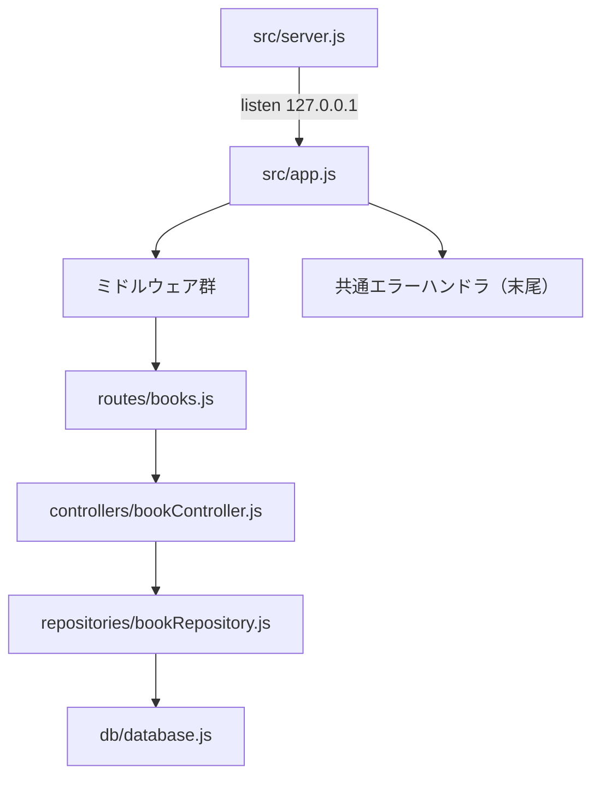
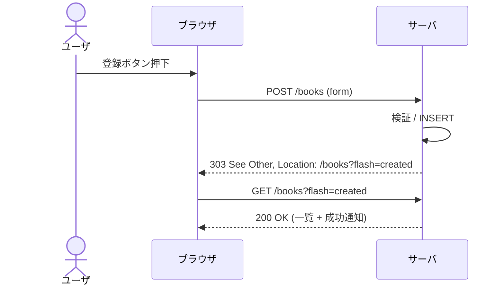

# A03130 ソフトウェア実現方針

## 1. 本書の位置付け

本書は「書籍管理Webアプリ」（以下、本システム）の**ソフトウェア実現方針**を定義する。

[A03110 ソフトウェア論理構成] で定めた4層モデルを、**具体的な技術スタック・ライブラリ選定・実装パターン・運用方針** にマッピングする。本書は実装者が「何を」「どう書くか」を判断する一次規範であり、後続の S03210（クラス図）・P03210（API ルーティング）・S04010 / P04010（実装）と整合させる。

前提とする上位ドキュメント:
- [A01010 非機能要件一覧](../010_要件定義/A01010_非機能要件一覧.md)
- [B01010 システム振舞い共通ルール](../010_要件定義/B01010_システム振舞い共通ルール.md)
- [G01010 レイアウト共通ルール](../010_要件定義/G01010_レイアウト共通ルール.md)
- [G02070 メッセージ一覧](../020_外部設計/G02070_メッセージ一覧.md)
- [A03110 ソフトウェア論理構成](./A03110_ソフトウェア論理構成.md)
- [R03120 ネーミングルール](./R03120_ネーミングルール.md)

---

## 2. 技術スタック

### 2.1 確定スタック

| 区分           | 採用技術                              | バージョン     | 由来 / 補足                                                          |
| -------------- | ------------------------------------- | -------------- | -------------------------------------------------------------------- |
| ランタイム     | Node.js                               | 24 LTS         | NFR-F03 / [A01010] 2                                                 |
| パッケージ管理 | npm                                   | Node 24 同梱   | NFR-C01                                                              |
| Web フレームワーク | Express                           | v5.x           | [A03110] 4.2 のアプリケーション層実装基盤                            |
| テンプレートエンジン | EJS                                | v3.x           | MPA / SSR 用 / [A03110] 4.1                                          |
| DB             | SQLite（`better-sqlite3`）            | v11.x          | ローカルファイル永続化 / 同期 I/O / [A03110] 4.4                     |
| CSS            | プレーン CSS                          | -              | [G01010] 4 章。プリプロセッサ不採用                                  |
| JS（クライアント） | ES2024（生 JS、ライブラリなし）   | -              | クライアント JS は最小限。jQuery / React / Vue は不採用              |
| Lint           | ESLint                                | 任意           | 実装フェーズで導入（規約は R03120 を踏襲）                           |
| テストフレームワーク | Node 標準 `node:test`             | Node 24 同梱   | 軽量・追加依存ゼロ                                                   |

### 2.2 採用しない技術と理由

| 技術                    | 不採用理由                                                                                    |
| ----------------------- | --------------------------------------------------------------------------------------------- |
| ORM（Sequelize, Prisma）| エンティティ 1 個・SQL も最小限のため不要。学習コストとビルド時間を回避（NFR-C01）。           |
| TypeScript              | 個人 PC ・小規模・ビルドステップ最小化のため不採用。型注釈は JSDoc で代替（必要に応じ）。      |
| SPA フレームワーク      | MPA で要件が満たせる（[A03110] 2.2）。                                                         |
| 認証ライブラリ          | NFR-E01 によりログイン機能なし。                                                              |
| Docker                  | 個人 PC でのワンコマンド起動が前提（NFR-C01）。                                                |
| WebSocket / SSE         | 1ユーザ・即時性要件なし。                                                                     |
| Webpack / Vite          | クライアントバンドル不要（MPA + 素の CSS/JS）。                                                |

### 2.3 主要 npm 依存（想定）

| パッケージ                  | 用途                                | 種別      |
| --------------------------- | ----------------------------------- | --------- |
| `express`                   | アプリケーション層基盤              | dependency |
| `ejs`                       | テンプレートエンジン                | dependency |
| `better-sqlite3`            | SQLite ドライバ                     | dependency |
| `cookie-parser`             | フラッシュメッセージ用（必要時）    | dependency（任意） |
| `eslint`                    | Lint                                | devDependency |
| `@types/*`                  | JSDoc 補助（必要時のみ）            | devDependency |

> セッションストアは導入しない。フラッシュメッセージは「短命 Cookie」または「クエリパラメタ `?flash=key`」で実現する（5.5 節で詳述）。

---

## 3. 実装パターン

### 3.1 Express v5 アプリ構成（雛形）



`src/app.js` の登録順は以下を厳守する。

1. ビューエンジン設定（`ejs`）／ `views/` パス
2. 静的アセット配信（`/static` → `public/`）
3. リクエストロガー（最小）
4. ボディパーサ（`express.urlencoded({ extended: false })`）
5. Cookie パーサ（フラッシュ実装で必要な場合）
6. ルータ登録（`/` → `routes/books.js` の `/books` 配下）
7. ルート未一致時の 404 ハンドラ
8. 共通エラーハンドラ（`(err, req, res, next)`）

### 3.2 単一プロセス・同期 I/O

[A03110] 2.2 の方針通り、以下を採用する。

- `better-sqlite3` は同期 API のみ使用する。`async/await` は I/O 待ちでなく構造化目的に限る。
- 単一 Node.js プロセス、`cluster`／ワーカースレッドは使わない。
- ロングランニングタスクは存在しない（最大 10 件取得＋ COUNT のみ）。

### 3.3 リポジトリパターン

`src/repositories/bookRepository.js` は以下のインタフェースを持つ。引数オブジェクトのキーは DB カラム名と一致させる（R03120 5.4 / 5.5）。

| 関数                                         | 戻り値                  | 役割                                                  |
| -------------------------------------------- | ----------------------- | ----------------------------------------------------- |
| `findAll({ page, page_size, sort, dir })`    | `Book[]`                | ページ＋ソートに沿った書籍一覧                         |
| `count()`                                    | `number`                | 総件数                                                |
| `findById(id)`                               | `Book \| null`          | 1件取得（存在しなければ `null`）                      |
| `create(book)`                               | `number`（新規 ID）     | INSERT 実行                                           |
| `update(id, book)`                           | `boolean`               | UPDATE 実行（影響行数 > 0 を真とする）                |
| `remove(id)`                                 | `boolean`               | DELETE 実行（影響行数 > 0 を真とする）                |

- SQL はリポジトリ内に文字列リテラルとして保持する。
- すべてプリペアドステートメント＋バインドパラメータで実行する（NFR-E03）。

### 3.4 コントローラ規約

`src/controllers/bookController.js` はユースケース（UC-01〜UC-04）に対応する関数を持つ。

| コントローラ関数  | 担当 UC | HTTP                          | 主な責務                                                          |
| ----------------- | ------- | ----------------------------- | ----------------------------------------------------------------- |
| `list`            | UC-02   | `GET /books`                  | クエリ → リポジトリ → ビュー描画                                  |
| `newForm`         | UC-01   | `GET /books/new`              | 空フォーム描画                                                    |
| `create`          | UC-01   | `POST /books`                 | バリデーション → リポジトリ create → 一覧へ 303 redirect          |
| `editForm`        | UC-03   | `GET /books/:id/edit`         | 1件取得（不在 → 404 経路）→ フォーム描画                          |
| `update`          | UC-03   | `POST /books/:id`             | バリデーション → リポジトリ update → 一覧へ 303 redirect          |
| `remove`          | UC-04   | `POST /books/:id/delete`      | リポジトリ remove → 一覧へ 303 redirect                            |

- 各関数は `(req, res, next)` シグネチャ。例外は `next(err)` でエラーハンドラに委譲する。
- バリデーションは関数の冒頭で実行し、失敗時は元のフォームを再描画する。

### 3.5 バリデーション方針

| 観点                | 内容                                                                                                                                                                          |
| ------------------- | ----------------------------------------------------------------------------------------------------------------------------------------------------------------------------- |
| 実装場所            | 画面側（HTML5 ＋ 入力制限）／サーバ側（自作バリデータ）の二重（NFR-E03）                                                                                                       |
| 自作バリデータ      | `src/lib/bookValidator.js`（必要に応じ追加）。`validateBook(input) → { ok, errors }` を返す純粋関数。                                                                          |
| エラーメッセージ ID | [G02070] 3.4 の `MSG-V-001`〜`MSG-V-006` をキーで参照。文言は EJS テンプレート側で解決する（i18n を見据えた構造、R03120 12 章）。                                            |
| 文字数制限          | [D02020] 5.1 ／ [G02030] 4.3 の値を採用                                                                                                                                       |
| ISBN 検証           | 「数字とハイフンのみ」のみ確認（チェックディジット未実装）                                                                                                                    |
| 価格範囲            | 0 ≤ price ≤ 9,999,999 の整数                                                                                                                                                  |
| 購入日              | `YYYY-MM-DD` 形式パース成功で OK。未来日付の拒否は MSG-V-006 で対応するが、初版では**警告のみで保存を許可**（[G02070] 3.4 注釈に従う） |
| トリム              | 文字列入力は **両端の空白をトリム**した上でバリデーション・保存                                                                                                              |
| 文字数カウント単位  | 「コードポイント数」ではなく **UTF-16 文字数** とする（JS の `String.length` 既定値で十分。サロゲート対について実装フェーズで再評価）                                          |

### 3.6 エラーハンドリング方針

| 種別                 | 検出方法                                                  | 対応                                                                                                                                       |
| -------------------- | --------------------------------------------------------- | ------------------------------------------------------------------------------------------------------------------------------------------ |
| 想定内 - バリデーション失敗 | コントローラ内で検証                                | 同じフォームを再描画し、エラーマップ＋ MSG-E-003 を表示                                                                                    |
| 想定内 - 対象不在    | リポジトリが `null` / `false` を返す                       | 編集系: SC99 に MSG-E-002／削除系: SC01 に MSG-W-001                                                                                       |
| 想定内 - ページ範囲外 | コントローラ `list` が `count` と `page` を照合           | 1 ページ目にフォールバックし、MSG-W-002 を表示                                                                                              |
| 想定外 - 例外        | Express 共通エラーハンドラが捕捉                          | SC99 / MSG-E-001 を表示。スタックトレースはログのみ（NFR-E06）                                                                              |
| 404                  | ルート未一致 → 404 ミドルウェア                            | SC99 / MSG-E-004 を表示                                                                                                                    |

エラーハンドラのレスポンスは常に `text/html`。HTTP ステータスは以下とする。

- バリデーション失敗 → 200 OK（再描画）
- 対象不在（編集系）→ 404 Not Found（SC99）
- 削除時の対象不在 → 303 See Other（一覧へ警告付きで戻る）
- 想定外例外 → 500 Internal Server Error（SC99）
- 未定義 URL → 404 Not Found（SC99）

### 3.7 PRG（Post / Redirect / Get）

更新系（`POST`）は処理後に **303 See Other** で `/books` へ遷移する（リロード時の二重送信防止、[B01010] 5.3 と整合）。



---

## 4. フロントエンド方針

### 4.1 EJS テンプレート

- 1 ファイル = 1 画面 を基本とする（[G02010] と一致）。
- 共通部品（ヘッダ・フッタ・通知バー）は `views/partials/` 配下に分離し `include` で取り込む。
- ローカル変数のキー名は snake_case（R03120 5.5）。
- HTML エスケープは `<%= %>` を既定とし、生出力 `<%- %>` は HTML 部品の埋め込み（`include` 結果）にのみ使う。

### 4.2 クライアントサイド JS（最小限）

| 用途                                  | 実装方針                                                          |
| ------------------------------------- | ----------------------------------------------------------------- |
| 通知バーの「×」ボタン                 | `addEventListener('click', ...)` で要素を removeChild             |
| 通知バーの 3 秒自動クローズ（成功時） | `setTimeout(() => el.remove(), 3000)`                              |
| 削除確認モーダル                       | `<dialog>` 要素 + `showModal()` API（モダンブラウザ前提）         |
| HTML5 バリデーション                  | `<input required>` ／ `pattern` ／ `min` ／ `max` ／ `maxlength` |
| 文字数オーバーフロー抑止              | `maxlength` 属性 + ペースト時の値カット                            |

### 4.3 CSS 設計

- BEM 風 + 状態クラス（R03120 8.2）。
- CSS Custom Property（`--color-*`）でカラーパレットを `style.css` 冒頭に集約（[G01010] 4 章）。
- メディアクエリは `1024px` を境界に最小限（[G02030] 8 章）。

---

## 5. 横断的関心事の実装方針

[A03110] 7 章を技術選定にマッピングする。

### 5.1 セキュリティ（NFR-E*）

| 要件     | 実装方針                                                                                                                                                                                                            |
| -------- | ------------------------------------------------------------------------------------------------------------------------------------------------------------------------------------------------------------------- |
| NFR-E01  | 認証なし。セッション領域も持たない。                                                                                                                                                                                |
| NFR-E02  | `server.js` で `app.listen(PORT, '127.0.0.1', ...)` 固定。`0.0.0.0` への bind を禁止。                                                                                                                              |
| NFR-E03  | クライアント JS の HTML5 検証 + サーバ側 `validateBook` の二重実装。SQL はすべてプリペアドステートメント。                                                                                                          |
| NFR-E04  | EJS 既定でエスケープ。CSRF: 認証なし＋ localhost 限定のため厳密対策不要だが、`POST` フォームに `SameSite=Strict` を付与した CSRF トークン cookie を**任意で**導入する余地を残す（初版では未実装、実装フェーズ判断）。 |
| NFR-E05  | 外部 API 呼び出しコードを禁止。`fetch` / `https` の使用箇所はレビュー対象。                                                                                                                                          |
| NFR-E06  | 共通エラーハンドラで Stack / `err.message` をユーザに見せない。サーバログ（INFO/WARN/ERROR）には残す。                                                                                                              |

### 5.2 ロギング（NFR-C02）

| 観点          | 実装方針                                                                                                |
| ------------- | ------------------------------------------------------------------------------------------------------- |
| ロガー        | 自作の薄いラッパ（`src/lib/logger.js`）。`console.log` 直接呼び出しは禁止。                              |
| 出力先        | 標準出力 + ファイル（`logs/app.log`）。ローテーションは未実装（手動運用、NFR-C02）。                    |
| フォーマット  | `[YYYY-MM-DD HH:mm:ss] [LEVEL] [module] メッセージ`（R03120 10.2）                                       |
| レベル切替    | 環境変数 `BOOK_APP_LOG_LEVEL`（既定 INFO）                                                              |
| 出力する場面  | 起動 / 終了 / リクエスト受信（method+path+status+ms） / 例外捕捉                                          |
| 出力しない情報 | 自由記述メモ（INFO/WARN 時）、ISBN（個人情報相当でないが冗長のため）                                   |

### 5.3 バージョン表示（NFR-C04）

- `package.json` の `version` を読み取り、`app.locals.appVersion` に格納する。
- すべてのテンプレートが `appVersion` を参照可能（`partials/footer.ejs` で `v<%= appVersion %>` 表示）。

### 5.4 静的アセット配信

- `app.use('/static', express.static(path.join(__dirname, '..', 'public')))`
- 開発時はキャッシュ無効、本番モード（`NODE_ENV=production`）でも個人利用のため変更しない（NFR-C01）。

### 5.5 フラッシュメッセージ

ログイン／セッションを持たないため、フラッシュメッセージは以下の二択から選ぶ。本リリースは **(B) クエリパラメタ方式** を採用する。

| 方式                          | 内容                                                                                                  | 採否    |
| ----------------------------- | ----------------------------------------------------------------------------------------------------- | ------- |
| (A) 短命 Cookie               | 1回読んだら消す Cookie（`Set-Cookie: flash=...; Max-Age=10`）                                          | 不採用  |
| (B) クエリパラメタ            | `Redirect: /books?flash=created` でキーを渡し、テンプレートでメッセージ ID に変換 → 表示              | **採用** |

- フラッシュキーは [G02070] 6 章の対応表に従う（`created` / `updated` / `deleted` / `already_deleted` / `out_of_range_page` / `not_found` / `internal_error` / `route_not_found`）。
- バリデーションエラーは PRG をせず**フォームを再描画**するため、フラッシュではなくテンプレートローカルとして渡す。

---

## 6. ディレクトリ・ファイル雛形

[A03110] 5 章 / [R03120] 4 章を参照のうえ、以下を実装フェーズの基準とする。

```
book-manager-app/
├─ package.json
├─ src/
│  ├─ app.js
│  ├─ server.js
│  ├─ routes/
│  │  └─ books.js
│  ├─ controllers/
│  │  └─ bookController.js
│  ├─ repositories/
│  │  └─ bookRepository.js
│  ├─ db/
│  │  └─ database.js
│  └─ lib/
│     ├─ logger.js          ← 任意（5.2）
│     └─ bookValidator.js   ← 任意（3.5）
├─ views/
│  ├─ book_list.ejs         ← SC01
│  ├─ book_form.ejs         ← SC02 / SC03 共有
│  ├─ error.ejs             ← SC99
│  └─ partials/
│     ├─ header.ejs
│     ├─ footer.ejs
│     └─ notification.ejs
├─ public/
│  └─ css/style.css
├─ data/        （実行時生成）
└─ logs/        （実行時生成）
```

---

## 7. 設定（package.json scripts）

```json
{
  "scripts": {
    "start": "node src/server.js",
    "dev":   "node --watch src/server.js",
    "lint":  "eslint src/",
    "test":  "node --test"
  }
}
```

- `npm start` がエンドユーザの起動コマンド（NFR-C01）。
- `npm run dev` は `--watch` でファイル変更時に自動再起動（開発時のみ）。
- テストは `node:test` を用いる。リポジトリのユニットテスト程度の最小範囲を T04010（動作確認テスト）で具体化。

---

## 8. 環境変数と設定値

R03120 11 章で定めた環境変数を、起動時に `process.env` から読み取り、未指定の場合は既定値を使用する。読み取り箇所は **`src/db/database.js`（DB パス）** と **`src/server.js`（ポート）** に集約する。

| 変数                  | 既定値                       |
| --------------------- | ---------------------------- |
| `BOOK_APP_PORT`       | `3000`                       |
| `BOOK_APP_DB_PATH`    | `./data/books.sqlite3`        |
| `BOOK_APP_LOG_PATH`   | `./logs/app.log`              |
| `BOOK_APP_LOG_LEVEL`  | `INFO`                       |
| `NODE_ENV`            | `development`                |

---

## 9. 性能・キャパシティ方針

| NFR     | 目標                                | 実現方法                                                                                                       |
| ------- | ----------------------------------- | -------------------------------------------------------------------------------------------------------------- |
| NFR-B01 | 通常操作 1 秒以内（ローカル）       | 単一プロセス・同期 SQLite・テンプレートはディスクキャッシュに頼る（OS バッファ）                               |
| NFR-B02 | 1,000 件登録時の一覧表示 1 秒以内   | `LIMIT 10 OFFSET (page-1)*10` + `created_at` のインデックス（D03240 で確定）。COUNT は `SELECT COUNT(*) FROM books` |
| NFR-B03 | スケーラビリティ対象外              | 同時セッション 1（NFR-B03）。スレッドプール / クラスタ不要                                                     |

> インデックスは `created_at`（既定ソート列）と、ソート対応列（`title`, `author`, `publisher`, `purchase_date`, `price`）に対して必要に応じ作成する（D03240 で確定）。

---

## 10. 例外運用と既知の割り切り

| 項目                                    | 取扱い                                                                                                  |
| --------------------------------------- | ------------------------------------------------------------------------------------------------------- |
| トランザクション                        | 1リクエスト = 1 SQL を基本とするため、明示的なトランザクションは原則不要（必要時 `db.transaction(...)`）。 |
| ロック競合                              | 1 ユーザ前提のため考慮しない（NFR-B03）。                                                                |
| 文字列のサロゲートペア                  | `String.length` で十分。絵文字混入時の桁数は実装フェーズで再評価。                                       |
| タイムゾーン                            | ローカル TZ（OS 設定に従う）。DATETIME は `YYYY-MM-DD HH:mm:ss` 形式の文字列で保存（[D02020] 凡例）。   |
| ISBN チェックディジット                 | 未実装（初版スコープ外、[G02030] 4.3 補足）                                                              |
| 監査ログ                                | 行うべき対象なし（個人利用、NFR-D02）                                                                    |
| バックアップ                            | ユーザによる `data/books.sqlite3` のファイルコピー（NFR-C03）                                            |

---

## 11. 後続成果物への引継ぎ

| 引継ぎ先              | 引継ぎ内容                                                                  |
| --------------------- | --------------------------------------------------------------------------- |
| S03210 クラス図       | 3.3 / 3.4 のインタフェース、6 章のファイル構成、R03120 5 章の命名規約        |
| P03210 APIルーティング | 3.4 のコントローラ × URL マッピング、3.7 の PRG / ステータスコード方針     |
| D03240 テーブル定義   | 3.3 のリポジトリ SQL 想定、9 章のインデックス要件                            |
| S04010 / P04010 実装  | 全章                                                                        |
| T04010 動作確認テスト | 3.6 のエラーハンドリング方針、3.5 のバリデーション規約、5 章のセキュリティ実装 |

---

## 12. A01010 / B01010 共通ルールに対する例外

なし。

## 13. 改訂履歴

| 版   | 日付       | 改訂者   | 内容       |
| ---- | ---------- | -------- | ---------- |
| 1.0  | 2026-05-19 | Devin AI | 初版作成   |
