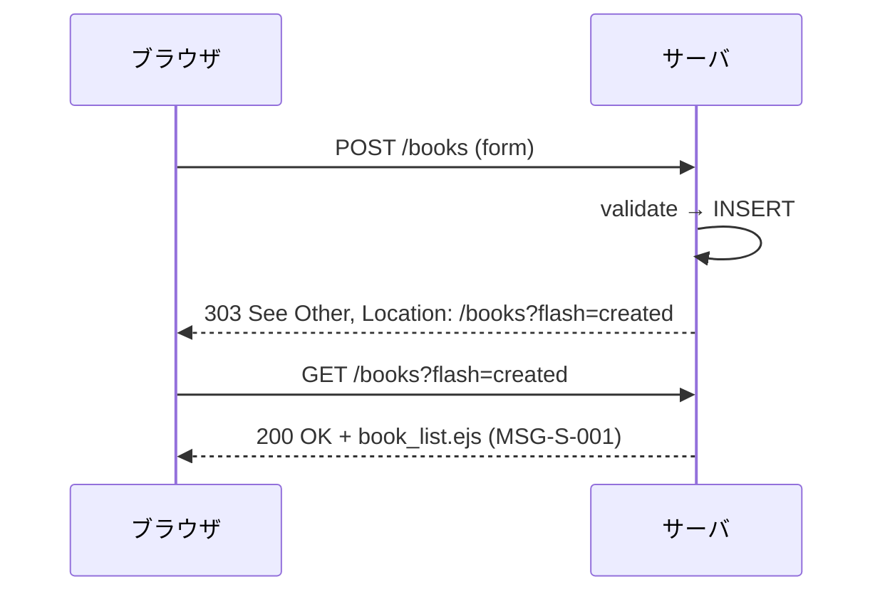
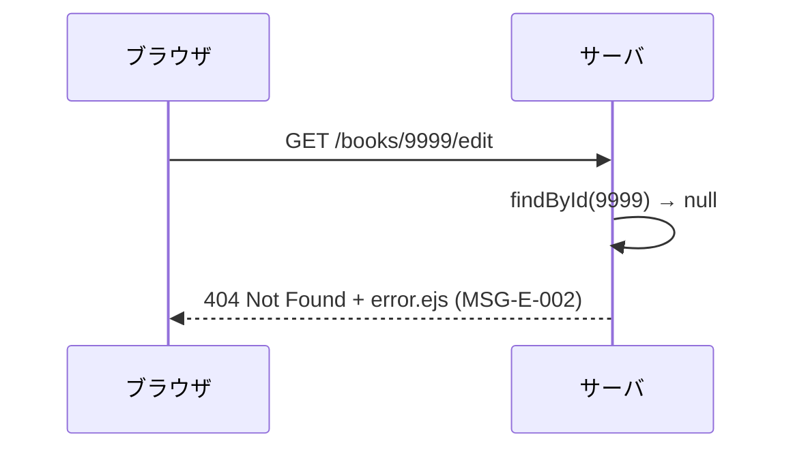
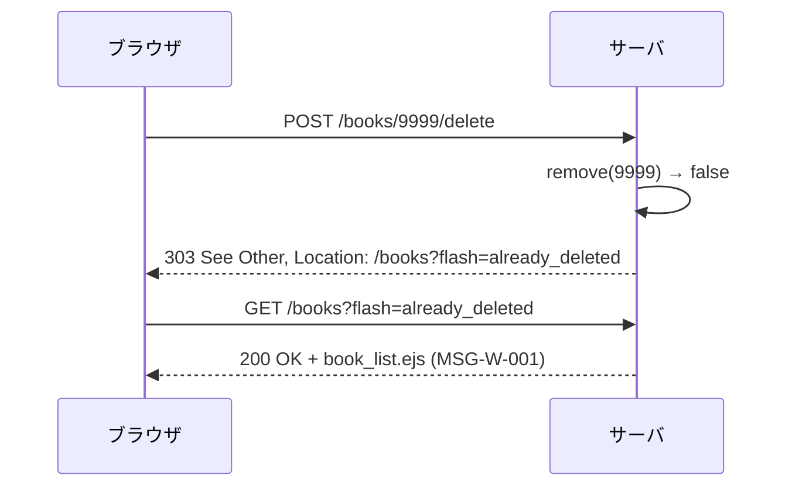

# P03210 APIルーティング仕様

## 1. 本書の位置付け

本書は「書籍管理Webアプリ」（以下、本システム）の**HTTP ルーティング仕様**を定義する。

HTML フォームを唯一のクライアントとする MPA であるため、本仕様は厳密な「REST API 仕様書」ではなく、**Express v5 上で公開する HTTP エンドポイントの一覧と入出力契約**を定義する。

前提とする上位ドキュメント:
- [B01010 システム振舞い共通ルール](../010_要件定義/B01010_システム振舞い共通ルール.md)
- [G02020 画面遷移](../020_外部設計/G02020_画面遷移.md)
- [G02030 画面レイアウト](../020_外部設計/G02030_画面レイアウト.md)
- [G02070 メッセージ一覧](../020_外部設計/G02070_メッセージ一覧.md)
- [A03110 ソフトウェア論理構成](../031_基本設計/A03110_ソフトウェア論理構成.md)
- [A03130 ソフトウェア実現方針](../031_基本設計/A03130_ソフトウェア実現方針.md)
- [R03120 ネーミングルール](../031_基本設計/R03120_ネーミングルール.md)
- [D03240 テーブル定義](./D03240_テーブル定義.md)
- [S03210 クラス図](./S03210_クラス図.md)

---

## 2. 設計方針

### 2.1 RESTful 風 + HTML フォーム制約

| 観点                  | 方針                                                                                                                                      |
| --------------------- | ----------------------------------------------------------------------------------------------------------------------------------------- |
| URL 設計              | リソースは `books` 1 個。RESTful 風だが、HTML フォーム制約により **メソッドは GET / POST のみ**。PUT / DELETE / PATCH は使用しない。      |
| 識別子                | サロゲートキー `:id`（数値、サーバ採番）。`:id` は `[0-9]+` のみ受け付け、それ以外は 404。                                                |
| ベースパス            | アプリ全体のベースパスは `/`（個人 PC ローカル前提）。書籍関連は `/books` 配下。                                                          |
| ステータスコード      | 正常更新後は **303 See Other**（PRG、[A03130] 3.7）。バリデーション失敗は **200 OK**（再描画）。対象不在は **404**。例外は **500**。     |
| レスポンス形式        | `text/html; charset=UTF-8` 固定（静的アセットは `text/css`）。JSON 応答は提供しない。                                                      |
| クエリパラメタ        | snake_case。`page` / `sort` / `dir` / `flash`（[R03120] 7.2）。                                                                            |
| ボディ形式            | `application/x-www-form-urlencoded; charset=UTF-8`                                                                                        |
| Cookie / セッション   | 使用しない（NFR-E01）。状態はクエリパラメタ `flash` または DB のみ。                                                                       |
| 認証                  | なし（NFR-E01）。                                                                                                                          |

### 2.2 ルーティングと UC / 画面の対応

| メソッド × パス               | コントローラ関数 | UC    | 主画面（テンプレート）         | 対応する画面遷移         |
| ----------------------------- | ---------------- | ----- | ------------------------------ | ------------------------ |
| GET `/books`                  | `list`           | UC-02 | `book_list.ejs`（SC01）         | [G02020] 一覧画面         |
| GET `/books/new`              | `newForm`        | UC-01 | `book_form.ejs`（SC02）         | 登録画面                  |
| POST `/books`                 | `create`         | UC-01 | （成功時 303）／`book_form.ejs`（失敗） | 登録 → 一覧             |
| GET `/books/:id/edit`         | `editForm`       | UC-03 | `book_form.ejs`（SC03）         | 編集画面                  |
| POST `/books/:id`             | `update`         | UC-03 | （成功時 303）／`book_form.ejs`（失敗） | 編集 → 一覧             |
| POST `/books/:id/delete`      | `remove`         | UC-04 | （303）                          | 一覧 → 一覧              |
| GET `/` （ルート）             | redirect 用     | -     | -                              | `GET /books` へ 302         |
| GET `/static/*`                | （Express static） | -   | （静的配信）                    | -                         |
| その他（未定義）              | `notFound`       | -     | `error.ejs`（SC99）             | -                         |
| 例外                          | `handle`         | -     | `error.ejs`（SC99）             | -                         |

---

## 3. ルートテーブル（網羅）

| #  | メソッド | パス                       | 名称              | 認証 | 入力（params / query / body）                                                                                       | 成功レスポンス                                  | 失敗レスポンス                                                       |
| -- | -------- | -------------------------- | ----------------- | ---- | -------------------------------------------------------------------------------------------------------------------- | ----------------------------------------------- | -------------------------------------------------------------------- |
| 1  | GET      | `/`                        | ルートリダイレクト | なし | -                                                                                                                    | 302 → `/books`                                  | -                                                                    |
| 2  | GET      | `/books`                   | 書籍一覧           | なし | query: `page?`, `sort?`, `dir?`, `flash?`                                                                            | 200 + `book_list.ejs`                            | 500 + SC99（例外時）                                                  |
| 3  | GET      | `/books/new`               | 新規登録フォーム   | なし | -                                                                                                                    | 200 + `book_form.ejs`（mode=new、空）            | -                                                                    |
| 4  | POST     | `/books`                   | 書籍登録           | なし | body: `BookInput`                                                                                                    | 303 → `/books?flash=created`                    | 200 + `book_form.ejs`（mode=new、errors）／ 500 + SC99                |
| 5  | GET      | `/books/:id/edit`          | 編集フォーム       | なし | params: `id (number)`                                                                                                | 200 + `book_form.ejs`（mode=edit、book）         | 404 + SC99（MSG-E-002）／ 500 + SC99                                  |
| 6  | POST     | `/books/:id`               | 書籍更新           | なし | params: `id`, body: `BookInput`                                                                                       | 303 → `/books?flash=updated`                    | 200 + `book_form.ejs`（errors）／ 404 + SC99 ／ 500 + SC99            |
| 7  | POST     | `/books/:id/delete`        | 書籍削除           | なし | params: `id`                                                                                                          | 303 → `/books?flash=deleted`                    | 303 → `/books?flash=already_deleted`（対象不在）／ 500 + SC99         |
| 8  | GET      | `/static/css/style.css`    | 共通 CSS           | なし | -                                                                                                                    | 200 + `text/css`                                | 404                                                                  |
| 9  | （任意） | `/*`                       | 未定義 URL         | なし | -                                                                                                                    | -                                               | 404 + SC99（MSG-E-004）                                              |

> リダイレクトはすべて **303 See Other**（更新系の PRG）と **302 Found**（GET の単なるリダイレクト＝ #1 のみ）を使い分ける。

---

## 4. エンドポイント詳細

### 4.1 GET `/books` — 書籍一覧

| 項目       | 内容                                                                                                                                                       |
| ---------- | ---------------------------------------------------------------------------------------------------------------------------------------------------------- |
| 目的       | 登録済み書籍を 10 件 / ページで表示（UC-02）                                                                                                                |
| クエリ     | `page`（1 以上の整数、既定 1）<br>`sort`（`id` / `title` / `author` / `publisher` / `purchase_date` / `price` / `created_at` のいずれか、既定 `created_at`）<br>`dir`（`asc` / `desc`、既定 `desc`）<br>`flash`（`created` / `updated` / `deleted` / `already_deleted` / `out_of_range_page` 等） |
| 不正クエリ | `page` が非整数または < 1: 1 にフォールバック＋ `flash=out_of_range_page`<br>`sort` がリスト外: `created_at` にフォールバック<br>`dir` が `asc`/`desc` 以外: `desc` にフォールバック |
| 範囲外     | `page > page_count`（`page_count = ceil(total / 10)`、total = 0 のときは `page_count = 1`）の場合、1 ページ目に戻し `flash=out_of_range_page` を表示       |
| 応答       | 200 OK / `text/html`                                                                                                                                       |
| ビューモデル | `{ books: Book[], page: number, page_count: number, total: number, sort: string, dir: string, flash: string|null, errors: {} }`                            |
| 0 件時     | 表ではなく MSG-I-001（[G02070] 3.6）＋ `MSG-I-002` リンクを表示                                                                                              |

#### リクエスト例

```
GET /books?page=3&sort=title&dir=asc HTTP/1.1
Host: 127.0.0.1:3000
Accept: text/html
```

### 4.2 GET `/books/new` — 新規登録フォーム

| 項目         | 内容                                                                  |
| ------------ | --------------------------------------------------------------------- |
| 目的         | 空フォーム描画（UC-01 の入口）                                         |
| クエリ       | -                                                                     |
| ビューモデル | `{ mode: 'new', book: {}, errors: {}, action_url: '/books', submit_label: '登録' }` |
| 応答         | 200 OK / `text/html`                                                  |

### 4.3 POST `/books` — 書籍登録

| 項目             | 内容                                                                                                                                  |
| ---------------- | ------------------------------------------------------------------------------------------------------------------------------------- |
| 目的             | 書籍を新規登録                                                                                                                        |
| `Content-Type`   | `application/x-www-form-urlencoded; charset=UTF-8`                                                                                    |
| ボディ           | `title`（必須）／`author`（必須）／`isbn`／`publisher`／`purchase_date`／`price`／`memo`（[D03240] 4.1）                                |
| 前処理           | 文字列のトリム、空文字 → `null`（[A03130] 3.5）                                                                                       |
| バリデーション   | `validateBook(input)`。失敗 → 200 + フォーム再描画＋ MSG-E-003＋ `errors` マップ                                                       |
| 成功時           | INSERT → 303 See Other / `Location: /books?flash=created`                                                                              |
| 失敗時（DB 例外）| 500 + SC99 + MSG-E-001（ログにスタック）                                                                                              |

#### リクエスト例

```
POST /books HTTP/1.1
Host: 127.0.0.1:3000
Content-Type: application/x-www-form-urlencoded; charset=UTF-8
Content-Length: ...

title=%E9%81%94%E4%BA%BA...&author=Andrew+Hunt&isbn=978-4-274-21933-2&publisher=...&purchase_date=2026-04-01&price=2860&memo=
```

#### 成功時レスポンス

```
HTTP/1.1 303 See Other
Location: /books?flash=created
Content-Length: 0
```

### 4.4 GET `/books/:id/edit` — 編集フォーム

| 項目         | 内容                                                                                              |
| ------------ | ------------------------------------------------------------------------------------------------- |
| 目的         | 対象 1 件をフォームにプリセット表示                                                               |
| パス変数     | `:id` — 数値（`[0-9]+`）。それ以外の文字を含む場合は 404                                          |
| 前処理       | `findById(id)` → `null` の場合は 404 + SC99 + MSG-E-002                                          |
| ビューモデル | `{ mode: 'edit', book: Book, errors: {}, action_url: '/books/:id', submit_label: '更新' }`        |
| 応答         | 200 OK / `text/html`                                                                              |

### 4.5 POST `/books/:id` — 書籍更新

| 項目             | 内容                                                                                                                                  |
| ---------------- | ------------------------------------------------------------------------------------------------------------------------------------- |
| 目的             | 既存 1 件の項目を更新                                                                                                                  |
| パス変数         | `:id` — 数値                                                                                                                          |
| ボディ           | `BookInput`（4.3 と同じ）                                                                                                              |
| バリデーション   | 失敗 → 200 + フォーム再描画＋ MSG-E-003＋ `errors`                                                                                    |
| 対象不在         | `update(id, input)` の戻り値 `false` ／ `findById(id)` が `null` の場合は 404 + SC99 + MSG-E-002                                       |
| 成功時           | 303 See Other / `Location: /books?flash=updated`                                                                                       |

### 4.6 POST `/books/:id/delete` — 書籍削除

| 項目         | 内容                                                                                                                          |
| ------------ | ----------------------------------------------------------------------------------------------------------------------------- |
| 目的         | 対象 1 件を物理削除（[B01010] 5.3）                                                                                            |
| パス変数     | `:id` — 数値                                                                                                                  |
| ボディ       | （なし、または CSRF トークンのみ／本リリースでは空）                                                                          |
| 成功時       | 303 See Other / `Location: /books?flash=deleted`                                                                              |
| 対象不在     | `remove(id)` の戻り値 `false`：303 / `Location: /books?flash=already_deleted`（MSG-W-001）                                    |
| 失敗時       | 500 + SC99 + MSG-E-001                                                                                                        |

> 「削除」だけでも `POST` のため、HTML フォームの `<form method="POST" action="/books/:id/delete">` で送信する。[G02020]・[G02030] のモーダル「削除する」ボタンが当該フォームの submit を担う。

### 4.7 GET `/` — ルートリダイレクト

| 項目     | 内容                                       |
| -------- | ------------------------------------------ |
| 応答     | 302 Found / `Location: /books`              |
| 補足     | ブックマーク・タイプミス時のフォールバック  |

### 4.8 GET `/static/*` — 静的アセット

| 項目     | 内容                                                                            |
| -------- | ------------------------------------------------------------------------------- |
| 公開対象 | `public/` 配下                                                                  |
| 例       | `/static/css/style.css` → `public/css/style.css`                                 |
| ヘッダ   | `Content-Type` は MIME に従う。`Cache-Control` は既定（個人 PC のため未調整）   |

### 4.9 未定義 URL

| 項目         | 内容                                                          |
| ------------ | ------------------------------------------------------------- |
| ハンドラ     | 末尾の 404 ミドルウェア `notFound`                            |
| 応答         | 404 Not Found / `error.ejs`（SC99）/ MSG-E-004                |

---

## 5. リダイレクトとフラッシュキー対応

[G02070] 6 章のフラッシュ対応表と整合させる。

| ルート                              | 成功時の Location                          | 主な失敗時の Location                                 |
| ----------------------------------- | ------------------------------------------ | ----------------------------------------------------- |
| POST `/books`                       | `/books?flash=created`                      | （フォーム再描画、リダイレクトなし）                  |
| POST `/books/:id`                   | `/books?flash=updated`                      | （フォーム再描画、リダイレクトなし）                  |
| POST `/books/:id/delete`            | `/books?flash=deleted`                      | `/books?flash=already_deleted`（対象不在）            |
| GET `/books?page=N` (N が範囲外)    | （内部で 1 にフォールバック、`?flash=out_of_range_page`） | -                                          |
| 共通エラーハンドラ（例外）          | -                                          | 500 SC99（MSG-E-001 をテンプレに直接渡す）             |
| 未定義 URL                          | -                                          | 404 SC99（MSG-E-004 を直接渡す）                       |

---

## 6. 入力契約（フォーム body）

[D03240] 4.1 / [G02030] 4.3 / [G02070] 3.4 と整合する。

| name              | 必須 | 型・形式                          | 桁・範囲                | バリデーションメッセージ |
| ----------------- | ---- | --------------------------------- | ----------------------- | ------------------------ |
| `title`           | ●    | string                            | 1〜200                  | MSG-V-001 / MSG-V-002    |
| `author`          | ●    | string                            | 1〜100                  | MSG-V-001 / MSG-V-002    |
| `isbn`            | -    | string（半角数字・ハイフンのみ）  | 0〜17                   | MSG-V-002 / MSG-V-003    |
| `publisher`       | -    | string                            | 0〜100                  | MSG-V-002                |
| `purchase_date`   | -    | string（`YYYY-MM-DD`）            | -                       | MSG-V-005 / MSG-V-006    |
| `price`           | -    | integer                           | 0〜9,999,999            | MSG-V-004                |
| `memo`            | -    | string                            | 0〜1,000                | MSG-V-002                |

> 空文字はサーバ側でトリム後 `null` に正規化してから検証・保存する（[A03130] 3.5）。

---

## 7. 入力サニタイズ・セキュリティ

| 観点                     | 実装                                                                                                                              |
| ------------------------ | --------------------------------------------------------------------------------------------------------------------------------- |
| SQL インジェクション     | すべてプリペアド＋バインド（[D03240] 9 章 / NFR-E03）。`sort` / `dir` はホワイトリスト                                            |
| XSS                      | EJS の `<%= %>` で自動エスケープ。`<%- %>` は `partials/include` 結果のみ（NFR-E04）                                              |
| CSRF                     | localhost ＋認証なしのため対策の必要性は限定的。初版では CSRF トークン未実装。将来導入時は `cookie-parser` + 自前トークン         |
| Open Redirect            | リダイレクト先は **アプリ内固定**（`/books?...`）。外部 URL を受け付けない                                                         |
| ペイロードサイズ         | `express.urlencoded({ limit: '64kb' })` 程度で十分。`memo` の最大 1,000 文字でも 4 KB 程度                                          |
| `Host` ヘッダ            | 127.0.0.1 でのみ listen（NFR-E02）                                                                                                 |
| HTTP メソッド            | `app.disable('x-powered-by')` で `X-Powered-By` を抑止                                                                              |
| ファイルアップロード     | 受け付けない                                                                                                                       |

---

## 8. ヘッダ規約

### 8.1 サーバ → クライアント

| ヘッダ               | 値                                              | 補足                                          |
| -------------------- | ----------------------------------------------- | --------------------------------------------- |
| `Content-Type`       | `text/html; charset=UTF-8`（通常）              | `/static/*` は MIME に応じる                  |
| `Content-Language`   | `ja`                                            | NFR-F05                                       |
| `X-Content-Type-Options` | `nosniff`                                   | XSS / MIME スニッフィング防止                  |
| `Referrer-Policy`    | `same-origin`                                   | 個人 PC ・ localhost 想定                      |
| `X-Frame-Options`    | `DENY`                                          | クリックジャッキング防止                      |
| `Cache-Control`      | 動的応答は `no-store`、静的は既定               | フラッシュメッセージの誤再表示防止             |

### 8.2 クライアント → サーバ

| ヘッダ           | 期待値                                              |
| ---------------- | --------------------------------------------------- |
| `Accept`         | `text/html`（HTML フォーム既定）                    |
| `Content-Type`   | `application/x-www-form-urlencoded; charset=UTF-8`  |
| `Cookie`         | 不使用（NFR-E01）                                   |

---

## 9. ステータスコード一覧

| ステータス | 用途                                                            | 対応する画面・メッセージ                          |
| ---------- | --------------------------------------------------------------- | ------------------------------------------------- |
| 200 OK     | 正常応答（GET 全般、POST のバリデーション失敗による再描画）       | SC01 / SC02 / SC03                                |
| 302 Found  | `/` から `/books` への単純リダイレクト                          | -                                                 |
| 303 See Other | PRG の更新系成功                                              | `/books?flash=...`                                |
| 404 Not Found | URL 未定義／対象 `:id` 不在（編集系のみ）                      | SC99 + MSG-E-002 / MSG-E-004                      |
| 500 Internal Server Error | 想定外例外                                          | SC99 + MSG-E-001                                  |

> 削除系（POST `/books/:id/delete`）で対象不在の場合は **404 ではなく 303 + 警告フラッシュ** に倒す（[G02070] MSG-W-001 と整合、ユーザ操作の連続性を優先）。

---

## 10. ルーティング登録の擬似コード

実装の指針として、Express v5 上のルータ定義の擬似コードを示す。実装フェーズで `src/routes/books.js` に展開する。

```js
// src/routes/books.js（実装イメージ）
const express = require('express');
const router = express.Router();
const c = require('../controllers/bookController');

router.get('/',           (req, res) => res.redirect(302, '/books'));
router.get('/books',                 c.list);
router.get('/books/new',             c.newForm);
router.post('/books',                c.create);
router.get('/books/:id(\\d+)/edit',  c.editForm);
router.post('/books/:id(\\d+)',      c.update);
router.post('/books/:id(\\d+)/delete', c.remove);

module.exports = router;
```

- `:id(\\d+)` で数値のみ受理し、それ以外のパスは未マッチ → 404 に流す。
- 404 / エラーハンドラは `src/app.js` で末尾に登録する。

---

## 11. シーケンス（HTTP 視点）

[S03210] 6 章 のシーケンス図と整合させた、HTTP レイヤから見た代表フローを以下に再掲する。

### 11.1 PRG パターン（書籍登録）



### 11.2 編集（対象不在）



### 11.3 削除（既に削除済）



---

## 12. 検証マトリクス（網羅性確認）

ユースケース・画面・URL・コントローラ関数の網羅性を確認する。

| UC    | 画面（[G02010]）         | URL                                | コントローラ関数 | 仕様参照                |
| ----- | ------------------------ | ---------------------------------- | ---------------- | ----------------------- |
| UC-01 | SC02 書籍登録            | GET `/books/new` ／ POST `/books`  | `newForm` / `create` | 4.2 / 4.3            |
| UC-02 | SC01 書籍一覧            | GET `/books`                       | `list`           | 4.1                     |
| UC-03 | SC03 書籍編集            | GET `/books/:id/edit` ／ POST `/books/:id` | `editForm` / `update` | 4.4 / 4.5     |
| UC-04 | SC04 削除確認モーダル＋一覧 | POST `/books/:id/delete`        | `remove`         | 4.6                     |
| -     | SC99 共通エラー          | （任意エラー）                      | `notFound` / `handle` | 4.9 / 9               |

---

## 13. テスト観点（実装フェーズ T04010 へ引継ぎ）

| #  | 観点                                                  | 期待                                                       |
| -- | ----------------------------------------------------- | ---------------------------------------------------------- |
| 1  | GET `/books` の既定ソート                              | `created_at DESC`、10 件、`total` / `page_count` が妥当     |
| 2  | GET `/books?sort=xxx`（不正値）                        | `created_at` にフォールバック、警告は出さない              |
| 3  | GET `/books?page=99999`                                | 1 ページ目にフォールバック＋ `flash=out_of_range_page`      |
| 4  | POST `/books`（必須未入力）                            | 200 + 再描画 + MSG-E-003 + 該当フィールドエラー             |
| 5  | POST `/books`（正常）                                  | 303 → `/books?flash=created`                                |
| 6  | GET `/books/abc/edit`                                  | 404（`:id(\\d+)` にマッチしないため）                       |
| 7  | GET `/books/9999/edit`                                 | 404 + SC99 + MSG-E-002                                      |
| 8  | POST `/books/1`（必須未入力）                          | 200 + 再描画 + MSG-E-003                                    |
| 9  | POST `/books/9999/delete`                              | 303 → `/books?flash=already_deleted`                        |
| 10 | GET `/`                                                | 302 → `/books`                                              |
| 11 | GET `/unknown`                                         | 404 + SC99 + MSG-E-004                                      |
| 12 | サーバ例外                                              | 500 + SC99 + MSG-E-001 + ログに Stack                       |
| 13 | XSS 入力（`<script>`）                                 | 表示時にエスケープされ実行されない                          |
| 14 | SQL インジェクション（`title=' OR 1=1`）               | プリペアドにより無効化、保存は文字列として                  |

---

## 14. B01010 / A03110 共通ルールに対する例外

なし。

## 15. 改訂履歴

| 版   | 日付       | 改訂者   | 内容       |
| ---- | ---------- | -------- | ---------- |
| 1.0  | 2026-05-19 | Devin AI | 初版作成   |
