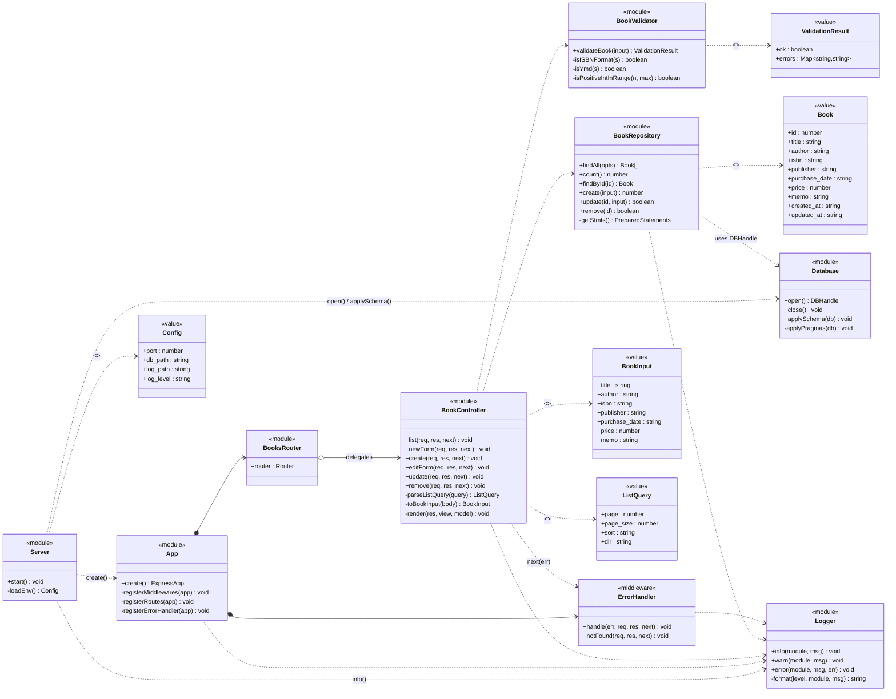
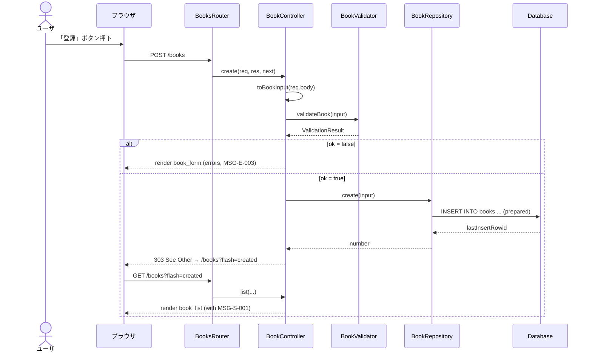
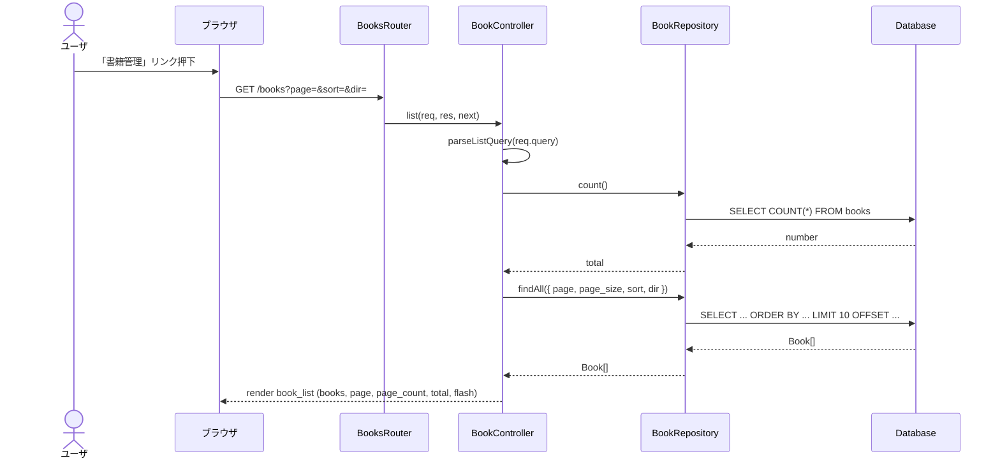
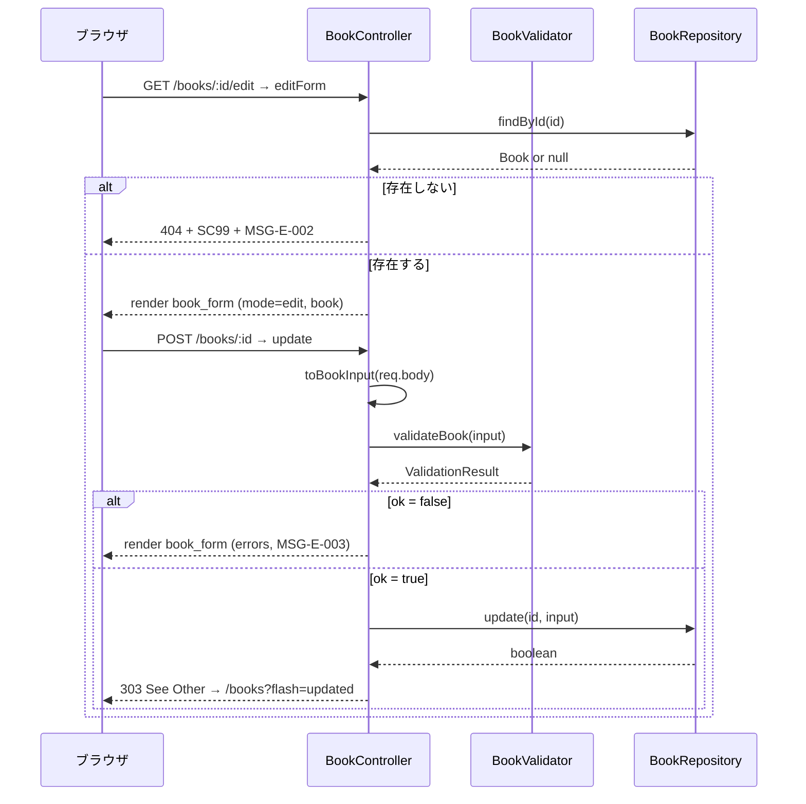
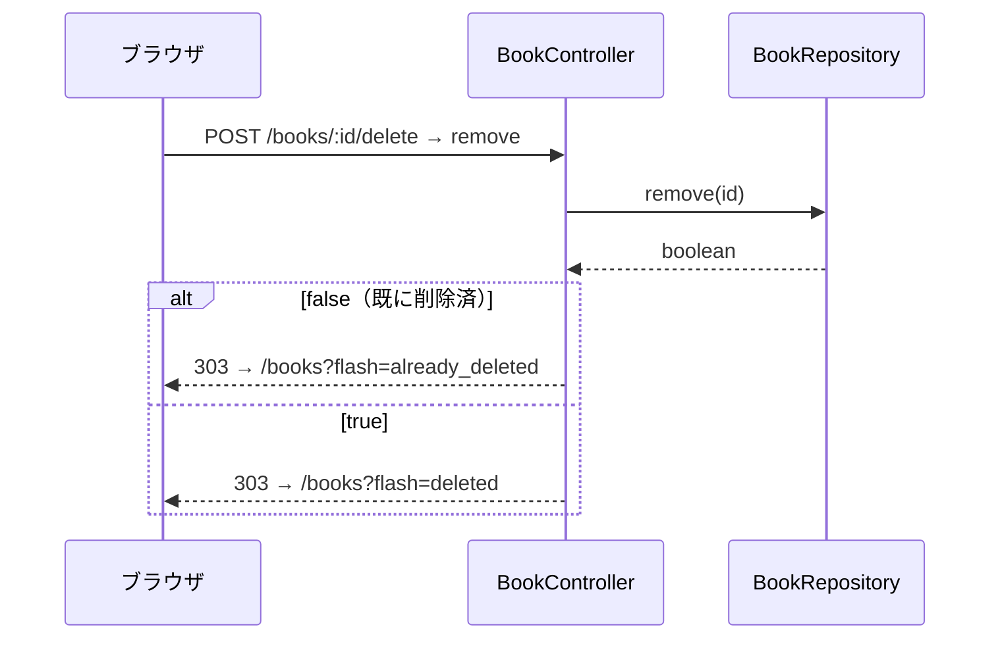

# S03210 クラス図

## 1. 本書の位置付け

本書は「書籍管理Webアプリ」（以下、本システム）の**ソフトウェア静的構造**を Mermaid `classDiagram` を用いて定義する。

[A03110 ソフトウェア論理構成] の 4 層モデルと、[A03130 ソフトウェア実現方針] の実装パターン（Express v5 ＋ EJS ＋ better-sqlite3）を、**モジュール（疑似クラス）の集合**として表現する。

JavaScript の素朴な CommonJS モジュール構成を採用するため、本書で言う「クラス」は**モジュールが公開する関数群の論理的グルーピング**を指す。実装上は `module.exports = { ... }` で関数を export するスタイルでよい（[A03130] 2.3 / 6 章）。

前提とする上位ドキュメント:
- [A03110 ソフトウェア論理構成](../031_基本設計/A03110_ソフトウェア論理構成.md)
- [A03130 ソフトウェア実現方針](../031_基本設計/A03130_ソフトウェア実現方針.md)
- [R03120 ネーミングルール](../031_基本設計/R03120_ネーミングルール.md)
- [D03240 テーブル定義](./D03240_テーブル定義.md)

---

## 2. 設計の射程と表記法

### 2.1 射程

本書は以下を扱う。

- アプリケーション層（Router / Controller / Validator / ErrorHandler）
- データアクセス層（Repository）
- インフラ層（Database / Logger）
- 上記から参照される値オブジェクト（Book / ValidationResult 等）

本書は以下を扱わない（[A03130] 2.2 不採用技術と一致）。

- フロント側 JS のクラス構造（[A03130] 4.2 で示した最小限の DOM 操作のみ）
- 外部ライブラリ（Express / EJS / better-sqlite3）の内部構造

### 2.2 表記法

| 表記                  | 意味                                                              |
| --------------------- | ----------------------------------------------------------------- |
| `<<module>>`          | CommonJS モジュール（実体は関数集合）                              |
| `<<value>>`           | 値オブジェクト（プレーンオブジェクト、コンストラクタなし）          |
| `<<middleware>>`      | Express ミドルウェアとして登録される関数                            |
| `+ method()`          | モジュールが公開する関数                                          |
| `- method()`          | モジュール内 private（未 export）                                 |
| `..>`                 | 依存関係（use）                                                   |
| `o-->`                | 利用関係（aggregation 相当：保有しないが利用する）                  |
| `*-->`                | 包含（composition 相当：ライフサイクルを保有）                      |
| `<<creates>>`         | インスタンスを生成する関係                                        |
| `<<reads>>`           | 値オブジェクトを返す                                              |

---

## 3. システム全体クラス図



---

## 4. モジュール詳細

### 4.1 `src/server.js` — Server

| 項目         | 内容                                                                                                |
| ------------ | --------------------------------------------------------------------------------------------------- |
| 役割         | Node.js プロセスのエントリポイント。`Config` を解決し、`Database` を初期化、`App.create()` を呼び出して 127.0.0.1 で listen。 |
| 公開関数     | `start()`                                                                                           |
| 主依存       | `app.js`, `db/database.js`, `lib/logger.js`                                                          |
| エラー処理   | 起動失敗時は ERROR ログ＋ `process.exit(1)`                                                          |
| シャットダウン | `SIGINT` / `SIGTERM` で `Database.close()` → プロセス終了                                            |

### 4.2 `src/app.js` — App

| 項目         | 内容                                                                                            |
| ------------ | ----------------------------------------------------------------------------------------------- |
| 役割         | Express アプリケーションのインスタンスを生成し、ビューエンジン・ミドルウェア・ルータ・エラーハンドラを順番に登録する（[A03130] 3.1 の登録順）。 |
| 公開関数     | `create() → ExpressApp`                                                                          |
| 登録順       | view engine → static → logger ミドル → urlencoded → routes → notFound → errorHandler             |
| `app.locals` | `appVersion`（`package.json` の version）                                                       |

### 4.3 `src/routes/books.js` — BooksRouter

| 項目     | 内容                                                                                                   |
| -------- | ------------------------------------------------------------------------------------------------------ |
| 役割     | `Router()` インスタンスを生成し、URL × メソッドを `BookController` のハンドラへ束ねる（詳細 P03210）。 |
| 公開     | `router`（`module.exports`）                                                                            |
| マウント | `app.use('/', booksRouter)`（パスは Router 内で `/books` から始まる）                                  |

### 4.4 `src/controllers/bookController.js` — BookController

| 関数        | UC    | 入力                            | 出力                                                                            |
| ----------- | ----- | ------------------------------- | ------------------------------------------------------------------------------- |
| `list`      | UC-02 | `req.query.{page, sort, dir}`    | `res.render('book_list', { books, page, page_count, total, flash })`             |
| `newForm`   | UC-01 | （なし）                         | `res.render('book_form', { mode: 'new', book: 空, errors: {} })`                  |
| `create`    | UC-01 | `req.body` (BookInput)           | 成功: `res.redirect(303, '/books?flash=created')`／失敗: `book_form` を再描画    |
| `editForm`  | UC-03 | `req.params.id`                  | 成功: `res.render('book_form', { mode: 'edit', book, errors: {} })`／不在: 404+SC99 |
| `update`    | UC-03 | `req.params.id`, `req.body`      | 成功: `res.redirect(303, '/books?flash=updated')`／失敗: `book_form` を再描画    |
| `remove`    | UC-04 | `req.params.id`                  | 成功: `res.redirect(303, '/books?flash=deleted')`／不在: `?flash=already_deleted` |

#### 補助関数

- `parseListQuery(query)`: クエリ文字列を `ListQuery` 値オブジェクトに正規化。
- `toBookInput(body)`: フォーム body から `BookInput` 値オブジェクトに変換（トリム・空文字 → NULL）。
- `render(res, view, model)`: 共通の `appVersion` 等を補って `res.render()` を呼ぶ薄いラッパ。

### 4.5 `src/lib/bookValidator.js` — BookValidator

| 関数            | シグネチャ                                            | 補足                                                                                                |
| --------------- | ------------------------------------------------------ | --------------------------------------------------------------------------------------------------- |
| `validateBook`  | `(input: BookInput) → ValidationResult`                | 各項目を順にチェックし、最初のエラーを `errors[項目]` にメッセージ ID（`MSG-V-xxx`）として詰める。  |
| `isISBNFormat`  | `(s: string) → boolean`                                | `/^[0-9-]+$/`、長さ 1〜17。                                                                          |
| `isYmd`         | `(s: string) → boolean`                                | `YYYY-MM-DD` 形式、月日の妥当性を `Date` でパースし往復一致。                                       |
| `isPositiveIntInRange` | `(n: number, max: number) → boolean`             | 0〜`max` の整数。                                                                                    |

エラーは値ではなくメッセージ ID で持つ（[G02070] 3.4 / R03120 12 章）。テンプレート側で ID → 文言に解決する。

### 4.6 `src/repositories/bookRepository.js` — BookRepository

| 関数          | SQL                                          | 戻り値                                  |
| ------------- | -------------------------------------------- | --------------------------------------- |
| `findAll`     | [D03240] 6.1                                  | `Book[]`（最大 `page_size` 件）         |
| `count`       | [D03240] 6.2                                  | `number`                                |
| `findById`    | [D03240] 6.3                                  | `Book | null`                            |
| `create`      | [D03240] 6.4                                  | `number`（`lastInsertRowid`）           |
| `update`      | [D03240] 6.5                                  | `boolean`（`changes > 0`）              |
| `remove`      | [D03240] 6.6                                  | `boolean`（`changes > 0`）              |

| 規約                                       |
| ------------------------------------------ |
| すべての SQL はプリペアドステートメント。プロセス起動時に `getStmts()` で一度だけ準備し、リクエスト間で再利用する（性能：NFR-B02）。 |
| `:sort` / `:dir` はホワイトリスト検証後にクエリ生成（[D03240] 6.1 補足）。 |
| 戻り値のキーは DB カラム名（snake_case、R03120 5.5）。 |

### 4.7 `src/db/database.js` — Database

| 関数            | 役割                                                                                       |
| --------------- | ------------------------------------------------------------------------------------------ |
| `open()`        | `better-sqlite3` で `data/books.sqlite3` を開き、PRAGMA を適用し、`DBHandle` を返す。      |
| `close()`       | DB ハンドルを閉じる。プロセス終了時にのみ呼ぶ。                                            |
| `applySchema(db)` | `[D03240] 5 章` の DDL を実行し、テーブル・インデックス・トリガを冪等に作成する。         |
| `applyPragmas(db)` | `journal_mode=WAL`、`synchronous=NORMAL`、`foreign_keys=ON` を設定する。                |

> `DBHandle` は `better-sqlite3` の `Database` インスタンスを指すが、本書ではモジュール境界を通る型として **不透明型** として扱う（リポジトリ以外は内部にアクセスしない）。

### 4.8 `src/lib/logger.js` — Logger

| 関数      | 用途                                                                  |
| --------- | --------------------------------------------------------------------- |
| `info`    | 通常の処理ログ                                                        |
| `warn`    | 想定内の異常（対象不在 等）                                            |
| `error`   | 想定外例外。スタックトレースはここでのみ出力する（NFR-E06）           |

レベルは `BOOK_APP_LOG_LEVEL`（[R03120] 11 章）で切替。出力は標準出力＋ファイル（`BOOK_APP_LOG_PATH`）。

### 4.9 `src/app.js` 内 — ErrorHandler

| 関数           | 役割                                                                                                    |
| -------------- | ------------------------------------------------------------------------------------------------------- |
| `notFound`     | 末尾の 404 ミドルウェア。`SC99 + MSG-E-004` で応答（[A03130] 3.6）。                                    |
| `handle`       | Express の 4 引数エラーミドルウェア。例外をログし、`SC99 + MSG-E-001` で 500 応答（NFR-E06）。           |

---

## 5. 値オブジェクト（Value）

### 5.1 Book

`BookRepository` が返すレコード。DB カラム名に一致する snake_case のキーを持つ（R03120 5.5）。

| キー            | 型      | 補足                                          |
| --------------- | ------- | --------------------------------------------- |
| `id`            | number  |                                               |
| `title`         | string  |                                               |
| `author`        | string  |                                               |
| `isbn`          | string \| null |                                       |
| `publisher`     | string \| null |                                       |
| `purchase_date` | string \| null | `YYYY-MM-DD`                          |
| `price`         | number \| null |                                       |
| `memo`          | string \| null |                                       |
| `created_at`    | string  | `YYYY-MM-DD HH:mm:ss`                          |
| `updated_at`    | string  | 同上                                          |

### 5.2 BookInput

コントローラがフォーム body から構築し、`BookValidator` および `BookRepository` に渡すための入力 DTO。`Book` から `id`／`created_at`／`updated_at` を除いたもの。空文字はトリム後 `null` に正規化する。

### 5.3 ValidationResult

| キー       | 型                          | 補足                                            |
| ---------- | --------------------------- | ----------------------------------------------- |
| `ok`       | boolean                     | エラーが 1 件もないとき `true`                  |
| `errors`   | `{ [field]: MessageId }`    | 例: `{ title: 'MSG-V-001', isbn: 'MSG-V-003' }` |

### 5.4 ListQuery

| キー         | 型     | 既定値        | 補足                                                  |
| ------------ | ------ | ------------- | ----------------------------------------------------- |
| `page`       | number | 1             | 1 始まり。範囲外時はコントローラで 1 に補正           |
| `page_size`  | number | 10            | 固定（[B01010] 5.4）                                  |
| `sort`       | string | `created_at`  | ホワイトリスト ([D03240] 6.1)                         |
| `dir`        | string | `DESC`        | `ASC` または `DESC` のみ                              |

### 5.5 Config

[R03120] 11 章 の環境変数を読み取った値オブジェクト。`Server.loadEnv()` で 1 度だけ生成。

---

## 6. シーケンスから見た典型ユースケース

主要 4 ユースケースの 1 リクエスト分のオブジェクト相互作用を示す。詳細な HTTP マッピングは [P03210] を参照。

### 6.1 UC-01 登録（POST /books）



### 6.2 UC-02 一覧参照（GET /books）



### 6.3 UC-03 編集（GET /books/:id/edit → POST /books/:id）



### 6.4 UC-04 削除（POST /books/:id/delete）



---

## 7. 依存方向と循環の検査

[A03110] 3.3 の依存方向ルールを満たすことを以下のマトリクスで担保する（◯ = 依存可、× = 依存禁止）。

| 呼び元 ＼ 呼び先 | Server | App | BooksRouter | BookController | BookValidator | BookRepository | Database | Logger | ErrorHandler |
| ---------------- | :----: | :-: | :---------: | :------------: | :-----------: | :------------: | :------: | :----: | :----------: |
| Server           |   -    |  ◯  |             |                |               |                |    ◯     |   ◯    |              |
| App              |        |  -  |     ◯       |                |               |                |          |   ◯    |      ◯       |
| BooksRouter      |        |     |     -        |       ◯        |               |                |          |        |              |
| BookController   |        |     |             |       -        |      ◯        |      ◯         |          |   ◯    |      ◯       |
| BookValidator    |        |     |             |                |      -        |                |          |        |              |
| BookRepository   |        |     |             |                |               |      -         |    ◯     |   ◯    |              |
| Database         |        |     |             |                |               |                |    -     |   ◯    |              |
| Logger           |        |     |             |                |               |                |          |   -    |              |
| ErrorHandler     |        |     |             |                |               |                |          |   ◯    |      -       |

> 「ErrorHandler は App の一部として登録される」が、コードファイルとしては `src/app.js` 内に定義する想定（実装上のクラス分割は最小限とする）。

---

## 8. 想定する `module.exports` 形

実装フェーズの目安として、各モジュールの export 形を示す。R03120 5.2 / 5.4 に沿う。

```js
// src/server.js
module.exports = { start };

// src/app.js
module.exports = { create };

// src/routes/books.js
module.exports = router; // express.Router() インスタンス

// src/controllers/bookController.js
module.exports = { list, newForm, create, editForm, update, remove };

// src/lib/bookValidator.js
module.exports = { validateBook };

// src/repositories/bookRepository.js
module.exports = { findAll, count, findById, create, update, remove };

// src/db/database.js
module.exports = { open, close, applySchema };

// src/lib/logger.js
module.exports = { info, warn, error };
```

---

## 9. 拡張余地

| 拡張テーマ                       | 影響を受けるクラス／モジュール                       | 想定変更                                            |
| -------------------------------- | ---------------------------------------------------- | --------------------------------------------------- |
| 認証（複数ユーザ）              | App / BooksRouter / 全リポジトリ                      | セッションミドル追加、`user_id` 列、認可判定        |
| 著者マスタ                       | BookRepository / Database / 新規 AuthorRepository    | テーブル分割、`Book` の `author` を `author_id` へ |
| API（JSON）化                    | BookController（出力分岐の追加）                       | `Accept` ヘッダで JSON / HTML を切替                |
| エクスポート                     | 新規 `ExportController` / `BookRepository.findAll`   | CSV 生成ユーティリティ                              |

---

## 10. B01010 / A03110 共通ルールに対する例外

なし。

## 11. 改訂履歴

| 版   | 日付       | 改訂者   | 内容       |
| ---- | ---------- | -------- | ---------- |
| 1.0  | 2026-05-19 | Devin AI | 初版作成   |
